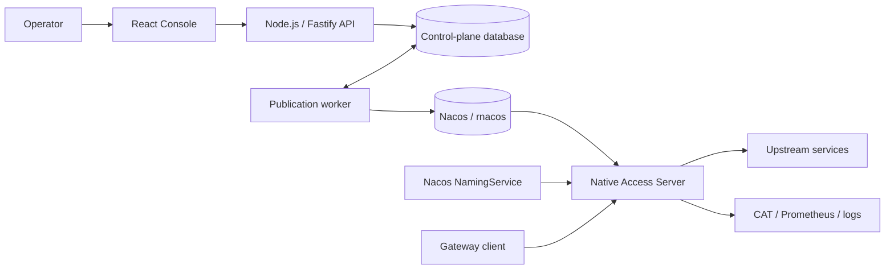

# Access Gateway

English | [简体中文](README.zh-CN.md)

Access Gateway is a high-performance gateway product composed of a C++23 data plane and a web
management console. The data plane is migrated from
[`fiber-gateway-cpp/apps/access-server`](https://github.com/fiber-net-gateway/fiber-gateway-cpp/tree/master/apps/access-server)
and continues to use the pinned Fiber framework as its runtime foundation. The control plane uses
TypeScript across a React frontend and a Node.js backend.

## Project status

The repository is under active development in two first-class areas:

- **Access Server** — the native runtime supports HTTPS, HTTP/2, and HTTP/3 enabled by default,
  Nacos-driven atomic TLS certificate snapshots plus project and route configuration,
  Host/Path/condition matching, RESPONSE and PROXY execution, WebSocket tunneling, service
  discovery, gray routing, CAT tracing, Prometheus metrics, and structured access logs. Production
  script-corpus differential verification and final cutover gates are still in progress.
- **Console** — the first MySQL-backed vertical slice is available: deterministic migrations,
  development identity and single-deployment RBAC, environment-free domain project APIs, encrypted
  immutable configuration versions, optimistic locking, audit events, and a route-first React
  workspace. Each route has an independently mounted CodeMirror YAML editor and is deterministically
  compiled to the native JSON wire model. Release/publication tables, the release state machine,
  publication conflict decisions, a fail-closed Native Validator adapter, current/historical version
  Release creation, and a leased rnacos publication worker with readback evidence are present.
  Project-level versioned HTTPS redirect and CIDR policies are available, together with an independent
  encrypted TLS inventory, immutable certificate versions, automatic DNS SAN-based ClientHello SNI
  selection, resolution preview, and TLS snapshot Releases with publication/readback evidence. Project
  selection remains based on HTTP Host/`:authority` and is not coupled to SNI. OIDC, resource-level
  publication retry/recovery, and per-instance activation collection remain to be implemented.

The console therefore reports unavailable or unknown state where the supporting workflow does not
exist. It does not fabricate publication or activation success.

## Architecture



The console owns configuration authoring and release workflows. `access-server` is the only
component on the gateway traffic path. Draft, published, and active states are deliberately
separate: a successful Nacos write is not proof that an individual server instance activated the
new snapshot.

## Repository layout

```text
access-gateway/
├── native/
│   ├── CMakeLists.txt             # Native build and pinned Fiber integration
│   └── access-server/             # Repository-owned C++23 data plane
├── server/                        # TypeScript, Node.js, and Fastify console API
├── web/                           # TypeScript, React, and Vite console frontend
├── third_party/
│   └── fiber-gateway-cpp/         # Pinned read-only Git submodule
├── AGENTS.md                      # Repository development conventions
└── package.json                   # Root npm workspace and unified commands
```

Application-specific native behavior belongs in `native/access-server`. Reusable Fiber runtime,
HTTP, Nacos, CAT, Prometheus, JSON, and script components come from the pinned submodule.

## Prerequisites

Console development requires:

- Node.js 20.19 or later;
- npm with workspace support.

Native development currently targets Linux and requires:

- CMake 4.1 or later;
- Ninja;
- Clang 17 or later, or GCC 13 or later;
- a C++23 toolchain.

The first native configuration may download third-party build dependencies. Initialize the pinned
submodule before configuring CMake.

## Clone

Clone the repository and its Fiber dependency together:

```bash
git clone --recurse-submodules https://github.com/fiber-net-gateway/access-gateway.git
cd access-gateway
```

For an existing checkout:

```bash
git submodule update --init --recursive
```

Routine builds must not use `git submodule update --remote`; dependency changes are reviewed and
committed as explicit gitlink updates.

## Console development

Install the root workspace, create local backend configuration, and start both development
servers:

```bash
npm install
cp server/.env.example server/.env
npm run dev
```

The default development endpoints are:

- Console: `http://localhost:5173`
- Console API: `http://127.0.0.1:3000`
- Health check: `http://127.0.0.1:3000/api/health`

Vite proxies browser requests under `/api` to Fastify. To run one side independently, use
`npm run dev:web` or `npm run dev:server`.

The API starts without MySQL for UI/API development, but persistent endpoints return `503` and
`/api/health/ready` reports degraded state. To enable persistence, create a MySQL 8.4 database,
set `MYSQL_ENABLED=true`, `MYSQL_PASSWORD`, and a local 32-byte document key in `server/.env`, then
run migrations before starting the API:

```bash
openssl rand -base64 32
# Put the result in DOCUMENT_ENCRYPTION_KEY_BASE64 inside server/.env.
npm run db:migrate
npm run dev
```

Migrations are checksum protected and serialized with a MySQL advisory lock. The API never runs
them automatically. `AUTH_MODE=development` creates a local platform administrator and is rejected
when `NODE_ENV=production`. Production OIDC startup remains fail-closed until its provider adapter
is implemented.

The implemented control-plane endpoints include:

- `/api/health`, `/api/health/live`, `/api/health/ready`, and `/api/system/status`;
- fixed workspace retrieval and a one-time environment bootstrap endpoint;
- environment-free `/api/projects` list/create and project detail;
- immutable Configuration Version list/save/detail/restore/validation with `If-Match` and
  idempotency;
- project YAML route validation and deterministic native-wire preview;
- versioned Project HTTPS redirect and CIDR network-policy authoring;
- Release creation from a current or historical version, publication queueing, and status detail;
- certificate inventory/version updates, DNS SAN-based SNI resolution preview, and TLS snapshot
  Release/publication APIs.

Each Configuration Version uses schema v4 and stores the HTTPS redirect setting, CIDR policy,
ordered route IDs, and exact YAML source. Stored schema v1/v2/v3 documents are normalized to v4 when
read without rewriting historical ciphertext; HTTPS redirect defaults to `off` for those older
models. Model documents are envelope-encrypted with AES-256-GCM before MySQL storage. The local key
configuration is intended for development only; production must use an external key provider.

Validate all console workspaces with:

```bash
npm run typecheck
npm test
npm run format:check
npm run format:native
npm run build
```

## Local Docker demo

The repository includes a Docker Compose demo containing the combined React Console and Fastify
API, MySQL 8.4, R-Nacos, and the native Access Server. Generate local-only random secrets and a
self-signed demo certificate, then start the stack:

```bash
npm run demo:init
npm run demo:up
```

The first native image build downloads the pinned C++ build dependencies and can take several
minutes. Compose applies the MySQL migrations, uploads the local certificate through the Console,
publishes a TLS snapshot, idempotently creates a demo Project and Configuration Version, publishes
its Release through the Console worker, and starts Access Server only after both R-Nacos readbacks
succeed.

Fastify serves both the `/api/*` endpoints and the built React single-page application from one
Console container. The complete stack therefore contains five long-running containers and three
one-shot migration/bootstrap containers.

Once all services are ready:

- Console: `http://localhost:8088`
- Access Server HTTPS/HTTP2 demo: `curl -k --http2 -H 'Host: demo.local' https://localhost:16688/`
- Access Server metrics: `http://localhost:16689/metrics`
- R-Nacos Console: `http://localhost:10848/rnacos/`
- MySQL: `127.0.0.1:3307`

R-Nacos Console credentials and database secrets are stored only in the ignored local `.env` file;
the self-signed certificate is under the ignored `deploy/demo/certs/` directory. Access Server port
16688 publishes both TCP (HTTPS/HTTP2) and UDP (HTTP3) on all WSL interfaces by default; the other
demo ports remain loopback-only. WSL2 NAT normally forwards TCP, but not UDP, from Windows
`localhost`. To verify HTTP3 from a Windows browser, obtain the WSL address with `hostname -I`, add
`<WSL-IP> demo.local` temporarily to the Windows hosts file, and open
`https://demo.local:16688/`. Set `ACCESS_SERVER_PUBLISHED_HOST=127.0.0.1` in `.env` when the gateway
should only be reachable inside WSL. Browsers negotiate QUIC only after trusting the demo
certificate; never trust or reuse this local self-signed certificate in production.
The bootstrap creates a Configuration Version and Release through the Console API; the publication
worker performs the R-Nacos write and readback. Per-instance activation remains unknown because
access-server activation evidence collection is not implemented.
Use `npm run demo:ps`, `npm run demo:logs`, and `npm run demo:down` to operate the stack. Add
`--volumes` to `docker compose down` only when you intentionally want to delete all demo data.

## Build and test Access Server

The root workspace exposes the common native workflow:

```bash
npm run configure:native
npm run build:native
npm run build:native-validator
npm run test:native
```

`npm run format:native` formats changed repository-owned C/C++ files with the pinned Fiber style;
`npm run format:native:all` formats all repository-owned C/C++ files. Both commands use the
repository-pinned clang-format 22 development dependency and never modify `third_party/`.

The equivalent CMake commands are:

```bash
cmake -S native -B native/build -G Ninja \
  -DCMAKE_BUILD_TYPE=Release -DFIBER_BUILD_TESTS=ON
cmake --build native/build --target fiber_app_access_server --parallel
cmake --build native/build --target fiber_app_access_gateway_validator --parallel
cmake --build native/build --target fiber_access_server_tests --parallel
ctest --test-dir native/build --output-on-failure -L access-server
```

The executable is written to `native/build/apps/access-server`.
The offline control-plane validator is written to
`native/build/apps/access-gateway-validator`; configure its absolute path with
`NATIVE_VALIDATOR_PATH`. It accepts one bounded, versioned JSON request on stdin and returns one
JSON result on stdout. It reuses the native codec, script compiler, and compiled route model, and
does not connect to Nacos or external services.

## Run Access Server

Copy the native example configuration and set at least the Nacos address for your environment.
When TLS is enabled, publish a complete TLS certificate snapshot before starting Access Server:

```bash
cp native/access-server/access-server.env.example access-server.env
./native/build/apps/access-server access-server.env
```

Without an argument, the process reads `access-server.env` from the current directory. The default
listeners are:

- gateway HTTPS: `0.0.0.0:16688/tcp` with HTTP/1.1 and HTTP/2 through ALPN;
- gateway HTTP/3: `0.0.0.0:16688/udp`;
- Prometheus metrics: `0.0.0.0:16689`.

TLS and HTTP/3 are enabled by default. Access Server waits for
`ploto.unified-access.tls-certificates` in group `ACCESS-SERVER`, derives SNI selectors from leaf DNS
SANs, and hot-swaps only a fully validated snapshot. A missing snapshot, expired certificate,
mismatched key, or failed TCP/UDP bind fails startup. File-based certificate settings have been
removed. Legacy plaintext HTTP requires both `ACCESS_SERVER_TLS_ENABLED=false` and
`ACCESS_SERVER_HTTP3_ENABLED=false`. The configuration format is strict `KEY=VALUE`; unknown or
duplicate keys fail startup. Do not commit local environment files, private keys, or credentials. See
[`native/access-server/access-server.env.example`](native/access-server/access-server.env.example)
for the full configuration surface.

Project HTTPS redirect is evaluated after HTTP Host/`:authority` selection and before route matching.
With TLS enabled, the business listener does not accept plaintext HTTP, so a direct client cannot
reach the redirect rule. To execute this rule behind an ingress, the trusted ingress must terminate
TLS, accept both HTTP and HTTPS, remove any client-supplied `X-Forwarded-Proto`, set the canonical
original scheme, and forward both protocols to an explicitly plaintext Access Server backend
(`ACCESS_SERVER_TLS_ENABLED=false` and `ACCESS_SERVER_HTTP3_ENABLED=false`) on a protected network.
If the ingress uses TLS backhaul, Access Server sees the connection itself as HTTPS and does not let
`X-Forwarded-Proto: http` override that fact; perform the redirect at the ingress instead. A separate
plaintext redirect listener is not currently implemented.

CIDR policy retains the Java-compatible `X-Real-Ip` behavior: a missing or unparsable header skips
the CIDR check. A trusted ingress must therefore remove any client-supplied value and set a canonical
client address; the current policy must not be treated as a standalone network firewall.

## Nacos configuration contract

The native codec is the source of truth for accepted values, defaults, and update behavior. The
default compatibility contract is:

| Purpose                  | Data ID                                 | Group           |
| ------------------------ | --------------------------------------- | --------------- |
| Project list             | `ploto.unified-access.projects`         | `ACCESS-SERVER` |
| Project route            | `ploto.unified-access.route.<project>`  | `ACCESS-SERVER` |
| TLS certificate snapshot | `ploto.unified-access.tls-certificates` | `ACCESS-SERVER` |
| Production gray rules    | `ploto.unified-access.gray-match`       | `DEFAULT_GROUP` |

The project list is a semicolon-separated string rather than JSON. Route and gray-rule payloads
retain the Java compatibility wire behavior. A candidate configuration is fully parsed and
compiled before immutable publication; invalid candidates retain the previous active snapshot.

## Documentation

- [Console product requirements](docs/console-requirements.md)
- [Console detailed design](docs/console-detailed-design.md)
- [Network policy and certificate design](docs/network-policy-and-certificate-design.md)
- [Fixed workspace and secure listener design](docs/fixed-workspace-and-secure-listener-design.md)
- [Access Server guide](native/access-server/README.md)
- [Compatibility contract](native/access-server/docs/compatibility-contract.md)
- [Migration plan](native/access-server/docs/migration-plan.md)
- [Script-corpus differential status](native/access-server/docs/script-corpus-differential.md)
- [Upstream provenance](native/access-server/UPSTREAM.md)
- [Development conventions](AGENTS.md)

## License

This project is licensed under the [Apache License 2.0](LICENSE). The migrated application retains
its [upstream license notice](native/access-server/LICENSE.upstream).
