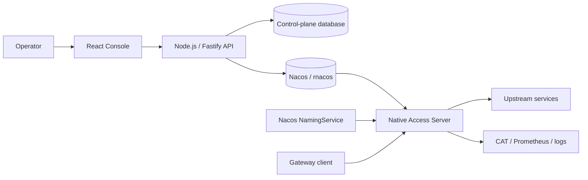

# Access Gateway

English | [简体中文](README.zh-CN.md)

Access Gateway is a high-performance gateway product composed of a C++23 data plane and a web
management console. The data plane is migrated from
[`fiber-gateway-cpp/apps/access-server`](https://github.com/fiber-net-gateway/fiber-gateway-cpp/tree/master/apps/access-server)
and continues to use the pinned Fiber framework as its runtime foundation. The control plane uses
TypeScript across a React frontend and a Node.js backend.

## Project status

The repository is under active development in two first-class areas:

- **Access Server** — the native runtime supports Nacos-driven project and route configuration,
  Host/Path/condition matching, RESPONSE and PROXY execution, WebSocket tunneling, service
  discovery, gray routing, CAT tracing, Prometheus metrics, and structured access logs. Production
  script-corpus differential verification and final cutover gates are still in progress.
- **Console** — the React/Vite frontend and Fastify backend foundation is available, including
  strict configuration parsing, a health endpoint, local API proxying, and workspace-wide quality
  commands. Authentication, persistence, configuration editors, Nacos publication, release
  management, and per-instance activation evidence are not implemented yet.

The console therefore reports unavailable or unknown state where the supporting workflow does not
exist. It does not fabricate publication or activation success.

## Architecture



The console owns configuration authoring and release workflows. `access-server` is the only
component on the gateway traffic path. Draft, published, and active states are deliberately
separate: a successful Nacos write is not proof that an individual server instance activated the
new snapshot.

## Repository layout

```text
access-gateway/
├── native/
│   ├── CMakeLists.txt             # Native build and pinned Fiber integration
│   └── access-server/             # Repository-owned C++23 data plane
├── server/                        # TypeScript, Node.js, and Fastify console API
├── web/                           # TypeScript, React, and Vite console frontend
├── third_party/
│   └── fiber-gateway-cpp/         # Pinned read-only Git submodule
├── AGENTS.md                      # Repository development conventions
└── package.json                   # Root npm workspace and unified commands
```

Application-specific native behavior belongs in `native/access-server`. Reusable Fiber runtime,
HTTP, Nacos, CAT, Prometheus, JSON, and script components come from the pinned submodule.

## Prerequisites

Console development requires:

- Node.js 20.19 or later;
- npm with workspace support.

Native development currently targets Linux and requires:

- CMake 4.1 or later;
- Ninja;
- Clang 17 or later, or GCC 13 or later;
- a C++23 toolchain.

The first native configuration may download third-party build dependencies. Initialize the pinned
submodule before configuring CMake.

## Clone

Clone the repository and its Fiber dependency together:

```bash
git clone --recurse-submodules https://github.com/fiber-net-gateway/access-gateway.git
cd access-gateway
```

For an existing checkout:

```bash
git submodule update --init --recursive
```

Routine builds must not use `git submodule update --remote`; dependency changes are reviewed and
committed as explicit gitlink updates.

## Console development

Install the root workspace, create local backend configuration, and start both development
servers:

```bash
npm install
cp server/.env.example server/.env
npm run dev
```

The default development endpoints are:

- Console: `http://localhost:5173`
- Console API: `http://127.0.0.1:3000`
- Health check: `http://127.0.0.1:3000/api/health`

Vite proxies browser requests under `/api` to Fastify. To run one side independently, use
`npm run dev:web` or `npm run dev:server`.

Validate all console workspaces with:

```bash
npm run typecheck
npm test
npm run format:check
npm run build
```

## Build and test Access Server

The root workspace exposes the common native workflow:

```bash
npm run configure:native
npm run build:native
npm run test:native
```

The equivalent CMake commands are:

```bash
cmake -S native -B native/build -G Ninja \
  -DCMAKE_BUILD_TYPE=Release -DFIBER_BUILD_TESTS=ON
cmake --build native/build --target fiber_app_access_server --parallel
cmake --build native/build --target fiber_access_server_tests --parallel
ctest --test-dir native/build --output-on-failure -L access-server
```

The executable is written to `native/build/apps/access-server`.

## Run Access Server

Copy the native example configuration and set at least the Nacos address for your environment:

```bash
cp native/access-server/access-server.env.example access-server.env
./native/build/apps/access-server access-server.env
```

Without an argument, the process reads `access-server.env` from the current directory. The default
listeners are:

- gateway HTTP: `0.0.0.0:16688`;
- Prometheus metrics: `0.0.0.0:16689`.

The configuration format is strict `KEY=VALUE`. Unknown or duplicate keys fail startup. Do not
commit local environment files or credentials. See
[`native/access-server/access-server.env.example`](native/access-server/access-server.env.example)
for the full configuration surface.

## Nacos configuration contract

The native codec is the source of truth for accepted values, defaults, and update behavior. The
default compatibility contract is:

| Purpose               | Data ID                                | Group           |
| --------------------- | -------------------------------------- | --------------- |
| Project list          | `ploto.unified-access.projects`        | `ACCESS-SERVER` |
| Project route         | `ploto.unified-access.route.<project>` | `ACCESS-SERVER` |
| Production gray rules | `ploto.unified-access.gray-match`      | `DEFAULT_GROUP` |

The project list is a semicolon-separated string rather than JSON. Route and gray-rule payloads
retain the Java compatibility wire behavior. A candidate configuration is fully parsed and
compiled before immutable publication; invalid candidates retain the previous active snapshot.

## Documentation

- [Console product requirements](docs/console-requirements.md)
- [Console detailed design](docs/console-detailed-design.md)
- [Access Server guide](native/access-server/README.md)
- [Compatibility contract](native/access-server/docs/compatibility-contract.md)
- [Migration plan](native/access-server/docs/migration-plan.md)
- [Script-corpus differential status](native/access-server/docs/script-corpus-differential.md)
- [Upstream provenance](native/access-server/UPSTREAM.md)
- [Development conventions](AGENTS.md)

## License

This project is licensed under the [Apache License 2.0](LICENSE). The migrated application retains
its [upstream license notice](native/access-server/LICENSE.upstream).
