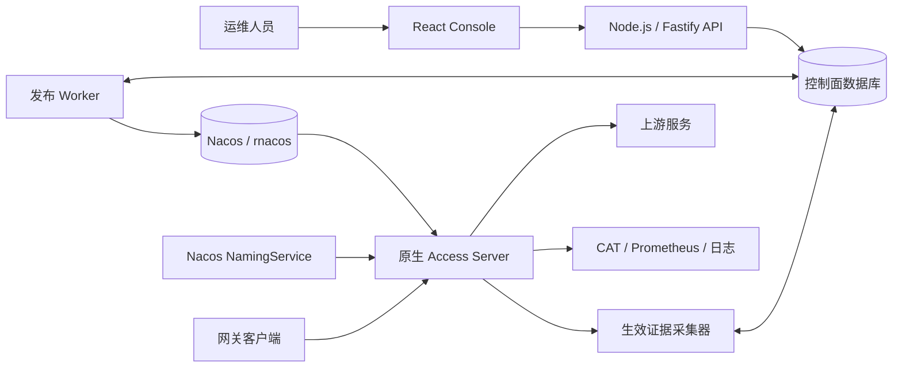

# Access Gateway

[English](README.md) | 简体中文

Access Gateway 是由 C++23 数据面与 Web 管理控制台组成的高性能网关产品。数据面迁移自
[`fiber-gateway-cpp/apps/access-server`](https://github.com/fiber-net-gateway/fiber-gateway-cpp/tree/master/apps/access-server)，
并继续使用固定版本的 Fiber 框架作为运行时基础。控制面前后端均采用 TypeScript，前端
使用 React，后端使用 Node.js。

## 项目状态

本仓库同时持续开发两个一等组件：

- **Access Server**：原生运行时已支持默认开启的 HTTPS、HTTP/2 与 HTTP/3、Nacos 驱动的原子
  TLS 证书快照、项目与路由配置、Host/Path/条件
  匹配、带静态/动态响应 gzip 协商的 RESPONSE 执行、PROXY 执行、WebSocket 隧道、服务发现、
  灰度路由、CAT 链路追踪、
  Prometheus 指标和结构化访问日志。2026-07-31 测试环境有限语法快照已完成 352/352
  decode + compile-only；完整生产语料差分验证与最终切流门槛仍未完成。
- **Console**：首个基于 MySQL 的纵向链路已经可用，包括确定性 migration、开发身份与固定
  部署 RBAC、不含环境参数的域名 Project API、加密的不可变配置版本、乐观锁、审计
  事件，以及 route-first React 工作台。每条 Route 使用独立挂载的 CodeMirror YAML 编辑器，
  并确定性编译为 native JSON wire model。Release/发布表、Release 状态机、发布冲突判定和
  fail-closed Native Validator 适配器、当前/历史版本 Release 创建和带 lease/回读证据的 rnacos
  发布 Worker 已经落地；Project 级版本化网络策略、独立加密 TLS 库存、不可变证书版本、基于
  DNS SAN 的 ClientHello SNI 自动选择与解析预览也已实现，并支持 TLS 快照 Release、发布与回读
  证据。Project 仍按 HTTP Host/`:authority` 选择，不与 SNI 绑定。Project/TLS Release 的认证、
  有界逐实例生效证据和带租约采集器已经实现；OIDC、资源级发布重试与恢复仍待实现。

因此，对于尚无配套工作流的状态，控制台会明确显示“不可用”或“未知”，不会伪造发布或
生效成功。

## 架构



Console 负责配置编写和发布流程，只有 `access-server` 位于网关流量链路中。草稿、已发布
和已生效是相互独立的状态：Nacos 写入成功不代表某个服务实例已经启用新快照。

## 仓库结构

```text
access-gateway/
├── native/
│   ├── CMakeLists.txt             # 原生构建与固定版本 Fiber 集成
│   └── access-server/             # 本仓库维护的 C++23 数据面
├── server/                        # TypeScript、Node.js、Fastify Console API
├── web/                           # TypeScript、React、Vite Console 前端
├── third_party/
│   └── fiber-gateway-cpp/         # 固定版本、只读的 Git 子模块
├── AGENTS.md                      # 仓库开发规范
└── package.json                   # 根 npm 工作区与统一命令
```

应用特有的数据面行为放在 `native/access-server`。可复用的 Fiber 运行时、HTTP、Nacos、
CAT、Prometheus、JSON 和脚本组件来自固定版本的子模块。

## 环境要求

Console 开发需要：

- Node.js 20.19 或更高版本；
- 支持 workspace 的 npm。

原生代码目前面向 Linux，需要：

- CMake 4.1 或更高版本；
- Ninja；
- Clang 17 或更高版本，或者 GCC 13 或更高版本；
- 支持 C++23 的工具链。

首次配置原生构建时可能下载第三方构建依赖。运行 CMake 前必须先初始化固定版本的子模块。

## 克隆仓库

同时克隆仓库和 Fiber 依赖：

```bash
git clone --recurse-submodules https://github.com/fiber-net-gateway/access-gateway.git
cd access-gateway
```

对于已有工作区：

```bash
git submodule update --init --recursive
```

日常构建不要使用 `git submodule update --remote`；依赖升级应作为明确的 gitlink 变更进行
审查和提交。

## Console 开发

安装根工作区依赖，创建后端本地配置，然后同时启动前后端开发服务：

```bash
npm install
cp server/.env.example server/.env
npm run dev
```

默认开发地址：

- Console：`http://localhost:5173`
- Console API：`http://127.0.0.1:3000`
- 健康检查：`http://127.0.0.1:3000/api/health`

Vite 会把浏览器的 `/api` 请求代理到 Fastify。需要单独运行一端时，使用
`npm run dev:web` 或 `npm run dev:server`。

API 可以在未配置 MySQL 时启动，便于开发前后端联通；此时持久化接口返回 `503`，
`/api/health/ready` 会报告降级。要启用持久化，请创建 MySQL 8.4 数据库，在
`server/.env` 中设置 `MYSQL_ENABLED=true`、`MYSQL_PASSWORD` 和本地 32 字节文档密钥，
然后先执行 migration：

```bash
openssl rand -base64 32
# 把结果写入 server/.env 的 DOCUMENT_ENCRYPTION_KEY_BASE64。
npm run db:migrate
npm run dev
```

Migration 使用 checksum 防篡改，并通过 MySQL advisory lock 串行执行；API 不会自动迁移。
`AUTH_MODE=development` 会建立本地平台管理员，且在 `NODE_ENV=production` 下被拒绝。
生产 OIDC provider adapter 完成前，OIDC 模式会拒绝启动。

目前实现的控制面接口包括：

- `/api/health`、`/api/health/live`、`/api/health/ready` 和 `/api/system/status`；
- 固定工作区获取，以及仅供部署 bootstrap 使用的一次性环境创建接口；
- 不含环境参数的 `/api/projects` 列表/创建，以及 Project 详情；
- 带 `If-Match` 与幂等键的 Configuration Version 列表、保存、详情、恢复和校验；
- Project YAML Route 校验和确定性的 native wire 预览；
- 从当前或历史版本创建 Release、加入发布队列和查询执行状态。

每个 Configuration Version 保存有序 Route ID 和精确 YAML 原文；旧的整份 Project JSON revision
会在读取时升级为稳定的 YAML Route Item。模型文档在写入 MySQL 前使用 AES-256-GCM 信封加密。本地密钥配置只
用于开发环境；生产环境应接入外部密钥服务。

使用以下命令验证全部 Console 工作区：

```bash
npm run typecheck
npm test
npm run format:check
npm run format:native
npm run build
```

## 本机 Docker 演示

仓库提供了完整的 Docker Compose 演示环境，包含合并部署的 React Console 与 Fastify API、
MySQL 8.4、R-Nacos 和原生 Access Server。先生成仅保存在本机的随机 Secret 和自签名演示
证书，再启动全部服务：

```bash
npm run demo:init
npm run demo:up
```

首次构建原生镜像会下载固定版本的 C++ 构建依赖，可能需要几分钟。Compose 会自动执行
MySQL migration，通过 Console API 幂等创建演示项目与 Configuration Version，由发布 Worker
将 Release 写入 R-Nacos 并回读校验，成功后再启动 Access Server。

Fastify 在同一个 Console 容器中同时提供 `/api/*` 接口和 React 单页应用。完整环境因此包含
6 个长期运行容器和 3 个 migration/bootstrap 一次性容器。

全部服务就绪后可访问：

- Console：`http://localhost:8088`
- Access Server HTTPS/HTTP2 演示：`curl -k --http2 -H 'Host: demo.local' https://localhost:16688/`
- Access Server 指标：`http://localhost:16689/metrics`
- R-Nacos Console：`http://localhost:10848/rnacos/`
- MySQL：`127.0.0.1:3307`

R-Nacos Console 凭据和数据库 Secret 只保存在 Git 已忽略的本机 `.env` 文件中，自签名证书
位于同样被忽略的 `deploy/demo/certs/`。Access Server 的 16688 端口同时发布 TCP（HTTPS、
HTTP/2）和 UDP（HTTP/3），并默认绑定全部 WSL 接口；其他演示端口仍只绑定环回地址。
WSL2 的 NAT 模式通常只为 Windows `localhost` 自动转发 TCP。要从 Windows 浏览器验证
HTTP/3，可在 WSL 运行 `hostname -I` 取得 WSL 地址，在 Windows hosts 文件中临时加入
`<WSL-IP> demo.local`，然后访问 `https://demo.local:16688/`。如只需在 WSL 内访问，可在
`.env` 设置 `ACCESS_SERVER_PUBLISHED_HOST=127.0.0.1` 收紧监听范围。
浏览器只有在信任该演示证书时才会协商 QUIC；不要在生产环境信任或复用这个本机自签名证书。
demo bootstrap 通过 Console API 创建 Configuration Version 和 Release，发布 Worker 负责写入
R-Nacos 并回读校验。独立采集器随后认证访问 demo Access Server，并单独报告精确的 route/TLS
生效版本；缺少或过期证据仍如实显示“激活未知”。可使用
`npm run demo:ps`、`npm run demo:logs` 和 `npm run demo:down`
管理演示环境。只有在确定要删除全部演示数据时，才为 `docker compose down` 添加 `--volumes`。

## 构建和测试 Access Server

根工作区提供了常用的原生开发流程：

```bash
npm run configure:native
npm run build:native
npm run build:native-validator
npm run test:native
```

`npm run format:native` 使用固定的 Fiber 风格格式化有改动的仓库自有 C/C++ 文件；
`npm run format:native:all` 格式化全部仓库自有 C/C++ 文件。两者使用仓库锁定的 clang-format 22
开发依赖，且不会修改 `third_party/`。

等价的 CMake 命令是：

```bash
cmake -S native -B native/build -G Ninja \
  -DCMAKE_BUILD_TYPE=Release -DFIBER_BUILD_TESTS=ON
cmake --build native/build --target fiber_app_access_server --parallel
cmake --build native/build --target fiber_app_access_gateway_validator --parallel
cmake --build native/build --target fiber_access_server_tests --parallel
ctest --test-dir native/build --output-on-failure -L access-server
```

可执行文件输出到 `native/build/apps/access-server`。
离线控制面校验器输出到 `native/build/apps/access-gateway-validator`，通过绝对路径
`NATIVE_VALIDATOR_PATH` 配置。它从 stdin 读取一条有大小上限、带版本的 JSON 请求，并在
stdout 返回一条 JSON 结果；校验直接复用原生 codec、脚本编译器和 compiled route model，
不会连接 Nacos 或外部服务。

## 运行 Access Server

复制原生示例配置，挂载 PEM 证书/私钥，并至少按环境修改 Nacos 地址：

```bash
cp native/access-server/access-server.env.example access-server.env
./native/build/apps/access-server access-server.env
```

未传参数时，进程读取当前目录下的 `access-server.env`。默认监听地址为：

- 网关 HTTPS：`0.0.0.0:16688/tcp`，通过 ALPN 支持 HTTP/1.1 与 HTTP/2；
- 网关 HTTP/3：`0.0.0.0:16688/udp`；
- Prometheus 指标：`0.0.0.0:16689`。

TLS 和 HTTP/3 默认开启；Access Server 从 Nacos 的
`ploto.unified-access.tls-certificates` / `ACCESS-SERVER` 等待首个有效完整快照，并在更新后按
leaf DNS SAN 无锁选择证书。快照缺失、证书过期、私钥不匹配或 TCP/UDP 任一绑定失败都会使启动
失败。文件证书配置已移除；明文 HTTP 部署必须同时显式设置
`ACCESS_SERVER_TLS_ENABLED=false` 和 `ACCESS_SERVER_HTTP3_ENABLED=false`。配置文件采用严格的 `KEY=VALUE` 格式，未知键和重复键
都会导致启动失败。不要提交本地环境文件、证书私钥或凭据。全部配置项参见
[`native/access-server/access-server.env.example`](native/access-server/access-server.env.example)。

## Nacos 配置契约

原生 codec 是输入值、默认值和更新行为的事实来源。默认兼容契约如下：

| 用途         | Data ID                                | Group           |
| ------------ | -------------------------------------- | --------------- |
| 项目列表     | `ploto.unified-access.projects`        | `ACCESS-SERVER` |
| 项目路由     | `ploto.unified-access.route.<project>` | `ACCESS-SERVER` |
| 生产灰度规则 | `ploto.unified-access.gray-match`      | `DEFAULT_GROUP` |

项目列表是分号分隔的字符串，而不是 JSON。路由和灰度规则载荷保持 Java 兼容的 wire 行为。
候选配置必须先完成全部解析和编译，再以不可变快照发布；候选无效时继续保留上一份生效快照。

## 文档

### 用户文档

[完整用户文档索引](docs/user-guide/README.md)及当前维护的主题均提供简体中文和英文版本：

| 主题           | 简体中文                                                         | English                                                                     |
| -------------- | ---------------------------------------------------------------- | --------------------------------------------------------------------------- |
| 路由规则与用法 | [路由规则与详细用法](docs/user-guide/zh-CN/routing.md)           | [Route rules and usage](docs/user-guide/en/routing.md)                      |
| 脚本路由用法   | [脚本路由用法](docs/user-guide/zh-CN/script-routing.md)          | [Script route usage](docs/user-guide/en/script-routing.md)                  |
| 脚本语言与 API | [脚本语法与 API 参考](docs/user-guide/zh-CN/script-reference.md) | [Script language and API reference](docs/user-guide/en/script-reference.md) |

### 工程文档

- [Console 产品需求](docs/console-requirements.md)
- [Console 详细设计](docs/console-detailed-design.md)
- [固定工作区与安全监听器设计](docs/fixed-workspace-and-secure-listener-design.md)
- [Access Server 指南](native/access-server/README.md)
- [兼容性契约](native/access-server/docs/compatibility-contract.md)
- [迁移计划](native/access-server/docs/migration-plan.md)
- [脚本语料差分状态](native/access-server/docs/script-corpus-differential.md)
- [上游来源记录](native/access-server/UPSTREAM.md)
- [开发规范](AGENTS.md)

## 许可证

本项目使用 [Apache License 2.0](LICENSE)。迁移的应用代码保留了对应的
[上游许可证声明](native/access-server/LICENSE.upstream)。
