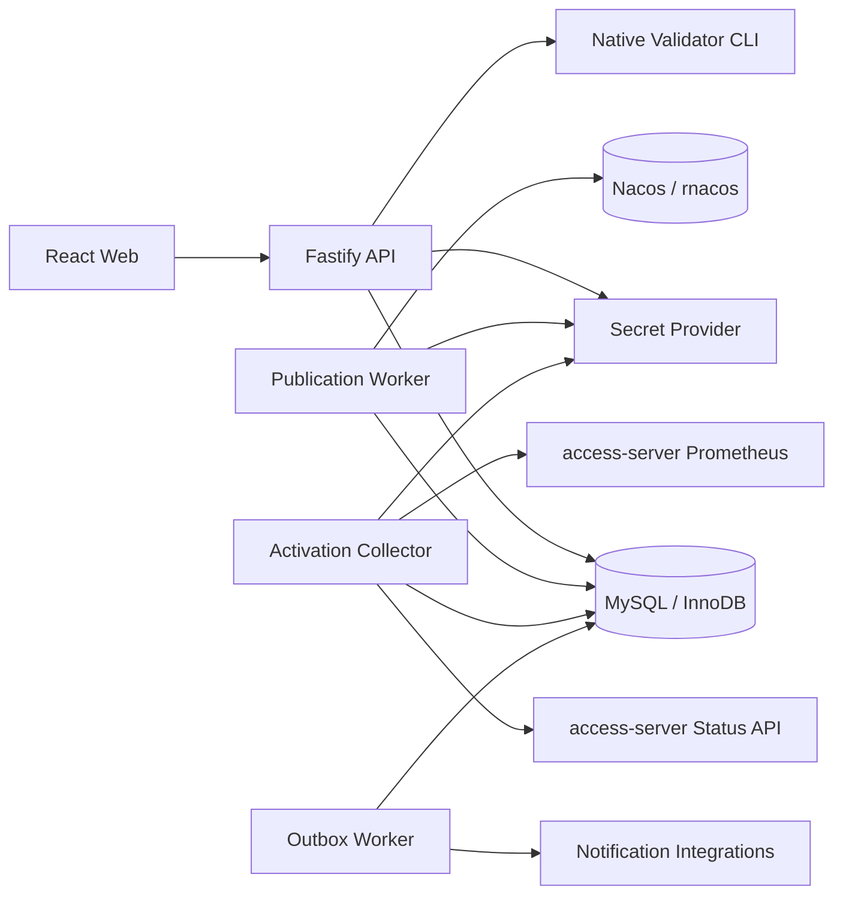
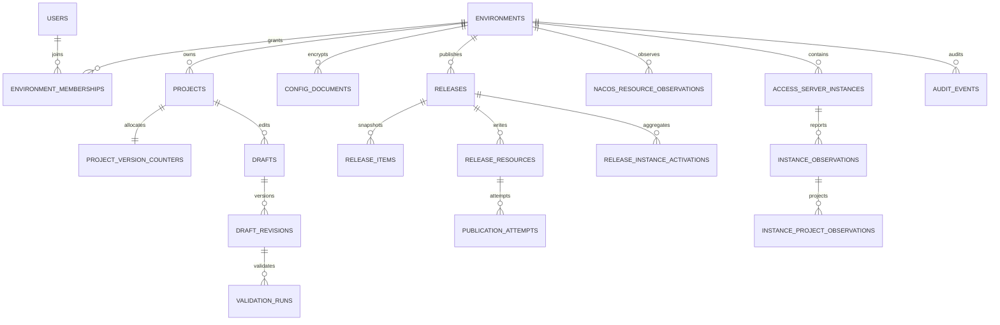

# Access Gateway Console 详细设计

- 状态：Draft v0.1
- 上游需求：[Access Gateway Console 产品需求文档](console-requirements.md)
- 技术范围：React Web、Fastify API、后台 Worker、MySQL、Nacos、Native Validator 和
  access-server 状态采集
- 数据库决定：MySQL 8.4 LTS 基线，InnoDB；不以 MariaDB 兼容为目标

## 1. 设计目标

本文把 Console 产品需求细化为可以分模块实现和测试的技术方案，重点解决：

- MySQL 中环境、项目、草稿、Release、发布证据、实例证据和审计数据的持久化；
- 数据库事务与 Nacos 外部写入无法形成分布式事务时的一致性和恢复；
- 项目 `version` 分配、乐观并发、幂等请求和同环境发布串行化；
- TypeScript 快速校验与 C++ Native Validator 权威校验的边界；
- Fastify API、后台发布 Worker、实例采集 Worker 和前端编辑器的模块接口；
- 配置内容、Nacos 凭据和审计信息的安全边界。

本文不实现具体页面视觉，不决定企业身份供应商，也不新增 access-server 业务流量能力。
所有“已激活”判断仍必须来自 access-server 明确提供的实例证据。

## 2. 核心设计决定

| 编号   | 决定                                                                | 原因                                                                  |
| ------ | ------------------------------------------------------------------- | --------------------------------------------------------------------- |
| DD-001 | MySQL 使用 InnoDB、UTC 和 `READ COMMITTED`                          | 需要 ACID、行锁、短事务和明确的最新行读取                             |
| DD-002 | API、发布 Worker、实例采集 Worker 分为独立进程                      | 外部 I/O、重试和轮询不能阻塞 API 生命周期                             |
| DD-003 | 使用 `mysql2/promise` 连接池和参数化 `execute`                      | 与当前 Node.js/TypeScript 技术栈直接集成，保持 SQL 显式可审查         |
| DD-004 | 不使用 ORM 自动同步 schema                                          | 迁移必须确定、可回滚评审，索引和锁语义必须显式                        |
| DD-005 | 配置正文和精确 Nacos payload 使用应用层信封加密后存入 BLOB          | route header/template 可能敏感，且精确 bytes 不能被 MySQL JSON 归一化 |
| DD-006 | Release 和 Release Resource 不可变；执行结果放在独立状态/attempt 行 | 保留完整审计和崩溃恢复证据                                            |
| DD-007 | 每个环境同一时间只允许一个 Release 写 Nacos                         | 防止两个发布计划交错导致 base 摘要失效                                |
| DD-008 | 后台任务用数据库队列、租约和 `FOR UPDATE SKIP LOCKED` 领取          | 支持多 Worker、崩溃恢复和无重复并发执行                               |
| DD-009 | 项目 version 在数据库事务中单调分配，允许出现空洞                   | 保证不复用；校验失败或取消不回收已分配 version                        |
| DD-010 | 网络调用不放在数据库事务中                                          | 避免长事务、锁等待和不确定外部延迟                                    |
| DD-011 | Native Validator 是发布前 fail-closed 依赖                          | C++ codec/compiled model 是最终事实来源                               |
| DD-012 | 激活证据和发布证据分别存储和聚合                                    | Nacos 回读不能证明实例已启用目标快照                                  |

## 3. 总体架构



### 3.1 进程职责

| 进程                   | 职责                                                  | 明确不做                                        |
| ---------------------- | ----------------------------------------------------- | ----------------------------------------------- |
| `console-api`          | HTTP schema、认证授权、草稿、校验、Release 创建、查询 | 不在请求协程中完成长时间发布或实例轮询          |
| `publication-worker`   | 领取发布任务、冲突检查、Nacos 写入/回读、状态聚合     | 不修改 Release payload，不代替 Native Validator |
| `activation-collector` | 轮询有界状态接口、保存证据、计算实例激活状态          | 不根据业务流量或 Prometheus 推导配置已激活      |
| `outbox-worker`        | 投递通知、审计导出等事务后副作用                      | 不作为业务事实的唯一存储                        |
| `migration`            | 串行执行带 checksum 的 SQL migration                  | 不和 API 自动并发修改 schema                    |

首期可以把 Worker 构建在同一个 `server` workspace 中，但部署时使用不同入口和进程。各进程
共享 domain、repository 和 integration 代码，不共享内存状态。

### 3.2 组件边界

- MySQL 是 Console 草稿、Release、执行证据和审计的事实来源，不是 access-server 的
  runtime 配置来源。
- Nacos 是 access-server 消费的已发布 wire payload 来源。
- Native Validator 只读 stdin、写 stdout，不连接 Nacos、MySQL、CAT 或公网。
- access-server 状态接口只提供有界、脱敏的版本证据；不允许 Console 读取进程内存。
- Secret Provider 解析凭据引用。业务表只保存 reference 和加密材料，不保存可回显明文。

## 4. Server 代码组织

目标结构：

```text
server/
├── migrations/
│   ├── 0001_identity_and_environments.sql
│   ├── 0002_projects_and_drafts.sql
│   ├── 0003_releases_and_publication.sql
│   ├── 0004_activation.sql
│   └── ...                         # schema_migrations 由 migration runner 建立
└── src/
    ├── app.ts
    ├── config/
    ├── database/
    │   ├── pool.ts
    │   ├── transaction.ts
    │   ├── migrate.ts
    │   └── errors.ts
    ├── crypto/
    ├── integrations/
    │   ├── nacos/
    │   ├── native-validator/
    │   ├── access-server-status/
    │   └── secrets/
    ├── modules/
    │   ├── auth/
    │   ├── environments/
    │   ├── projects/
    │   ├── drafts/
    │   ├── validation/
    │   ├── releases/
    │   ├── publication/
    │   ├── instances/
    │   └── audit/
    └── processes/
        ├── api.ts
        ├── publication-worker.ts
        ├── activation-collector.ts
        └── outbox-worker.ts
```

每个 `modules/<domain>/` 包含：

```text
routes.ts          Fastify route 和 schema
service.ts         权限后业务编排与事务边界
repository.ts      参数化 SQL；不调用 Nacos/Validator
model.ts           domain 类型与状态转换
errors.ts          稳定 machine-readable error
*.test.ts          领域和 route 测试
```

Fastify `buildApp()` 通过显式依赖参数接收 service/repository adapter。进程入口负责创建
MySQL pool、Secret Provider 和 integration client，并按相反顺序关闭；测试通过 fake 或
Fastify injection 构造应用，不打开生产连接。

## 5. MySQL 基线与连接规范

### 5.1 数据库能力基线

- MySQL 8.4 LTS，InnoDB；生产开启 crash recovery 和定期备份。
- 数据库、表默认 `CHARACTER SET utf8mb4 COLLATE utf8mb4_0900_bin`，避免项目名、Data ID
  和模板 key 被大小写不敏感 collation 合并。
- 所有业务时间使用 `DATETIME(6)`，连接建立后执行 `SET time_zone = '+00:00'`。
- 事务默认 `READ COMMITTED`；需要并发保护的行显式使用 `SELECT ... FOR UPDATE`。
- SQL mode 至少包含 `STRICT_TRANS_TABLES`、`NO_ZERO_DATE`、
  `ERROR_FOR_DIVISION_BY_ZERO` 和 `NO_ENGINE_SUBSTITUTION`。
- 使用 `ROW` binlog。`SKIP LOCKED` 只用于队列领取，不用于普通业务查询。
- 数据库 JSON 只存保护策略、脱敏摘要和稳定错误结构；精确配置 bytes 存加密 BLOB。

### 5.2 连接池

使用 `mysql2/promise`：

- API 和每类 Worker 使用独立 pool；不跨进程共享连接。
- `connectionLimit` 由部署配置给出，默认从较小值开始；总连接数必须按副本数计算。
- `waitForConnections=true`，设置有限 queue limit、connect timeout、idle timeout 和 TLS。
- 事务必须从 pool 获取单个 connection，在 `finally` 中 rollback/release。
- 普通 SQL 使用 `execute(sql, params)`；动态排序字段、表名和列名只能来自代码 allowlist。
- `BIGINT` 不转换为 JavaScript `number`。Repository 读取为 decimal string 或 `bigint`，
  API 只暴露 UUID public ID。

### 5.3 事务帮助函数

统一事务包装器：

```ts
export interface TransactionOptions {
  isolation?: 'READ COMMITTED'
  retryOnDeadlock?: boolean
}

export async function withTransaction<T>(
  pool: DatabasePool,
  operation: (transaction: DatabaseTransaction) => Promise<T>,
  options?: TransactionOptions,
): Promise<T>
```

只对满足以下条件的事务自动重试：

- MySQL 明确返回 deadlock 或可重试 lock timeout；
- operation 没有执行数据库外副作用；
- operation 使用稳定 idempotency input；
- 最多进行有限次数带抖动退避的完整事务重试。

Nacos、Validator、Secret Provider 和状态接口调用都不能放入可自动重试的数据库事务。

### 5.4 运行配置

在 `server/src/config/` 集中解析，禁止模块直接读取 `process.env`。至少支持：

- MySQL host、port、database、user、password secret/file、TLS CA/cert/key；
- pool connection/max-idle/queue limit、connect/query/transaction timeout；
- process role：API、publication、activation、outbox 或 migration；
- document KEK provider/key ID、Native Validator 绝对路径和 contract version；
- Worker lease/heartbeat、poll interval、并发和 retry 上限；
- session signing/encryption secret reference 和 trusted proxy/origin allowlist。

配置解析失败使进程启动失败。日志只输出非秘密的生效配置摘要；API/Worker 不自动执行
migration，也不接受在 URL query 中携带数据库密码。

## 6. 标识、摘要与加密

### 6.1 标识

- 表内部主键为 `BIGINT UNSIGNED AUTO_INCREMENT`，用于紧凑外键和聚簇索引。
- 对外实体同时包含应用生成的 RFC 4122 UUID `public_id BINARY(16)`，API 使用标准 UUID
  string。
- `BIGINT` 内部 ID 不进入 URL、审计 summary 或前端类型。
- environment `code` 是不可变、大小写敏感的 ASCII 字符串；显示名称可修改。

### 6.2 摘要

- `sha256 BINARY(32)`：Console 对精确 plaintext bytes 计算，用于 diff、回读和幂等判断。
- `nacos_md5 BINARY(16)`：保存 Nacos 返回的 MD5 证据；不能代替 SHA-256 或安全校验。
- API 使用小写 hex 编码摘要。
- 摘要输入必须是实际写入的 bytes，不能对 parse/stringify 后的 JSON 再计算。

### 6.3 配置文档加密

`config_documents` 保存草稿结构、导入原文和 Release payload：

1. 每个文档生成随机 256-bit DEK；
2. 使用 AES-256-GCM 加密 plaintext，随机 96-bit nonce；
3. 使用外部 KMS/Secret Provider 的 KEK 包装 DEK；
4. MySQL 保存 ciphertext、nonce、auth tag、wrapped DEK、key ID、plaintext SHA-256 和长度；
5. 解密仅发生在授权 service/worker 内存中，plaintext 不进入日志或 error object。

开发环境可以使用环境变量提供的本地 KEK，生产 KEK 不能保存在同一 MySQL 中。密钥轮换
通过新 key ID 写新文档、后台重包 DEK 完成，不修改 Release 的 plaintext 摘要。

## 7. 数据模型

### 7.1 关系概览



### 7.2 表清单

| 领域        | 表                                                                                                                  | 用途                                      |
| ----------- | ------------------------------------------------------------------------------------------------------------------- | ----------------------------------------- |
| migration   | `schema_migrations`                                                                                                 | migration version、checksum 和执行时间    |
| identity    | `users`, `user_sessions`                                                                                            | 身份映射和安全会话                        |
| environment | `environments`, `environment_memberships`, `secret_references`                                                      | 环境、RBAC 和 secret locator              |
| document    | `config_documents`                                                                                                  | 加密的结构化模型、导入原文和 wire payload |
| project     | `projects`, `project_version_counters`                                                                              | 稳定项目身份和单调 version                |
| draft       | `drafts`, `draft_revisions`, `validation_runs`                                                                      | 可编辑头和不可变 revision/校验证据        |
| nacos       | `nacos_resource_observations`                                                                                       | 每次读取的精确资源证据                    |
| release     | `releases`, `release_items`, `release_resources`, `release_resource_dependencies`, `release_approvals`              | 不可变计划和资源图                        |
| publication | `publication_jobs`, `publication_attempts`, `environment_publish_leases`                                            | 后台执行、重试和同环境互斥                |
| activation  | `access_server_instances`, `instance_observations`, `instance_project_observations`, `release_instance_activations` | 实例证据和聚合                            |
| support     | `audit_events`, `outbox_events`, `api_idempotency_records`                                                          | 审计、通知和 HTTP 幂等                    |

### 7.3 关键字段约定

所有可修改的头表包含：

- `lock_version BIGINT UNSIGNED NOT NULL DEFAULT 0`：乐观锁；
- `created_at DATETIME(6)`、`updated_at DATETIME(6)`：UTC；
- `created_by`/`updated_by`：可为空以表示系统 worker；
- archive 使用明确 `archived_at`，不对历史事实做软删除伪装。

所有状态使用小写 snake_case 的 `VARCHAR`，TypeScript 定义封闭 union 并在 service 层校验
状态转换。避免 MySQL `ENUM` 让每次增加状态都必须重建列。

### 7.4 核心 DDL 契约

以下 DDL 表达 schema 契约。实际实现按 migration 拆分，并为所有 foreign key/index 使用
稳定名称。

```sql
CREATE TABLE schema_migrations (
    version VARCHAR(64) CHARACTER SET ascii COLLATE ascii_bin PRIMARY KEY,
    checksum BINARY(32) NOT NULL,
    applied_at DATETIME(6) NOT NULL DEFAULT CURRENT_TIMESTAMP(6)
) ENGINE = InnoDB;

CREATE TABLE users (
    id BIGINT UNSIGNED NOT NULL AUTO_INCREMENT PRIMARY KEY,
    public_id BINARY(16) NOT NULL,
    subject VARCHAR(255) NOT NULL,
    display_name VARCHAR(255) NOT NULL,
    email VARCHAR(320) NULL,
    status VARCHAR(32) NOT NULL,
    is_platform_admin BOOLEAN NOT NULL DEFAULT FALSE,
    created_at DATETIME(6) NOT NULL DEFAULT CURRENT_TIMESTAMP(6),
    updated_at DATETIME(6) NOT NULL DEFAULT CURRENT_TIMESTAMP(6),
    UNIQUE KEY uk_users_public_id (public_id),
    UNIQUE KEY uk_users_subject (subject)
) ENGINE = InnoDB DEFAULT CHARACTER SET utf8mb4 COLLATE utf8mb4_0900_bin;

CREATE TABLE secret_references (
    id BIGINT UNSIGNED NOT NULL AUTO_INCREMENT PRIMARY KEY,
    public_id BINARY(16) NOT NULL,
    provider VARCHAR(32) NOT NULL,
    locator VARCHAR(1024) NOT NULL,
    display_name VARCHAR(255) NOT NULL,
    metadata_json JSON NULL,
    created_by BIGINT UNSIGNED NULL,
    created_at DATETIME(6) NOT NULL DEFAULT CURRENT_TIMESTAMP(6),
    rotated_at DATETIME(6) NULL,
    UNIQUE KEY uk_secret_references_public_id (public_id),
    CONSTRAINT fk_secret_references_created_by
        FOREIGN KEY (created_by) REFERENCES users (id)
) ENGINE = InnoDB DEFAULT CHARACTER SET utf8mb4 COLLATE utf8mb4_0900_bin;

CREATE TABLE environments (
    id BIGINT UNSIGNED NOT NULL AUTO_INCREMENT PRIMARY KEY,
    public_id BINARY(16) NOT NULL,
    code VARCHAR(64) CHARACTER SET ascii COLLATE ascii_bin NOT NULL,
    name VARCHAR(255) NOT NULL,
    tier VARCHAR(32) NOT NULL,
    status VARCHAR(32) NOT NULL,
    nacos_endpoint VARCHAR(2048) NOT NULL,
    nacos_namespace VARCHAR(255) NOT NULL,
    nacos_tenant VARCHAR(255) NOT NULL,
    nacos_secret_ref_id BIGINT UNSIGNED NULL,
    projects_data_id VARCHAR(512) NOT NULL,
    route_data_id_prefix VARCHAR(512) NOT NULL,
    route_group VARCHAR(255) NOT NULL,
    gray_data_id VARCHAR(512) NOT NULL,
    gray_group VARCHAR(255) NOT NULL,
    naming_group VARCHAR(255) NOT NULL,
    zone VARCHAR(255) NOT NULL,
    protection_policy JSON NOT NULL,
    last_release_sequence BIGINT UNSIGNED NOT NULL DEFAULT 0,
    lock_version BIGINT UNSIGNED NOT NULL DEFAULT 0,
    created_by BIGINT UNSIGNED NOT NULL,
    updated_by BIGINT UNSIGNED NOT NULL,
    created_at DATETIME(6) NOT NULL DEFAULT CURRENT_TIMESTAMP(6),
    updated_at DATETIME(6) NOT NULL DEFAULT CURRENT_TIMESTAMP(6),
    UNIQUE KEY uk_environments_public_id (public_id),
    UNIQUE KEY uk_environments_code (code),
    CONSTRAINT fk_environments_nacos_secret
        FOREIGN KEY (nacos_secret_ref_id) REFERENCES secret_references (id),
    CONSTRAINT fk_environments_created_by FOREIGN KEY (created_by) REFERENCES users (id),
    CONSTRAINT fk_environments_updated_by FOREIGN KEY (updated_by) REFERENCES users (id)
) ENGINE = InnoDB DEFAULT CHARACTER SET utf8mb4 COLLATE utf8mb4_0900_bin;

CREATE TABLE environment_memberships (
    environment_id BIGINT UNSIGNED NOT NULL,
    user_id BIGINT UNSIGNED NOT NULL,
    role VARCHAR(32) NOT NULL,
    created_by BIGINT UNSIGNED NOT NULL,
    created_at DATETIME(6) NOT NULL DEFAULT CURRENT_TIMESTAMP(6),
    PRIMARY KEY (environment_id, user_id),
    KEY ix_environment_memberships_user (user_id, environment_id),
    CONSTRAINT fk_memberships_environment
        FOREIGN KEY (environment_id) REFERENCES environments (id),
    CONSTRAINT fk_memberships_user FOREIGN KEY (user_id) REFERENCES users (id),
    CONSTRAINT fk_memberships_created_by FOREIGN KEY (created_by) REFERENCES users (id)
) ENGINE = InnoDB;

CREATE TABLE config_documents (
    id BIGINT UNSIGNED NOT NULL AUTO_INCREMENT PRIMARY KEY,
    public_id BINARY(16) NOT NULL,
    environment_id BIGINT UNSIGNED NOT NULL,
    purpose VARCHAR(32) NOT NULL,
    content_type VARCHAR(128) NOT NULL,
    schema_version INT UNSIGNED NULL,
    plaintext_sha256 BINARY(32) NOT NULL,
    plaintext_size BIGINT UNSIGNED NOT NULL,
    key_id VARCHAR(255) NOT NULL,
    wrapped_dek VARBINARY(1024) NOT NULL,
    nonce BINARY(12) NOT NULL,
    auth_tag BINARY(16) NOT NULL,
    ciphertext LONGBLOB NOT NULL,
    created_at DATETIME(6) NOT NULL DEFAULT CURRENT_TIMESTAMP(6),
    UNIQUE KEY uk_config_documents_public_id (public_id),
    KEY ix_config_documents_digest (environment_id, plaintext_sha256),
    CONSTRAINT fk_config_documents_environment
        FOREIGN KEY (environment_id) REFERENCES environments (id)
) ENGINE = InnoDB;

CREATE TABLE projects (
    id BIGINT UNSIGNED NOT NULL AUTO_INCREMENT PRIMARY KEY,
    public_id BINARY(16) NOT NULL,
    environment_id BIGINT UNSIGNED NOT NULL,
    name VARCHAR(255) NOT NULL,
    status VARCHAR(32) NOT NULL,
    lock_version BIGINT UNSIGNED NOT NULL DEFAULT 0,
    created_by BIGINT UNSIGNED NOT NULL,
    created_at DATETIME(6) NOT NULL DEFAULT CURRENT_TIMESTAMP(6),
    updated_at DATETIME(6) NOT NULL DEFAULT CURRENT_TIMESTAMP(6),
    archived_at DATETIME(6) NULL,
    UNIQUE KEY uk_projects_public_id (public_id),
    UNIQUE KEY uk_projects_environment_name (environment_id, name),
    KEY ix_projects_environment_status (environment_id, status, name),
    CONSTRAINT fk_projects_environment FOREIGN KEY (environment_id) REFERENCES environments (id),
    CONSTRAINT fk_projects_created_by FOREIGN KEY (created_by) REFERENCES users (id)
) ENGINE = InnoDB DEFAULT CHARACTER SET utf8mb4 COLLATE utf8mb4_0900_bin;

CREATE TABLE project_version_counters (
    project_id BIGINT UNSIGNED NOT NULL PRIMARY KEY,
    last_allocated_version INT NOT NULL DEFAULT 0,
    updated_at DATETIME(6) NOT NULL DEFAULT CURRENT_TIMESTAMP(6),
    CONSTRAINT fk_project_version_counters_project
        FOREIGN KEY (project_id) REFERENCES projects (id),
    CONSTRAINT ck_project_version_nonnegative CHECK (last_allocated_version >= 0)
) ENGINE = InnoDB;

CREATE TABLE drafts (
    id BIGINT UNSIGNED NOT NULL AUTO_INCREMENT PRIMARY KEY,
    public_id BINARY(16) NOT NULL,
    environment_id BIGINT UNSIGNED NOT NULL,
    project_id BIGINT UNSIGNED NULL,
    scope_key VARCHAR(320) NOT NULL,
    kind VARCHAR(32) NOT NULL,
    state VARCHAR(32) NOT NULL,
    title VARCHAR(255) NOT NULL,
    current_revision_no INT UNSIGNED NOT NULL DEFAULT 0,
    lock_version BIGINT UNSIGNED NOT NULL DEFAULT 0,
    created_by BIGINT UNSIGNED NOT NULL,
    updated_by BIGINT UNSIGNED NOT NULL,
    created_at DATETIME(6) NOT NULL DEFAULT CURRENT_TIMESTAMP(6),
    updated_at DATETIME(6) NOT NULL DEFAULT CURRENT_TIMESTAMP(6),
    archived_at DATETIME(6) NULL,
    UNIQUE KEY uk_drafts_public_id (public_id),
    UNIQUE KEY uk_drafts_environment_scope (environment_id, scope_key),
    KEY ix_drafts_environment_state (environment_id, state, updated_at),
    CONSTRAINT fk_drafts_environment FOREIGN KEY (environment_id) REFERENCES environments (id),
    CONSTRAINT fk_drafts_project FOREIGN KEY (project_id) REFERENCES projects (id),
    CONSTRAINT fk_drafts_created_by FOREIGN KEY (created_by) REFERENCES users (id),
    CONSTRAINT fk_drafts_updated_by FOREIGN KEY (updated_by) REFERENCES users (id)
) ENGINE = InnoDB DEFAULT CHARACTER SET utf8mb4 COLLATE utf8mb4_0900_bin;

CREATE TABLE draft_revisions (
    id BIGINT UNSIGNED NOT NULL AUTO_INCREMENT PRIMARY KEY,
    public_id BINARY(16) NOT NULL,
    draft_id BIGINT UNSIGNED NOT NULL,
    revision_no INT UNSIGNED NOT NULL,
    parent_revision_id BIGINT UNSIGNED NULL,
    model_document_id BIGINT UNSIGNED NOT NULL,
    source_document_id BIGINT UNSIGNED NULL,
    base_nacos_observation_id BIGINT UNSIGNED NULL,
    validation_state VARCHAR(32) NOT NULL,
    change_summary VARCHAR(1024) NOT NULL,
    created_by BIGINT UNSIGNED NOT NULL,
    created_at DATETIME(6) NOT NULL DEFAULT CURRENT_TIMESTAMP(6),
    UNIQUE KEY uk_draft_revisions_public_id (public_id),
    UNIQUE KEY uk_draft_revisions_number (draft_id, revision_no),
    CONSTRAINT fk_draft_revisions_draft FOREIGN KEY (draft_id) REFERENCES drafts (id),
    CONSTRAINT fk_draft_revisions_parent FOREIGN KEY (parent_revision_id) REFERENCES draft_revisions (id),
    CONSTRAINT fk_draft_revisions_model FOREIGN KEY (model_document_id) REFERENCES config_documents (id),
    CONSTRAINT fk_draft_revisions_source FOREIGN KEY (source_document_id) REFERENCES config_documents (id),
    CONSTRAINT fk_draft_revisions_created_by FOREIGN KEY (created_by) REFERENCES users (id)
) ENGINE = InnoDB;

CREATE TABLE releases (
    id BIGINT UNSIGNED NOT NULL AUTO_INCREMENT PRIMARY KEY,
    public_id BINARY(16) NOT NULL,
    environment_id BIGINT UNSIGNED NOT NULL,
    sequence_no BIGINT UNSIGNED NOT NULL,
    kind VARCHAR(32) NOT NULL,
    status VARCHAR(32) NOT NULL,
    title VARCHAR(255) NOT NULL,
    description TEXT NOT NULL,
    rollback_of_release_id BIGINT UNSIGNED NULL,
    native_validator_contract INT UNSIGNED NOT NULL,
    native_validator_revision VARCHAR(64) NOT NULL,
    lock_version BIGINT UNSIGNED NOT NULL DEFAULT 0,
    created_by BIGINT UNSIGNED NOT NULL,
    created_at DATETIME(6) NOT NULL DEFAULT CURRENT_TIMESTAMP(6),
    ready_at DATETIME(6) NULL,
    publish_started_at DATETIME(6) NULL,
    published_at DATETIME(6) NULL,
    UNIQUE KEY uk_releases_public_id (public_id),
    UNIQUE KEY uk_releases_sequence (environment_id, sequence_no),
    KEY ix_releases_environment_status (environment_id, status, created_at),
    CONSTRAINT fk_releases_environment FOREIGN KEY (environment_id) REFERENCES environments (id),
    CONSTRAINT fk_releases_rollback FOREIGN KEY (rollback_of_release_id) REFERENCES releases (id),
    CONSTRAINT fk_releases_created_by FOREIGN KEY (created_by) REFERENCES users (id)
) ENGINE = InnoDB DEFAULT CHARACTER SET utf8mb4 COLLATE utf8mb4_0900_bin;

CREATE TABLE release_resources (
    id BIGINT UNSIGNED NOT NULL AUTO_INCREMENT PRIMARY KEY,
    public_id BINARY(16) NOT NULL,
    release_id BIGINT UNSIGNED NOT NULL,
    project_id BIGINT UNSIGNED NULL,
    kind VARCHAR(32) NOT NULL,
    data_id VARCHAR(512) CHARACTER SET ascii COLLATE ascii_bin NOT NULL,
    group_name VARCHAR(255) CHARACTER SET ascii COLLATE ascii_bin NOT NULL,
    operation VARCHAR(16) NOT NULL,
    publish_order INT UNSIGNED NOT NULL,
    required_resource BOOLEAN NOT NULL DEFAULT TRUE,
    payload_document_id BIGINT UNSIGNED NULL,
    base_observation_id BIGINT UNSIGNED NULL,
    target_sha256 BINARY(32) NULL,
    allocated_project_version INT NULL,
    status VARCHAR(32) NOT NULL,
    verified_nacos_md5 BINARY(16) NULL,
    verified_sha256 BINARY(32) NULL,
    verified_at DATETIME(6) NULL,
    lock_version BIGINT UNSIGNED NOT NULL DEFAULT 0,
    UNIQUE KEY uk_release_resources_public_id (public_id),
    UNIQUE KEY uk_release_resources_data_id (release_id, data_id, group_name),
    KEY ix_release_resources_execution (release_id, status, publish_order),
    CONSTRAINT fk_release_resources_release FOREIGN KEY (release_id) REFERENCES releases (id),
    CONSTRAINT fk_release_resources_project FOREIGN KEY (project_id) REFERENCES projects (id),
    CONSTRAINT fk_release_resources_payload FOREIGN KEY (payload_document_id) REFERENCES config_documents (id)
) ENGINE = InnoDB DEFAULT CHARACTER SET utf8mb4 COLLATE utf8mb4_0900_bin;

CREATE TABLE publication_attempts (
    id BIGINT UNSIGNED NOT NULL AUTO_INCREMENT PRIMARY KEY,
    public_id BINARY(16) NOT NULL,
    release_resource_id BIGINT UNSIGNED NOT NULL,
    attempt_no INT UNSIGNED NOT NULL,
    idempotency_key VARCHAR(128) CHARACTER SET ascii COLLATE ascii_bin NOT NULL,
    result VARCHAR(32) NOT NULL,
    before_exists BOOLEAN NULL,
    before_nacos_md5 BINARY(16) NULL,
    before_sha256 BINARY(32) NULL,
    after_nacos_md5 BINARY(16) NULL,
    after_sha256 BINARY(32) NULL,
    error_code VARCHAR(64) NULL,
    error_detail_json JSON NULL,
    started_at DATETIME(6) NOT NULL,
    finished_at DATETIME(6) NULL,
    UNIQUE KEY uk_publication_attempts_public_id (public_id),
    UNIQUE KEY uk_publication_attempts_number (release_resource_id, attempt_no),
    UNIQUE KEY uk_publication_attempts_idempotency (idempotency_key),
    CONSTRAINT fk_publication_attempts_resource
        FOREIGN KEY (release_resource_id) REFERENCES release_resources (id)
) ENGINE = InnoDB DEFAULT CHARACTER SET utf8mb4 COLLATE utf8mb4_0900_bin;
```

`draft_revisions.base_nacos_observation_id` 和 `release_resources.base_observation_id` 的 foreign
key 在创建 `nacos_resource_observations` 后补充，避免 migration 的建表顺序形成循环。

### 7.5 其余表字段

#### `validation_runs`

- `draft_revision_id`、`model_sha256`；
- `stage`：`control_plane` 或 `native`；
- `status`：`running`、`passed`、`failed`、`unavailable`、`canceled`；
- `validator_contract_version`、`validator_revision`；
- `errors_json`：只保存脱敏后的 `code/field/offset/message`；
- `started_at`、`finished_at`。

相同 revision 和 model digest 的成功结果可复用，但创建 Release 时仍需对最终已分配 version
的精确 wire payload 再运行 native validation。

#### `nacos_resource_observations`

- environment、Data ID、group、`exists`；
- encrypted `payload_document_id`；
- `nacos_md5`、`sha256`、`fetched_at`；
- `source`：import、preflight、before_write、readback、recovery；
- 脱敏的 client/error code。

该表 append-only。查询“当前值”使用 `(environment_id, data_id, group_name, fetched_at, id)`
索引取最新 observation，不原地覆盖历史证据。

#### `release_items`

- release、kind、project、draft revision；
- normalized model document；
- assigned project version；
- change kind 和脱敏 diff summary。

#### `release_resource_dependencies`

复合主键 `(resource_id, depends_on_resource_id)`。新增项目的 project-list resource 依赖对应
route resource verified；移除 route 的可选清理依赖 project-list verified。插入时检查同一
Release 且无环。

#### `release_approvals`

包含 release、actor、decision、comment、created_at；同一用户对同一 release 只保留一个
最终 decision，但历史 decision 通过审计事件保留。发布策略在执行时重新计算，不仅依赖
缓存 approval count。

#### `publication_jobs`

- release 唯一；
- state、requested_by、requested_at；
- lease owner/token/expires、heartbeat；
- cancel_requested、last_error、next_run_at、attempt_count。

领取索引为 `(state, next_run_at, lease_expires_at, id)`。Worker 在短事务内使用
`FOR UPDATE SKIP LOCKED` 领取，提交后才执行外部 I/O。

#### `environment_publish_leases`

environment 为主键，保存 release、job、lease token、owner 和 expires。Worker 必须同时
持有 job lease 与 environment lease 才能写 Nacos；续租失败立即停止新的写入，并在当前
外部调用返回后进入恢复读取。

#### 激活表

- `access_server_instances`：environment、稳定 instance key、status endpoint、secret ref、
  source、enabled、poll interval、last seen；
- `instance_observations`：instance、build/revision、runtime/watcher state、project-list MD5、
  gray MD5/rule count、observed_at、expires_at、poll result；
- `instance_project_observations`：observation、project name、version、MD5、status 和脱敏的
  `AccessConfigError`；
- `release_instance_activations`：release、instance、status、supporting observation、
  evaluated_at、expires_at。

实例 observation append-only，按环境策略保留详细数据；聚合行可重建。过期 observation
不能支持 `active`。

#### 支撑表

- `audit_events`：append-only，包含 environment、actor、event type、target type/public ID、
  request ID、result、脱敏 summary JSON、created_at；
- `outbox_events`：topic、dedupe key、payload JSON、state、attempt、next run、lease；
- `api_idempotency_records`：actor、environment、operation、key、request hash、response status、
  encrypted response document、expires_at。

审计写入与产生业务事实的数据库事务同提交。Runtime 数据库账号对 `audit_events` 不授予
UPDATE/DELETE；归档由独立受控账号执行。

## 8. 状态机与并发控制

### 8.1 Draft

状态：`editing -> validating -> ready`，任何内容变更产生新 revision 并回到 `editing`。

保存流程：

1. API 验证 `If-Match`/`lockVersion` 和权限；
2. 在事务外完成 schema parse、摘要和配置文档加密；
3. 事务中 `SELECT drafts ... FOR UPDATE`；
4. 再次比较 `lock_version`，冲突返回 409；
5. 插入 `config_documents`、`draft_revisions`，递增 current revision 和 lock version；
6. 插入 audit/outbox；
7. 提交后返回新 ETag。

同一 base revision 的第二个保存请求不会静默覆盖第一个。客户端必须重新加载并显式合并。

### 8.2 项目 version 分配

每个项目使用 `project_version_counters`：

```text
last_allocated = max(database counter, latest imported/published version)
target = last_allocated + 1
```

在一个事务中按 project ID 升序锁定所有 counter，避免多项目 Release 产生死锁。分配前检查
target 不超过 Java/C++ signed int32 最大值。Version 一旦写入 Release 即不回收；失败产生
空洞没有运行语义问题，复用 version 会被 runtime 忽略，因此严禁复用。

外部系统可能在分配后发布更高 version。发布前 base 摘要冲突会阻止覆盖；重新导入后 bump
counter，再创建新 Release。

### 8.3 Release

允许的主要转换：

```text
creating -> validating -> ready -> queued -> publishing
validating -> validation_failed
publishing -> published
publishing -> partially_published
publishing -> publish_failed
ready/queued -> canceled
published -> superseded
```

- Release 元数据和资源图在进入 `ready` 后不可修改。
- 状态转换 SQL 必须带预期旧状态与 lock version；受影响行数不是 1 时报告并发冲突。
- `published` 仅由所有 required resource `verified` 聚合得到。
- 任意 required resource 已改变目标环境但整体未完成时为 `partially_published`，不能降级成
  `publish_failed` 掩盖影响。

### 8.4 Release 创建

1. API 收集 draft revision，读取 Nacos 基线并写 observation；
2. 控制面校验在事务外完成；
3. 事务中锁 environment 行、递增 `last_release_sequence`，再锁 project version counter；
4. 分配 release sequence/project version，插入 `creating` Release 和 item；
5. 提交后渲染精确 payload，计算摘要并调用 Native Validator；
6. 校验失败时保存 validation result，Release 转 `validation_failed`；
7. 校验成功时事务插入加密 payload、resource 和 dependency，Release 转 `ready`；
8. 写 audit/outbox。

进程在步骤 4 后崩溃会留下 `creating` Release。Recovery job 将其转为 `abandoned`，或根据
完整 item 重新执行步骤 5；不会回收 version。

### 8.5 Rollback

Rollback API 不复制旧 resource 的 version bytes直接发布：

1. 解密历史 Release 的 normalized model；
2. 建立新的 draft revision，base 指向当前 Nacos observation；
3. 重新分配高于当前值的 project version；
4. 使用当前 validator contract 重新校验；
5. 创建 `kind=rollback` 且 `rollback_of_release_id` 指向历史 Release 的新 Release。

如果当前 native validator 已不接受历史内容，rollback 创建失败并明确报告，不绕过校验。

## 9. Native Validator 设计

### 9.1 进程协议

API/Worker 使用 `child_process.spawn` 的 argv array 启动固定路径二进制，不使用 shell，也不把
payload 放入命令行或临时文件。stdin/stdout 使用一行版本化 JSON，payload 采用 base64：

```json
{
  "contractVersion": 1,
  "requestId": "uuid",
  "kind": "project_route",
  "project": "example",
  "payloadBase64": "..."
}
```

成功：

```json
{
  "contractVersion": 1,
  "valid": true,
  "normalized": {
    "projectVersion": 12,
    "hostCount": 2,
    "routeCount": 8
  },
  "errors": []
}
```

失败：

```json
{
  "contractVersion": 1,
  "valid": false,
  "errors": [
    {
      "code": "invalid_field",
      "field": "routes[3].condition",
      "offset": 128,
      "message": "expression compilation failed"
    }
  ]
}
```

### 9.2 运行约束

- 单次输入、输出和 stderr 设置 byte 上限；超限终止并返回 validator protocol error。
- 设置 deadline、最大并发和子进程退出清理；请求取消时终止对应子进程。
- 只接受已配置的 contract version，并记录二进制 revision。
- stderr 仅作为受控诊断，不直接写应用日志；必须先去除 payload 和业务值。
- unavailable、timeout、crash、malformed output 均 fail closed。
- validation cache key 为 validator revision + contract + kind + project + payload SHA-256。

Gray payload 使用同一协议的 `kind=gray_rules`。项目列表由 Console 自身确定性序列化并进行
项目名/重复项校验，不通过 Native Validator 推测 route 是否已存在。

## 10. Nacos Adapter 与发布算法

### 10.1 Adapter

```ts
export interface NacosResourceRevision {
  exists: boolean
  payload: Uint8Array | null
  nacosMd5: string | null
  sha256: string | null
}

export interface NacosConfigAdapter {
  get(resource: ResourceKey, signal: AbortSignal): Promise<NacosResourceRevision>
  publish(resource: ResourceKey, payload: Uint8Array, signal: AbortSignal): Promise<void>
  remove(resource: ResourceKey, signal: AbortSignal): Promise<void>
  testConnection(signal: AbortSignal): Promise<ConnectionTestResult>
}
```

- Adapter 只允许访问 Environment 声明的项目/route/gray Data ID pattern。
- 每次调用解析 secret reference，设置 deadline、响应大小上限和无代理策略。
- 日志只包含 environment public ID、resource kind、Data ID 摘要、attempt 和结果，不包含
  payload、密码或 token。
- `remove` 只用于明确的 route cleanup，不能用 publish empty string 模拟删除。

### 10.2 Worker 领取

1. 短事务查询到期 job：`SELECT ... FOR UPDATE SKIP LOCKED LIMIT 1`；
2. 写 lease token/owner/expires 并提交；
3. 领取 environment publish lease；已有未过期 lease 时释放 job 等待；
4. 在执行期间有限频率续租；
5. 所有状态更新都校验 lease token，旧 Worker 不能覆盖新 Worker 的恢复结果。

### 10.3 单资源执行

对于 `upsert`：

1. 创建 `publication_attempts(result=running)`；
2. 从 Nacos 读取 before 并保存 observation；
3. 若 before SHA 等于 target SHA，说明可能是崩溃恢复或人工等价写入，直接进入回读验证；
4. 若从未成功写入且 before 不等于 Release base，标记 `conflict`，不覆盖；
5. 若重试时 before 既不是 base 也不是 target，标记 `conflict_after_partial`；
6. 调用 publish；
7. 再次 get，逐 byte/SHA 比较 target；
8. 一致则事务标记 resource `verified`、attempt success 并写 audit；
9. 不一致则标记 `readback_mismatch`，保存实际摘要但不记录 plaintext。

对于 `delete`：before 不存在视为幂等成功；存在时必须匹配 base，删除后回读必须为不存在。

Nacos read-before-write 不是跨客户端原子 CAS。Worker 始终回读并保留第三方竞争写入风险；若
部署使用的 Nacos API 提供可靠 CAS，adapter 可增加 capability，但不能删除现有冲突和回读
证据。

### 10.4 依赖和失败策略

- 只有全部 dependency verified 的 resource 才能执行。
- 新项目 route verified 后才能写包含该项目的 project list。
- 移除项目时 project list verified 后才允许可选 route cleanup。
- independent resource 可以在其他分支失败后继续；依赖失败的 resource 标记 blocked。
- 默认不自动反向写回已 verified resource，因为补偿写同样不是事务。系统建议用户重试或
  从明确基线创建恢复 Release。

### 10.5 崩溃窗口

| 崩溃位置                                  | 恢复行为                                                    |
| ----------------------------------------- | ----------------------------------------------------------- |
| 写 Nacos 前                               | lease 过期后重新读取 base，再决定写入                       |
| Nacos 写成功、DB 未记录                   | before 已等于 target，回读一致后补记 verified，不重复盲写   |
| DB 已记 resource verified、Release 未聚合 | recovery 重新聚合所有 resource 状态                         |
| 部分项目完成                              | 保持 partially published，按 dependency 和实际 Nacos 值恢复 |
| Worker 失去 environment lease             | 停止新写入；新 owner 从 Nacos 事实恢复                      |

## 11. 激活证据采集

### 11.1 采集流程

1. Collector 使用数据库队列选择到期实例，领取短 lease；
2. 解析状态端点 secret，设置 mTLS/token、deadline 和响应大小上限；
3. 验证 contract version、instance ID 稳定性和数据上限；
4. 事务插入 instance/project observations；
5. 对最近 Published Release 重新计算实例激活状态；
6. 写 outbox 通知状态变化。

采集失败只产生 `unreachable`/`unknown` 证据，不改变 Nacos 或 Release 发布状态。

### 11.2 激活判定

| 状态          | 条件                                                           |
| ------------- | -------------------------------------------------------------- |
| `unknown`     | 未配置端点、从未取得有效证据或 contract 不兼容                 |
| `pending`     | 有未过期证据，实例仍明确报告较旧 version，且无目标配置拒绝错误 |
| `active`      | 项目 version 和 MD5/SHA 与 Release verified resource 一致      |
| `rejected`    | 实例报告目标 resource 的解析/编译失败，并仍 pin 旧 version     |
| `stale`       | 最后一份支持证据已过期                                         |
| `unreachable` | 轮询失败且环境策略已超过失败阈值                               |

Release 创建时快照一份 activation target policy：目标实例集合、`all`/quorum/percentage 规则
和 evidence TTL。后加入实例显示在环境运行页，不追溯改变历史 Release 的“当时目标集合”；
可以另行展示当前全部实例一致性。

### 11.3 Prometheus

Metrics adapter 只抓取固定指标：requests result、duration 和 inflight。抓取结果用于当前
运行概览，可以存短期 rollup 或直接接入现有监控系统；不写入激活表，不增加动态项目 label。

## 12. API 详细设计

### 12.1 通用约定

- 基础路径 `/api`，JSON 使用 UTF-8；上传原始 payload 设置明确大小上限。
- public ID 使用 UUID string；时间使用 RFC 3339 UTC；摘要使用 lowercase hex。
- 列表按稳定 `(sort_column, public_id)` 游标分页，默认和最大 page size 固定。
- 可修改资源返回 `ETag`，更新要求 `If-Match`；冲突返回 409。
- 创建 Release、publish、retry、rollback 要求 `Idempotency-Key`；同 key 不同 request hash
  返回 409。
- 结构错误返回 400，认证 401，授权 403，不存在 404，并发/外部冲突 409，语义或 native
  validation 失败 422，异步任务接受 202，依赖不可用 503。
- Error 保持稳定 `code/message/requestId/fields`，不回显 SQL、secret 或 raw payload。

### 12.2 Environment API

当前部署模型固定为一个工作区：`environments` 表继续作为权限、审计和发布外键的隔离根，
但产品 API 以 `GET /api/workspace` 返回唯一记录。`POST /api/environments` 仅供首次部署
bootstrap 使用，并在已有记录时拒绝创建第二个环境。

| Method | Path                                     | 权限              | 行为                                |
| ------ | ---------------------------------------- | ----------------- | ----------------------------------- |
| GET    | `/api/workspace`                         | 任一成员          | 返回唯一固定工作区                  |
| GET    | `/api/environments`                      | 任一成员          | 仅返回有权限环境和摘要              |
| POST   | `/api/environments`                      | platform admin    | 仅首次 bootstrap 创建固定工作区     |
| GET    | `/api/environments/:id`                  | environment read  | 返回非秘密配置和 ETag               |
| PATCH  | `/api/environments/:id`                  | environment admin | `If-Match` 更新；高风险字段单独审计 |
| POST   | `/api/environments/:id/connection-tests` | environment admin | 202，执行只读 Nacos/Naming 测试     |
| PUT    | `/api/environments/:id/members/:userId`  | environment admin | 更新角色，防止删除最后一个 admin    |

Environment response 只返回 secret reference public ID、provider 和 display name，不返回
locator、ciphertext、用户名或密码。

### 12.3 Project/Draft API

| Method   | Path                                         | 行为                                                 |
| -------- | -------------------------------------------- | ---------------------------------------------------- |
| GET/POST | `/api/environments/:envId/projects`          | 列表/创建规范化域名项目                              |
| POST     | `/api/environments/:envId/imports/nacos`     | 202 导入项目列表、route 和 gray observation          |
| GET      | `/api/projects/:projectId`                   | 项目、当前 Nacos 摘要、Draft/Release/activation 摘要 |
| GET/POST | `/api/projects/:projectId/drafts`            | 获取或创建活动 Draft                                 |
| POST     | `/api/drafts/:draftId/revisions`             | `If-Match` 保存新 revision                           |
| GET      | `/api/drafts/:draftId/revisions/:revisionId` | 解密并按权限返回结构化模型                           |
| GET      | `/api/drafts/:draftId/current-revision`      | 返回当前草稿修订；revision 0 时为 404                |
| POST     | `/api/draft-revisions/:id/validations`       | 202 执行 control/native validation                   |
| GET      | `/api/validation-runs/:id`                   | 查询阶段、结果和 field errors                        |
| GET      | `/api/draft-revisions/:id/wire-preview`      | 返回脱敏 diff、摘要和授权后的精确预览                |

Gray 使用 environment 下的同类 Draft API，`scope_key=gray`，不伪装成项目。

### 12.4 Release/Publication API

| Method | Path                                 | 行为                                                       |
| ------ | ------------------------------------ | ---------------------------------------------------------- |
| POST   | `/api/environments/:envId/releases`  | 从 revision 创建异步 Release                               |
| GET    | `/api/releases/:id`                  | Release、resource graph、approval、publish/activation 聚合 |
| GET    | `/api/releases/:id/diff`             | 脱敏结构化 diff；敏感值按权限遮罩                          |
| POST   | `/api/releases/:id/approvals`        | 记录 approve/reject 和审计                                 |
| POST   | `/api/releases/:id/publications`     | 校验保护策略后创建/唤醒 publication job                    |
| POST   | `/api/release-resources/:id/retries` | 仅重试失败且依赖允许的 resource                            |
| POST   | `/api/releases/:id/rollback-drafts`  | 从历史 normalized model 创建新 Draft                       |
| POST   | `/api/publication-jobs/:id/cancel`   | 请求停止后续写入，不宣称撤回已写内容                       |

Publication POST 返回 202 和 job location。前端轮询或通过后续事件通道更新，但页面刷新后
必须完全从 API 恢复状态。

### 12.5 Instance/Audit API

| Method   | Path                                       | 行为                               |
| -------- | ------------------------------------------ | ---------------------------------- |
| GET/POST | `/api/environments/:envId/instances`       | 列表/配置静态状态端点              |
| GET      | `/api/instances/:id/observations`          | 游标分页证据，不返回 route payload |
| GET      | `/api/releases/:id/activations`            | 目标实例状态和证据过期时间         |
| GET      | `/api/environments/:envId/metrics/summary` | 固定全局指标摘要                   |
| GET      | `/api/environments/:envId/audit-events`    | 授权过滤和游标分页                 |

## 13. 权限与会话

### 13.1 权限矩阵

| 操作                           | Admin | Maintainer | Publisher | Auditor |
| ------------------------------ | ----- | ---------- | --------- | ------- |
| 查看环境和证据                 | 是    | 是         | 是        | 是      |
| 修改环境/成员/secret ref       | 是    | 否         | 否        | 否      |
| 编辑 Draft/校验                | 是    | 是         | 否        | 否      |
| 创建 Release                   | 是    | 是         | 是        | 否      |
| approve/publish/retry/rollback | 是    | 策略决定   | 是        | 否      |
| 查看审计                       | 是    | 自身相关   | 是        | 是      |

保护策略可以要求创建者不能批准或发布自己的 Release。Service 在执行时查询当前 membership
和 policy，不信任前端隐藏按钮。

### 13.2 会话

身份供应商通过 `AuthProvider` adapter 接入；MySQL `users.subject` 保存稳定外部 subject。
会话 cookie 为 Secure、HttpOnly、SameSite，数据库只保存随机 session token 的 SHA-256、
过期/撤销时间和必要设备摘要。所有修改请求验证 CSRF token 和 Origin；登录、权限变化、
凭据变化和生产发布可以强制重新认证。

## 14. Frontend 详细设计

### 14.1 路由

```text
/
/projects/:projectId
/projects/:projectId/drafts/:draftId
/gray
/releases
/releases/:releaseId
/instances
/audit
/settings
```

Workspace loader 校验成员权限并在启动时只加载一次固定工作区。路由不携带 environment code；
有 dirty editor 时仍需阻止离开编辑页面。

### 14.2 状态分层

- **Server state**：项目、revision、validation、Release 和实例证据；以 API ETag/游标为准。
- **Editor state**：未保存 Host/Route/Gray 表单、示例请求和 UI 展开状态。
- **URL state**：environment、project、tab、筛选、分页游标和选中 resource。
- **Session state**：当前用户和权限，不持久化 secret。

保存成功后用服务端返回 revision/ETag 替换本地 base。后台 validation result 必须携带
revision ID/model digest；过时结果不能覆盖新 revision 的错误面板。

### 14.3 Editor 组件

```text
ProjectEditor
├── ProjectSummary
├── HostStrategyTable
├── RouteList
│   └── RouteEditor
│       ├── CommonRouteFields
│       ├── ConditionEditor
│       ├── ResponseRouteFields | ProxyRouteFields
│       ├── HeaderTemplateTable
│       ├── CidrRuleTable
│       └── NormalizedValuePreview
├── ValidationPanel
├── WirePreview
└── UnsavedChangesGuard
```

大型 Route 列表使用稳定 route client ID、局部分段渲染和拖拽后的显式顺序。Field error 使用
JSON path 映射到控件；目标控件未挂载时先展开对应 route，再聚焦。Raw payload 只能只读
预览，直到 expert mode 另行评审。

### 14.4 发布页面

- 顶部同时显示 Release status、Nacos publication status 和 activation status；
- 资源图按 dependency/order 展示 base/target/verified 摘要；
- attempt timeline 展示 read、write、readback、retry 和脱敏错误；
- 部分成功使用阻止式提示，列出已改变 Data ID；
- Cancel 按钮文案为“停止后续发布”，不得暗示撤回已完成写入；
- 回滚入口先创建新 Draft，不直接从浏览器触发 Nacos 写入。

## 15. 审计、日志与可观测性

### 15.1 审计事件

事件类型至少包括：

- environment created/updated、membership changed、secret reference rotated；
- draft revision saved/imported/validated；
- release created/approved/rejected/queued/canceled；
- resource conflict/write/readback/retry/verified；
- rollback draft created；
- instance endpoint changed、activation changed；
- authentication success/failure/session revoked。

Audit summary 保存字段名称、对象摘要和遮罩后的 diff，不保存完整 payload。每个外部调用日志
和 audit event 关联 request ID/job ID/attempt public ID。

### 15.2 Console 指标

建议固定指标，不使用 environment/project 名称作为无界 label：

- API request count/duration，按 route template、method、status class；
- MySQL pool active/queued、transaction retry、deadlock；
- validation count/duration/result；
- publication job/resource count、duration、result；
- Nacos call duration/result；
- activation poll count/result 和 evidence age；
- outbox backlog/age。

环境、Release 和 project 细节进入结构化日志/审计查询，不进入高基数 Prometheus label。

### 15.3 Health

- `/api/health/live`：进程 EventLoop 可响应，不检查外部系统；
- `/api/health/ready`：配置有效、MySQL 可在短 deadline 内查询、migration version 匹配；
- Nacos/Validator/Secret Provider 的失败展示在 dependency status，不让短暂故障反复重启 API；
- Worker readiness 额外检查其必要依赖，失去依赖时停止领取新任务。

## 16. 安全设计

- API、Worker、migration 使用不同 MySQL 账号。Migration 有 DDL；API/Worker 只有所需 DML；
  审计表禁止 runtime UPDATE/DELETE。
- 生产 MySQL 强制 TLS、最小网络访问、加密备份和定期恢复演练。
- 所有 SQL 值参数化；用户可选 sort/filter 映射到固定 SQL fragment。
- Nacos endpoint 和 status endpoint 进行 scheme、host、port allowlist 及 DNS rebinding/SSRF
  防护；禁止访问 link-local、metadata endpoint 和非授权网段。
- Native Validator 二进制路径来自只读部署配置，使用无 shell spawn、资源/时间限制和低权限
  用户。
- Secret Provider 返回的凭据只活在最短作用域；错误和 trace 不挂载 request body、cookie、
  Authorization 或 route header/template 值。
- Config document decrypt API 按环境权限检查，敏感 diff 默认遮罩，并对查看明文产生审计。
- 导入和预览限制大小、深度和数量；HTML/template 内容只作为文本安全编码，不在 Console
  DOM 中执行。

## 17. Migration、部署与备份

### 17.1 Migration

- SQL 文件名称递增且一经应用不可修改；`schema_migrations` 保存 SHA-256。
- 部署流水线只运行一个 migration job，成功后再滚动 API/Worker。
- Expand/contract：先加兼容列/表，部署双读写，再回填，最后在后续版本移除旧结构。
- 大表 DDL 必须评估 metadata lock 和在线能力，不由 API 启动自动执行。
- 每个 migration 在空库、上一版本快照和包含最大验收规模数据的数据库上测试。

### 17.2 部署单元

```text
console-web
console-api (N replicas)
publication-worker (N replicas, DB lease coordination)
activation-collector (N replicas, DB lease coordination)
outbox-worker (N replicas)
mysql
secret-provider / KMS
native-validator binary mounted read-only
```

API 扩缩容无会话内存依赖。Worker 可多副本，但同环境 publication lease 保证写入串行。

### 17.3 备份与恢复

- MySQL 做加密全量备份和 binlog point-in-time recovery；明确 RPO/RTO 后再进入生产。
- Secret Provider/KMS key metadata 与数据库备份分别保护；只有数据库备份不能解密配置。
- 恢复到新环境后默认禁止 publication worker，先验证 migration、文档解密和 Release 摘要。
- 恢复不会自动重放历史 publication job；运维确认目标 Nacos 后才解除环境写保护。

## 18. 测试设计

### 18.1 单元测试

- schema/领域状态转换、权限、version 边界、摘要和加密 round trip；
- project list deterministic serialization；
- Release dependency graph 和状态聚合；
- publication recovery decision table；
- activation evidence TTL/aggregate；
- error redaction、SSRF allowlist 和 idempotency request hash。

### 18.2 MySQL 集成测试

使用 disposable MySQL 8.4，不能以 SQLite 代替：

- migration 从空库和上一版本升级；
- binary collation 下项目名唯一性；
- `READ COMMITTED`、row lock、deadlock retry；
- 多 Worker `SKIP LOCKED` 不重复领取；
- environment lease 过期和 fencing token；
- 乐观锁、version 并发分配、idempotency unique key；
- audit/outbox 与业务事务同提交；
- config BLOB 大小、加密、摘要和备份恢复。

### 18.3 Adapter/Contract 测试

- Native Validator 使用 access-server golden fixtures 验证 contract；
- disposable rnacos 覆盖 read/write/readback/delete、认证、超时、冲突和部分成功；
- fake Nacos 精确注入“写成功后进程崩溃”窗口；
- access-server 状态 contract 覆盖 active/older/rejected/malformed/oversized/timeout；
- Secret Provider 覆盖 rotation 和 unavailable，确保错误不包含 secret。

### 18.4 API/Frontend/E2E

- Fastify injection 覆盖 schema、RBAC、环境隔离、ETag、幂等和稳定 error；
- 前端覆盖 Host/Route/Gray 编辑、field path 聚焦、dirty guard、diff 和 partial publication；
- E2E 覆盖 RESPONSE、service PROXY、static PROXY、外部冲突、部分发布、崩溃恢复和回滚；
- 所有日志/审计测试使用 canary secret，断言输出中不存在该值。

## 19. 实施顺序

1. MySQL pool、transaction helper、migration runner、health/readiness；
2. identity/environment/RBAC、Secret Provider interface、audit/outbox；
3. project/draft/revision、config document encryption、Nacos read/import；
4. Native Validator CLI contract、validation run 和 field error；
5. Release/version/resource graph 和 immutable payload；
6. publication job/lease/attempt、Nacos write/readback 和恢复；
7. rollback、approval/production policy；
8. access-server status contract、activation collector 和实例页面；
9. Prometheus summary、notification 和运维增强。

每一步必须保持 API 可启动、migration 可重复验证、旧数据可读，并按变更范围运行 Console
完整质量命令。引入 Native Validator 或状态 contract 时同时运行 focused native tests。

## 20. 需求追踪

| 需求范围             | 详细设计章节         |
| -------------------- | -------------------- |
| CON-AUTH / CON-ENV   | 5、7、12.2、13、16   |
| CON-OVW              | 11、14、15           |
| CON-PRJ              | 7、8.1、12.3、14.3   |
| Host/Route/Gray 编辑 | 6、9、12.3、14.3     |
| CON-VAL              | 8.4、9、12.3         |
| CON-REL              | 7、8、10、12.4、14.4 |
| CON-ACT              | 7、11、12.5          |
| CON-AUD              | 7.5、15、16          |
| 非功能需求           | 5、6、15、16、17、18 |

## 21. 技术参考

- [MySQL releases: Innovation and LTS](https://dev.mysql.com/doc/refman/8.4/en/mysql-releases.html)
- [MySQL 8.4 InnoDB locking reads](https://dev.mysql.com/doc/refman/8.4/en/innodb-locking-reads.html)
- [MySQL 8.4 transaction isolation levels](https://dev.mysql.com/doc/refman/8.4/en/innodb-transaction-isolation-levels.html)
- [MySQL 8.4 JSON data type](https://dev.mysql.com/doc/refman/8.4/en/json.html)
- [MySQL 8.4 InnoDB error handling](https://dev.mysql.com/doc/refman/8.4/en/innodb-error-handling.html)
- [MySQL utf8mb4 character set](https://dev.mysql.com/doc/refman/8.4/en/charset-unicode-utf8mb4.html)
- [mysql2 Promise wrapper and connection pools](https://sidorares.github.io/node-mysql2/docs)
- [Access Server compatibility contract](../native/access-server/docs/compatibility-contract.md)
- [Console product requirements](console-requirements.md)
