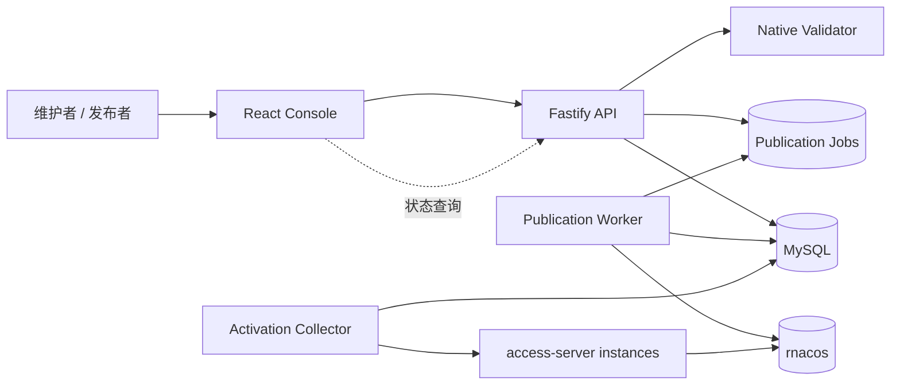
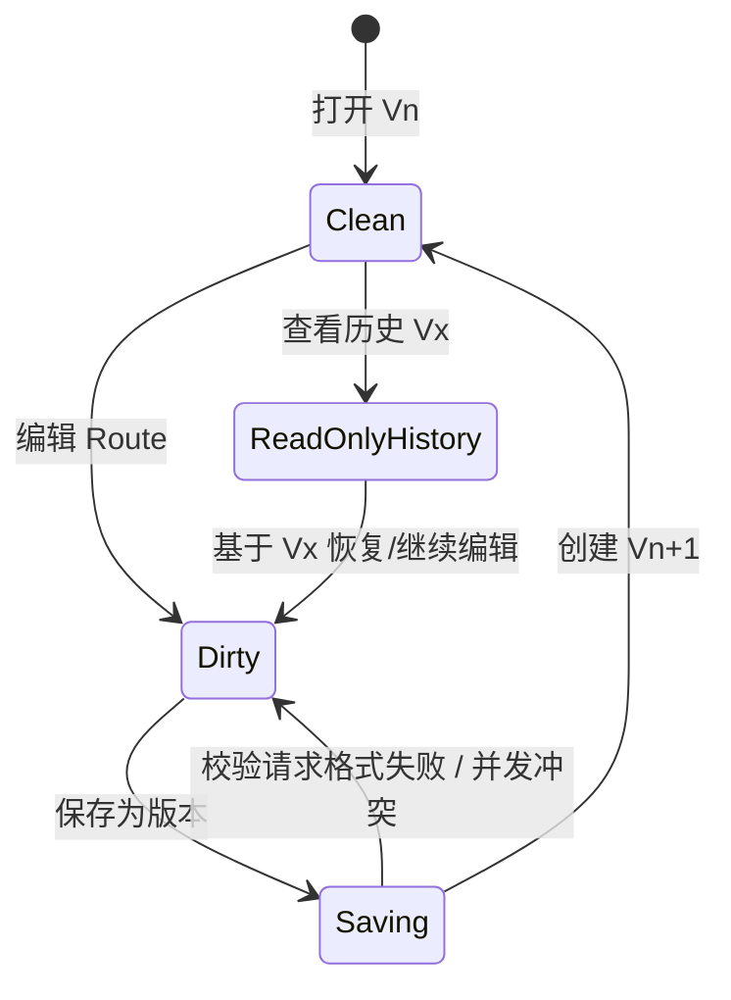
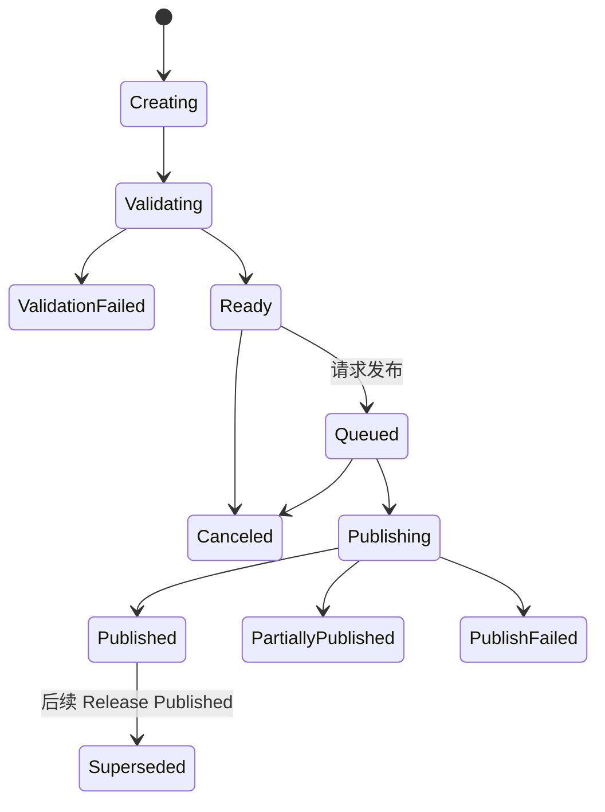

# Access Gateway Console 详细设计

- 状态：Draft v0.5
- 上游需求：[Access Gateway Console 产品需求文档](console-requirements.md)
- 核心流程：逐条 YAML/JavaScript Route → 保存配置版本 → 选择当前/历史版本 → 创建 Release → 发布到 rnacos
- 适用范围：`web/`、`server/`、MySQL migration、rnacos publication worker，以及必要的
  `native/access-server/` 校验和激活证据接口
- 实现基线：Configuration Version API 与历史 UI、按当前/历史版本创建 Release、Native Validator
  重校验、rnacos publication worker、逐资源回读证据和 Docker demo 已实现；版本 diff、资源级重试、
  Project 网络策略、可更新逻辑证书、不可变版本、SAN 派生 SNI 索引和 Project Settings 下线
  Release 已实现；崩溃后自动重新领取 running job、证书动态交付和实例激活采集尚未实现

## 1. 设计目标

本文把“路由配置保存为版本，并选择当前或历史版本发布”细化为可实现、可迁移、可测试的技术
方案。设计必须同时满足：

1. 用户每次显式保存都会得到不可变、可审计的配置版本；
2. 发布请求引用具体配置版本 ID，不在后台把“当前版本”解析成一个可能变化的指针；
3. 当前配置版本和任一历史配置版本都可以成为新 Release 的来源；
4. 发布历史版本不改变当前配置版本，不覆盖未保存内容，也不改写历史记录；
5. 每次发布都重新校验并分配新的 native wire `version`；
6. Console 保存、rnacos 发布和 access-server 激活保持三套独立状态及证据；
7. rnacos 多 Data ID 写入不是事务，部分成功、重试和崩溃恢复必须如实记录；
8. 新 API 不暴露环境选择，不引入 Gray 配置，也不让 Console 成为流量代理。

## 2. 术语与强制不变量

### 2.1 术语

| 术语                          | 含义                                                                      |
| ----------------------------- | ------------------------------------------------------------------------- |
| Working Copy                  | 浏览器中正在编辑、尚未保存为版本的 Route 集合                             |
| Configuration Version / `Vn`  | Project 内第 n 个不可变配置快照；内部由 `draft_revisions` 承载            |
| Current Configuration Version | Project 最新保存的 Configuration Version                                  |
| Historical Version            | 早于 Current Configuration Version 的任一不可变版本                       |
| Release / `Rn`                | 从一个具体 Configuration Version 编译出的不可变发布计划                   |
| Wire Version                  | 写入 project route JSON 的单调整数 `version`，供 access-server 热更新比较 |
| Published Source Version      | 最近成功写入并回读一致的 Release 所引用的 Configuration Version           |
| Activation Evidence           | 具体 access-server 实例报告其实际采用的 wire version/摘要                 |

### 2.2 不变量

- Configuration Version 的 YAML、Route ID、Route 顺序、说明、作者和创建时间一经保存不可修改。
- Configuration Version 只覆盖 route wire payload 的创作模型；Project domain 是项目身份，TLS
  SAN 派生索引、证书私钥、rnacos 连接和运行时激活证据不进入版本文档。
- Current Configuration Version 只能前进到新插入的版本号，不能指回历史行。
- Release 必须引用具体且同属该 Project 的 Configuration Version 主键。
- 创建 Release 后，来源版本 ID、编译器 revision、validator revision、wire version 和 payload bytes
  不可修改。
- 发布历史版本只创建新 Release；`drafts.current_revision_no` 和浏览器 Working Copy 均保持不变。
- 恢复历史版本只复制历史内容并创建下一个 Configuration Version，不能修改历史版本或倒退版本号。
- `V12` 和 wire `version=12` 没有关联；API 和 UI 必须使用完整字段名，禁止用含义不明的
  `version` 同时表达二者。
- 同一 Project 的 wire version 严格单调递增；分配后即使 Release 失败也不回收，允许有空洞。
- rnacos readback 成功只能证明 Published，不能证明 Active。
- 历史版本必须使用当前服务端编译器和 Native Validator 重新验证；旧校验成功不是发布授权。

## 3. 总体架构与职责



| 组件                 | 负责                                                      | 不负责                                  |
| -------------------- | --------------------------------------------------------- | --------------------------------------- |
| Web                  | Working Copy、版本选择、diff、确认、状态展示和未保存保护  | 分配 wire version、直接写 rnacos        |
| Console API          | 鉴权、版本事务、校验编排、Release 创建、查询和审计        | 在请求生命周期内执行长时间 publication  |
| Version Repository   | 不可变版本存取、当前指针、乐观锁和稳定分页                | 编译 YAML 或调用 rnacos                 |
| Release Service      | 固定 sourceVersionId、分配 wire version、生成不可变资源图 | 把 rnacos 回读当作激活证据              |
| Native Validator     | 使用数据面事实模型验证完整 wire candidate                 | 保存配置、分配版本、访问 MySQL          |
| Publication Worker   | lease、冲突检查、逐资源写入/回读、幂等重试和恢复          | 修改 Release payload 或选择其他来源版本 |
| Activation Collector | 收集有界、鉴权、逐实例证据并计算激活聚合                  | 推断 rnacos 写入即实例激活              |

数据库、rnacos、validator 和实例客户端都位于 typed service/adapter 后。Fastify handler 不包含 SQL、
rnacos 协议或 subprocess 细节。单元测试构造 API 时不打开任何外部连接。

## 4. 生命周期与状态

### 4.1 编辑和保存



Working Copy 状态只存在于前端。服务端正式版本状态为：

- `not_run`：已保存，尚无与该内容摘要匹配的完整校验结果；
- `pending`：校验运行中；
- `valid`：当前 compiler/validator 组合已通过；
- `invalid`：存在 YAML、schema、project 或 native 错误。

版本列表上的校验状态是最近一次匹配 `model_sha256 + compiler_revision + validator_revision` 的结果。
validator 升级后，旧 `valid` 结果可以展示为“曾通过 / 需重新校验”，不能直接用于创建 Ready
Release。

### 4.2 Release 和 publication



Release 状态沿用 `server/src/modules/releases/state.ts` 中的稳定枚举。`Published` 只表示全部必需
Release Resource 已写入且 readback 摘要一致。激活聚合单独返回：`unknown`、`pending`、`active`、
`degraded`，不写入 Release 主状态。

### 4.3 三个“当前”值

Project 查询必须同时返回以下值，UI 不得合并：

| 字段                                 | 示例        | 更新时机                                  |
| ------------------------------------ | ----------- | ----------------------------------------- |
| `currentConfigurationVersion.number` | `V18`       | 保存或恢复产生新 Configuration Version    |
| `publishedRelease.sourceVersion`     | `V12 / R31` | 新 Release 全部必需资源 readback verified |
| `activation.summary`                 | `unknown`   | 收到逐实例、未过期、typed evidence        |

因此允许出现“当前配置 V18，rnacos 发布来源 V12，激活未知”。这是正常事实，不是错误状态。

## 5. 数据模型

### 5.1 复用现有表

现有模型无需复制一套 `configuration_versions` 表：

- `drafts`：一个 Project 一个活动记录；`current_revision_no` 是当前配置版本号，`lock_version` 用于
  保存并发控制；
- `draft_revisions`：不可变 Configuration Version；`revision_no` 是 Project 内展示号；
- `config_documents`：AES-256-GCM 信封加密的精确模型文档及 plaintext SHA-256；
- `validation_runs`：绑定 `draft_revision_id` 和 model digest 的校验证据；
- `release_items.draft_revision_id`：Release 对具体来源版本的不可变引用；
- `release_items.allocated_project_version` 与 `release_resources.allocated_project_version`：wire
  version；
- `release_resources`、`publication_jobs`、`publication_attempts`：资源计划和外部副作用证据；
- `instance_project_observations`、`release_instance_activations`：激活证据及聚合。

代码层使用 `ConfigurationVersion` 命名，不把用户界面继续暴露为 `DraftRevision`。旧 API 可以在
迁移窗口内保留，但新 Web 只使用版本 API。

### 5.2 增量 migration

建议新增 `0005_route_configuration_versions.sql`：

```sql
ALTER TABLE draft_revisions
    ADD COLUMN restored_from_revision_id BIGINT UNSIGNED NULL AFTER parent_revision_id,
    ADD COLUMN route_count INT UNSIGNED NOT NULL DEFAULT 0 AFTER validation_state,
    ADD CONSTRAINT fk_draft_revisions_restored_from
        FOREIGN KEY (restored_from_revision_id) REFERENCES draft_revisions (id),
    ADD KEY ix_draft_revisions_history (draft_id, revision_no DESC);

ALTER TABLE release_items
    ADD COLUMN source_relation VARCHAR(32) NULL AFTER draft_revision_id,
    ADD KEY ix_release_items_project_version (project_id, draft_revision_id, release_id);

ALTER TABLE releases
    ADD COLUMN compiler_revision VARCHAR(64) NULL AFTER rollback_of_release_id;
```

约束由 migration 与 service 双重保证：

- 新 Release 的 `source_relation ∈ {current, historical}`；它记录创建瞬间相对 current pointer 的
  关系，后续 current pointer 前进时不重算。旧 Release 无法证明时保持 `NULL/unknown`；
- 新 Release 必须写入 `compiler_revision`；旧 Release 为 `NULL` 时只能展示历史证据，不能重新编译
  或据此恢复执行；
- `restored_from_revision_id` 必须同 draft；`parent_revision_id` 指保存时的原当前版本，二者用途不同；
- `route_count` 是列表投影，写入时从已验证的控制面模型计算，不能信任客户端；
- 内容摘要复用 `config_documents.plaintext_sha256`，不再存一份可能漂移的 digest；
- 历史版本是否曾发布、最近发布结果和 Published 来源均通过 `release_items + releases` 派生；允许
  建受控缓存，但缓存不是事实来源。

### 5.3 Configuration Version 逻辑模型

```ts
interface ConfigurationVersionSummary {
  id: string
  projectId: string
  number: number
  relation: 'current' | 'historical'
  baseVersionId: string | null
  restoredFromVersionId: string | null
  changeSummary: string
  routeCount: number
  modelSha256: string
  validation: 'not_validated' | 'validating' | 'valid' | 'invalid' | 'stale'
  publication: 'never' | 'queued' | 'published' | 'failed' | 'superseded'
  createdBy: { id: string; displayName: string }
  createdAt: string
}
```

版本详情在 summary 基础上返回 `model: ProjectRoutesModel`。列表 API 不解密或返回完整 YAML，避免
大列表泄露敏感 header 值并降低开销。

### 5.4 Release 逻辑模型

```ts
interface ProjectReleaseView {
  id: string
  sequence: string
  projectId: string
  sourceConfigurationVersion: {
    id: string
    number: number
    relationAtCreation: 'current' | 'historical'
  }
  allocatedWireVersion: number
  status: ReleaseStatus
  sourceModelSha256: string
  wireSha256: string
  nativeValidator: { contractVersion: number; revision: string }
  publication: PublicationSummary
  activation: ActivationSummary
  createdAt: string
}
```

API 禁止返回裸 `version` 字段。Release 的 exact payload 存入独立 `config_documents`，不能在执行
时从来源版本重新编译，否则 compiler 升级会改变已审批内容。

## 6. 核心事务与算法

### 6.1 保存为版本

请求包含 `baseVersionId`、完整 `ProjectRoutesModel`、`changeSummary` 和 `forceSameContent`，并通过
`If-Match` 提交 draft lock version。

Repository 在一个 MySQL transaction 内：

1. `SELECT ... FROM drafts WHERE public_id=? FOR UPDATE`；
2. 验证 Project 归属、未归档、角色为 admin/maintainer；
3. 比较 `If-Match`、`baseVersionId` 和当前 revision，任一不匹配返回
   `CONFIG_VERSION_CONFLICT`；
4. 在 API 边界验证 schema、Route ID 唯一性、大小上限，并计算 canonical model SHA-256；
5. 如果 digest 与当前版本相同且未显式 `forceSameContent`，返回 `CONFIG_VERSION_UNCHANGED`；
6. 加密精确模型并插入 `config_documents`；
7. 插入 `draft_revisions(revision_no=current+1, parent_revision_id=current, ...)`；
8. 原子更新 `drafts.current_revision_no` 和 `lock_version`；
9. 写入脱敏 `configuration_version.created` audit event；
10. commit 后返回新版本和新 ETag。

Working Copy 可以暂时保留无效 YAML 以便继续修复，但 Web 和 API 都必须在创建版本前运行确定性的
YAML 与本地 Route 结构校验。语法错误、非 mapping 根节点、不安全 YAML 特性、未知字段、缺失
`path`/`type` 或非 JSON-safe 标量会阻止保存；完整 Project/native 语义校验仍与保存生命周期分离。

同一个 Idempotency-Key 的重试必须返回第一次创建的版本。事务失败不得留下 current pointer 指向
不存在 revision 的状态。

### 6.2 恢复历史版本为新当前版本

恢复请求携带历史 `sourceVersionId`、当前 `baseVersionId`、说明和 `If-Match`。事务锁定当前 draft
后，复制 source 的解密模型到新加密文档，插入下一个 revision：

- `parent_revision_id = 恢复操作发生时的当前版本`；
- `restored_from_revision_id = 用户选择的历史版本`；
- `revision_no = current + 1`。

恢复不复用历史校验结果，新版本初始状态为 `not_validated`。如果复制后的 model digest 与当前版本
相同，仍默认提示无变化；用户确认后可用恢复原因强制创建，以保留明确操作意图。

### 6.3 校验具体版本

校验服务只接受不可变 `configurationVersionId`，不接受浏览器任意 model 作为可发布证据：

1. 解密版本模型并验证存储摘要；
2. 运行 YAML、Route schema 和 Project relationship 校验；
3. 使用一个“未分配 wire version”的规范候选执行控制面编译检查；
4. 调用 Native Validator；
5. 保存 compiler revision、validator contract/revision、model SHA-256 和结构化错误；
6. 结果仅更新派生校验状态，不修改 Configuration Version 内容。

编辑器可继续提供对 Working Copy 的即时预检，但该结果标记为 `previewOnly=true`，不能被 Release
Service 当作版本校验证据。

### 6.4 从所选版本创建 Release

`sourceVersionId` 和 `expectedCurrentVersionId` 必须由请求显式传入。Release Service 执行：

1. 校验 publisher 权限、Project 未归档、source version 属于该 Project；
2. 对比用户确认页面中的 `expectedCurrentVersionId`；如果 current pointer 已变化，返回
   `CONFIG_VERSION_CONFLICT`，要求用户基于最新上下文重新确认；
3. 在一个短事务中先锁定 draft，再次比较 `expectedCurrentVersionId` 并确定 current/source
   relation；匹配后才锁定 `project_version_counters`、分配 `last_allocated_version + 1`、插入
   `creating` Release 并提交；同 Idempotency-Key 重试返回同一 Release，wire version 不回收；
4. 把 Release 转为 `validating`，使用创建时记录的 compiler revision 将 source model、Project
   domain 和新 wire version 编译为 exact JSON；
5. 使用 Native Validator 校验 exact payload；失败时保存 `validation_failed` Release 和错误证据；
6. 读取 rnacos 目标 Data ID 形成 base observations；只读失败时 fail closed；
7. 计算与 base 的语义 diff、资源依赖和 exact target SHA-256；
8. 在第二个短事务中插入 `release_items`、`release_resources` 和加密 payload document，把 Release
   置为 `ready`；
9. 返回确认页所需的来源版本、当前版本、Published 来源、wire version、diff 和风险。

编译、subprocess 校验和 rnacos read 都不能发生在 MySQL transaction 内。进程若在 `creating` 或
`validating` 中崩溃，只能在 compiler/validator revision 与创建时记录完全一致时恢复准备；否则把
Release 标记为 `abandoned`，由用户创建新 Release。已分配 wire version 仍不回收。

历史版本过去的 payload 不能复用，因为它含有旧 wire version，也可能由旧 compiler 生成。历史内容
只作为 source model；本次 Release 的 payload 和所有校验证据必须重新生成并冻结。

如果 source 是历史版本，Release 创建和发布全过程都不更新 `drafts`。如果创建期间另一个用户保存
了新当前版本，Release 仍绑定原 sourceVersionId；页面刷新后展示新的“当前配置版本”，但不偷偷
更换 Release 来源。

### 6.5 rnacos 资源计划

保持既有 wire contract：

| 资源          | Data ID                               | Group           | 内容                 |
| ------------- | ------------------------------------- | --------------- | -------------------- |
| Project list  | `ploto.unified-access.projects`       | `ACCESS-SERVER` | 分号分隔 domain      |
| Project route | `ploto.unified-access.route.<domain>` | `ACCESS-SERVER` | Java-compatible JSON |

单 Project 修改通常只有 route resource。新增 Project 的资源依赖为 `route -> project list`：先验证
route 写入，再把 domain 暴露给订阅图。归档顺序相反：先从 list 移除并回读，再把 route 清理作为
独立资源。Gray Data ID 永远不进入本工作流。

### 6.6 Publication Worker

Worker 使用有期限 lease 领取 job；同一固定 workspace 同时只允许一个 Release 写 rnacos。每个资源
执行：

1. read current external bytes；
2. 若等于 target，记录 `skipped_already_applied` 并完成 readback；
3. 若与 frozen base 摘要不同且不等于 target，记录 `external_conflict` 并停止依赖资源；
4. write exact frozen bytes；
5. readback，比较 Console SHA-256，并保存 rnacos MD5 作为外部证据；
6. 保存 attempt 后才推进 resource/job 状态。

完整恢复实现中，Worker 崩溃后必须先 read 外部事实。无法确定写是否成功时不能盲目重复写，也
不能标记 Published。当前实现已有有期限 workspace lease、base 冲突检查和 already-at-target
判定，但 running job 的自动重新领取和资源级 retry API 尚未实现，失败状态不会伪装成 Published。

## 7. API 详细设计

### 7.1 通用约定

- API 统一位于 `/api`，新路径不包含 `environmentId`；
- public ID 使用 UUID；版本号只是展示和排序字段，不能代替 ID 做修改操作；
- 时间为 RFC 3339 UTC；计数器和 ETag 中的 bigint 使用十进制字符串；
- 列表使用 `(revision_no, id)` 或 `(created_at, id)` 编码的不透明稳定 cursor；
- 保存、恢复、创建 Release、开始发布和 retry 均要求 `Idempotency-Key`；
- 错误结构为稳定 `code/message/requestId/fields`，不回显 SQL、密钥、凭据或完整敏感 YAML。

### 7.2 Configuration Version API

| Method | Path                                                                      | 权限     | 行为                       |
| ------ | ------------------------------------------------------------------------- | -------- | -------------------------- |
| GET    | `/api/projects/:projectId/configuration-versions`                         | read     | 倒序分页返回版本 summary   |
| POST   | `/api/projects/:projectId/configuration-versions`                         | maintain | 从 Working Copy 保存新版本 |
| GET    | `/api/projects/:projectId/configuration-versions/current`                 | read     | 返回当前版本与配置 ETag    |
| GET    | `/api/projects/:projectId/configuration-versions/:versionId`              | read     | 返回只读精确模型           |
| POST   | `/api/projects/:projectId/configuration-versions/:versionId/validations`  | maintain | 校验不可变版本             |
| POST   | `/api/projects/:projectId/configuration-versions/:versionId/restorations` | maintain | 从历史来源保存新当前版本   |

版本 comparison/diff API 为下一增量，当前 UI 只提供只读历史快照。

Restoration 请求中的路径 `versionId` 是历史编辑来源，`baseVersionId` 和 `If-Match` 必须指向
保存时观察到的当前版本与配置锁。请求可携带编辑后的完整 `model`；省略 `model` 表示原样恢复历史
内容。两种方式都只插入一个新版本并记录 `restoredFromVersionId`，不会先创建中间恢复版本。

保存请求：

```json
{
  "baseVersionId": "uuid-or-null",
  "changeSummary": "为用户接口增加 30s 超时",
  "forceSameContent": false,
  "model": {
    "schemaVersion": 5,
    "kind": "project_routes_yaml",
    "routes": [
      { "id": "uuid", "format": "yaml", "source": "path: /api/*\nmethod: GET\ntype: PROXY\n..." },
      {
        "id": "uuid",
        "format": "js",
        "path": "/jobs/:id",
        "method": "POST",
        "source": "return {id: $path.id};"
      }
    ]
  }
}
```

响应使用 `ETag: "<draft-lock-version>"`，并返回 `ConfigurationVersionSummary`。版本详情不得返回
配置文档加密元数据或任何 secret reference locator。

### 7.3 Release API

| Method | Path                                    | 权限    | 行为                                      |
| ------ | --------------------------------------- | ------- | ----------------------------------------- |
| POST   | `/api/projects/:projectId/releases`     | publish | 从明确 sourceVersionId 创建 Release       |
| GET    | `/api/projects/:projectId/releases`     | read    | 项目发布历史                              |
| GET    | `/api/releases/:releaseId`              | read    | Release、resource、publication/activation |
| POST   | `/api/releases/:releaseId/publications` | publish | 把 Ready Release 加入发布队列             |

资源级 retry 与 job cancel 是已保留的数据模型能力，当前 API 尚未开放。

创建请求：

```json
{
  "sourceVersionId": "uuid",
  "expectedCurrentVersionId": "uuid",
  "title": "发布稳定路由版本",
  "description": "选择 V12；当前配置 V18 保持不变"
}
```

请求不能只传 `source: "current"`。前端在用户打开确认框时把默认 current 解析为具体 ID，并固定
当时看到的 current ID；任一 ID 发生上下文冲突时重新打开确认流程。响应明确返回：

```json
{
  "sourceConfigurationVersion": {
    "id": "uuid",
    "number": 12,
    "relationAtCreation": "historical"
  },
  "currentConfigurationVersion": { "id": "uuid", "number": 18 },
  "allocatedWireVersion": 43,
  "status": "ready"
}
```

### 7.4 稳定错误码

| Code                              | HTTP | 场景                                  |
| --------------------------------- | ---- | ------------------------------------- |
| `INVALID_CONFIGURATION_YAML`      | 400  | YAML 或本地 Route 结构不合法          |
| `CONFIG_VERSION_CONFLICT`         | 409  | base version 或 ETag 已过期           |
| `CONFIG_VERSION_UNCHANGED`        | 409  | 相同内容且未确认强制保存              |
| `CONFIG_VERSION_NOT_PUBLISHABLE`  | 422  | 所选版本校验失败                      |
| `PROJECT_LIST_LIMIT_EXCEEDED`     | 422  | Project List 超出 native 资源上限     |
| `CONFIG_VERSION_PROJECT_MISMATCH` | 404  | source version 不属于当前授权 Project |
| `NATIVE_VALIDATOR_UNAVAILABLE`    | 503  | 权威校验不可用或 contract 不匹配      |
| `WIRE_VERSION_EXHAUSTED`          | 409  | native 支持的整数版本空间耗尽         |
| `RNACOS_BASE_CONFLICT`            | 409  | 外部内容不同于 frozen base 和 target  |
| `IDEMPOTENCY_KEY_REUSED`          | 409  | 同 key 对应不同请求摘要               |

为防止对象枚举，未授权或跨 Project 的 version/release 查询统一返回 404。

## 8. Web 详细设计

### 8.1 页面结构

```text
/projects/:projectId/routes
├── ProjectVersionBar
│   ├── 当前配置 Vn
│   ├── 未保存状态
│   ├── rnacos 来源 Vx / Release Ry
│   └── 激活状态
├── RouteList
│   └── YamlCodeEditor[]
├── SaveVersionButton
└── PublishVersionButton

/projects/:projectId/versions
├── VersionFilters
├── VersionTimeline
│   └── VersionRow[]
└── VersionViewer / VersionDiff

/projects/:projectId/releases
└── ReleaseTimeline / ResourceAttempts / ActivationEvidence
```

### 8.2 保存为版本

- Routes 页主按钮文案为“保存为版本”；YAML 合法时快捷键 `Ctrl/Cmd+S` 打开保存弹窗；
- 编辑时即时展示 YAML 行列错误，不重建 CodeMirror 或移动焦点；存在本地 YAML 错误时按钮禁用，
  快捷键只提示修复错误，不打开保存弹窗；API 使用同一 YAML 子集再次阻止非法保存；
- 弹窗展示 base version、Route 数和变更摘要，版本说明必填；
- 保存期间编辑器不被服务端旧响应覆盖；请求绑定提交时的 local fingerprint；
- 成功后 Working Copy base 更新到新 version ID，dirty 置为 false，历史列表插入新行；
- `CONFIG_VERSION_CONFLICT` 打开三方选择：查看差异、以最新版本重新应用、放弃本地修改；
- `CONFIG_VERSION_UNCHANGED` 先提示无内容变化，只有填写原因后才允许强制保存。

可选的浏览器崩溃恢复副本放在受限 local storage/IndexedDB，按用户和 Project 隔离并设置 TTL。它
必须显示为“恢复副本”，不能出现在版本列表，不能直接发布，并且不得缓存服务端未授权的历史 YAML。

### 8.3 版本历史

版本列表默认倒序，当前版本固定显示“当前”。每行至少展示：

- `Vn`、说明、作者、相对/绝对时间和 Route 数；
- 校验状态；
- 是否发布过、最近 Release 及其 Published/失败状态；
- `restored from Vx`；
- “查看”“比较”“基于此版本编辑”“发布此版本”。

历史 YAML 只读展示。点击“基于此版本编辑”不会立即改变当前版本：用户先在 Working Copy 中查看
内容，再通过“恢复并保存为新版本”创建新版本。可提供直接恢复弹窗，但后端语义仍是插入新版本。
Routes 页必须同时显示“编辑来源 Vx”和“当前保存基线 Vy”。历史模型与当前模型不同时，从进入
编辑器起即视为未保存副本；保存请求携带编辑后的 model，并生成唯一的新版本 Vz。放弃副本只重新
加载当前版本，不写数据库。

### 8.4 发布版本弹窗

弹窗分三步：

1. **选择来源**：默认当前版本；可按版本号/说明搜索历史版本；无效或 stale 版本禁用并说明原因；
2. **校验与差异**：展示来源版本与当前配置、Published 来源和 rnacos base 的差异，以及目标 Data
   ID、新 wire version、validator revision；
3. **确认发布**：历史来源使用阻止式提示“将发布历史版本 Vn；当前配置仍为 Vm”。

存在 dirty Working Copy 时，在第一步显示：

- “先保存为新版本”（推荐）；
- “继续发布已保存版本”（未保存修改不进入本次 Release）；
- “取消”。

任何选项都不得静默丢弃 Working Copy。Release 创建完成后，前端持有 release ID；后续 current
version 变化不能改变确认页或 publication job 的来源。

### 8.5 状态文案

| 事实                  | 文案示例                           |
| --------------------- | ---------------------------------- |
| 编辑基线              | `基于 V18 编辑 · 有未保存修改`     |
| 当前配置              | `当前配置 V18`                     |
| 历史发布              | `rnacos 已发布：V12 / Release R31` |
| 无激活证据            | `实例激活：未知`                   |
| 历史版本被选择        | `将发布历史版本 V12，当前仍为 V18` |
| historical validation | `V7 曾通过旧校验器，需要重新校验`  |

状态不能只用颜色区分。版本选择、弹窗、diff、Route 折叠/排序和错误跳转均需支持键盘操作；焦点关闭
弹窗后回到触发按钮。

## 9. 权限、安全与审计

### 9.1 权限

| 操作               | Admin | Maintainer | Publisher | Auditor |
| ------------------ | ----- | ---------- | --------- | ------- |
| 查看版本/YAML/diff | 是    | 是         | 是        | 是      |
| 保存/恢复版本      | 是    | 是         | 否        | 否      |
| 校验版本           | 是    | 是         | 是        | 否      |
| 创建/发布 Release  | 是    | 策略决定   | 是        | 否      |
| retry/cancel       | 是    | 否         | 是        | 否      |

服务端每次执行时查询当前 membership 和 policy，不信任前端隐藏按钮。生产策略可要求创建者不能审批或
发布自己的 Release，并可要求重新认证。

### 9.2 安全

- Route YAML 和 compiled payload 使用现有 envelope encryption；列表只返回摘要；
- parser 禁止 alias、anchor、merge、自定义 tag 和多文档输入；
- Native Validator 使用固定 argv、无 shell、限时/限内存/限 stdout，并记录 binary revision；
- rnacos 凭据只在 adapter 内使用，日志和错误不包含 username/password/token；
- Authorization、Cookie、请求/响应 body 和敏感 route header 值不得进入日志、trace 或审计；
- diff 默认遮罩已标记敏感的 header 值，精确 payload 预览要求额外权限；
- 所有 SQL 参数化；cursor 不包含 secret 或可篡改的内部主键。

### 9.3 审计事件

至少记录：

- `configuration_version.created`、`configuration_version.restored`、
  `configuration_version.validation_completed`；
- `release.created_from_current`、`release.created_from_history`、`release.validation_failed`；
- `publication.queued`、resource conflict/write/readback/retry、`publication.completed`；
- activation changed 和 permission denied。

版本审计保存 source/current version ID 和 number、model digest、Route 数、说明、actor、request ID、
结果和时间；不保存完整 YAML。历史发布事件必须同时记录当时 current version，便于回答“为何发布
V12 而不是 V18”。

## 10. 并发、幂等与故障恢复

- Working Copy 保存使用 draft ETag + baseVersionId 双重检查；
- Version ID 一旦解析即固定，不能因 current pointer 更新而漂移；
- Project wire version 通过 `SELECT ... FOR UPDATE` 串行分配；
- Release 创建幂等记录请求 canonical hash；同 key 不同 sourceVersionId 必须冲突；
- 固定 workspace publication lease 防止两个 Release 资源写入交错；
- Worker lease 包含 owner/token/expiry，更新必须携带 token，过期 worker 不能继续写；
- API 进程退出不取消已入库 publication job；
- cancel 只停止尚未发生的后续写入，UI 文案不得暗示撤销已 verified 的资源；
- MySQL 恢复后不自动重放历史 job，先校验 rnacos 目标、lease 和 attempt 事实；
- rnacos 不可达时保持 queued/retryable 或明确 failed，不更新 Published；
- Native Validator 不可用时 fail closed，但 Configuration Version 仍可保存。

## 11. 测试设计

### 11.1 Server 单元与 API 测试

- 保存 V1/V2 的单调号、不可变内容、ETag 和 parent relation；
- 相同内容默认拒绝、带原因强制保存、并发 base 冲突；
- V3 恢复为 V9 时 parent=V8、restoredFrom=V3；
- 列表稳定 cursor、summary 不含完整 YAML、跨 Project 返回 404；
- current/historical source relation 在 Release 创建时冻结；
- 用户确认后 current version 变化时创建 Release 返回冲突且不消耗 wire version；
- 当前 V6 发布 V3 后 current pointer 仍为 V6；
- 同一 V3 重复发布分配不同且递增的 wire version；
- 历史校验结果过期时重新调用当前 Native Validator；
- Idempotency-Key 重试不重复创建版本、Release 或分配 wire version；
- secret redaction、权限矩阵和审计字段。

测试使用 Fastify injection、fake repository/adapter 和 fake validator，不要求 MySQL、rnacos、
公网或 wall clock。

### 11.2 MySQL 集成测试

- migration 从当前 `0004_activation` 升级和空库安装；
- 保存/恢复事务在注入失败时不产生孤儿 pointer/document；
- 两连接并发保存仅一个成功；
- 两连接分配 wire version 不重复；
- 删除/归档 Project 不破坏版本、Release 和 audit 外键；
- 最大 Route 数和文档大小下的版本分页与 Release 查询计划。

### 11.3 Compiler、native 与 rnacos 测试

- 当前/历史版本相同 source model 在不同 wire version 下生成预期 exact payload；
- RESPONSE、service/static PROXY、condition、template、CIDR、body limit 和 WebSocket golden；
- 旧 schema 可迁移时确定性升级，不可迁移时 fail closed；
- same-version candidate 被数据面忽略，新 Release 总是使用更高 wire version；
- invalid candidate 保留旧 native snapshot；
- disposable rnacos 覆盖 write/readback、外部冲突、部分成功、超时和 worker 崩溃恢复。

不能仅凭单元测试声明生产兼容；原生生产脚本语料差分和最终切流 gate 完成前继续保留当前资格说明。

### 11.4 Frontend/E2E

- YAML 编辑不重建 CodeMirror，不因临时解析错误丢失焦点；
- dirty Working Copy 的保存、切项目、选版本和发布保护；
- 当前/历史版本选择、只读历史、diff、恢复为新版本；
- 发布 V3 时页面持续显示 current V6，不将两者混淆；
- validation stale/invalid 禁止发布并可聚焦错误；
- 键盘操作、焦点恢复、屏幕阅读器标签和非颜色状态；
- 页面刷新后从 API 恢复 Release/resource/activation 状态。

## 12. Migration 与兼容策略

1. 增加 nullable/有默认值字段和索引，不重写旧 revision 或 Release；
2. 后端先提供 Configuration Version facade API，内部继续读取 `draft_revisions`；
3. 旧 schema v1 revision 在读取时按现有规则升级为稳定 Route ID/YAML，原始加密文档保留；
4. 回填 `route_count` 时解密批量限速、失败可恢复，不把私密内容写日志；
5. Release 查询同时兼容旧 `source_relation` 默认值，通过创建时的 revision/current 信息尽可能
   推导；无法证明时展示 `unknown`，不伪造 current；
6. Web 切换到版本 API 后，旧 `/api/drafts/.../revisions` 标记 deprecated，至少保留一个发布周期；
7. 确认无旧客户端后再删除旧写入口；历史表名无需为了 UI 术语做高风险 rename。

部署顺序为 migration → 兼容 API → Web → publication worker。Worker 在 API schema 未就绪或
rnacos adapter 未配置时保持 unavailable，UI 不模拟发布成功。

## 13. 实施顺序

1. 已完成 migration、Configuration Version model/repository 和保存/列表/详情 API；
2. 已完成恢复、validation-by-version 和审计；语义 diff 待实现；
3. 已完成 Web 保存弹窗、版本历史、只读查看、当前/历史状态；
4. 已完成 Release Service 的 sourceVersionId、wire version、exact payload 冻结和 API；
5. 已完成 Web 发布版本弹窗、历史确认和 dirty Working Copy 隔离；
6. 已完成 rnacos adapter、publication worker 和逐资源证据；资源级重试与崩溃恢复待实现；
7. 已完成 Project Settings、Project List 下线 Release 和发布成功后的归档；route Data ID 清理仍为
   后续独立可选动作；
8. 增加实例 typed activation evidence；能力缺失期间保持 Activation unknown；
9. 完成 disposable rnacos E2E、native compatibility matrix 和运维文档。

每个增量都必须保持“能保存版本但不能伪发布”的安全退化路径。仅完成版本 UI 而无 worker 时，
发布按钮显示能力未配置；仅完成 rnacos 写入而无 activation API 时，Published 后显示激活未知。

## 14. 需求追踪

| 需求范围                 | 详细设计章节                               |
| ------------------------ | ------------------------------------------ |
| 保存不可变配置版本       | 2、4.1、5、6.1、7.2、8.2                   |
| 当前/历史版本列表与 diff | 4.3、5.3、7.2、8.3                         |
| 选择历史版本发布         | 2.2、6.4、7.3、8.4                         |
| 恢复历史版本             | 5.2、6.2、7.2                              |
| wire version 与兼容校验  | 2.2、5.4、6.3、6.4                         |
| rnacos 多资源发布        | 4.2、6.5、6.6、10                          |
| 发布/激活状态分离        | 4.2、4.3、8.5                              |
| 权限、安全和审计         | 7.4、9                                     |
| Migration 和测试         | 11、12、13                                 |
| 网络策略与逻辑证书版本   | `network-policy-and-certificate-design.md` |

实现时还必须遵守仓库根 `AGENTS.md` 中的 native wire contract、秘密保护、不可变 Release、失败保留
旧快照和实例证据边界。
