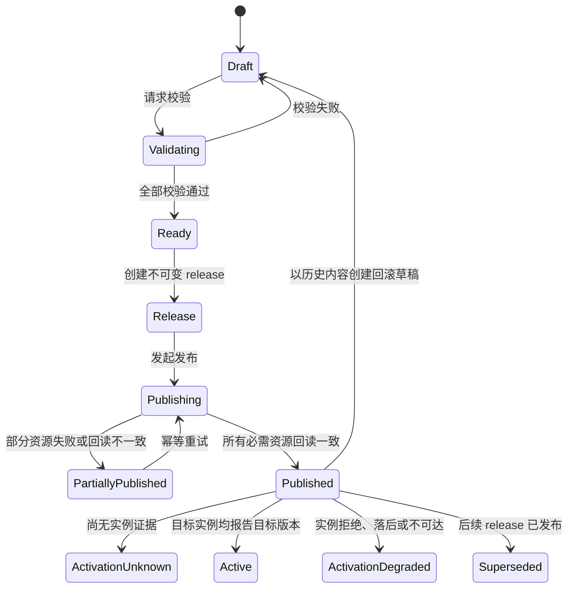

# Access Gateway Console 产品需求文档

- 状态：Draft v0.1
- 适用范围：`web/` React 前端、`server/` Node.js 后端，以及为 Console 提供验证和生效
  证据所需的少量 `access-server` 配套能力
- 事实基线：当前仓库 `native/access-server` 实现及其 Java 兼容契约
- 配套设计：[Access Gateway Console 详细设计](console-detailed-design.md)

## 1. 文档目的

本文根据 `access-server` 已实现的配置模型、Nacos 订阅拓扑、路由执行、热更新语义和
可观测能力，定义 Access Gateway Console 的产品需求、领域模型、交互边界、交付阶段与
验收标准。

本文是产品、前端、后端、原生数据面和测试共同使用的需求基线，不是页面视觉稿或数据库
DDL。未在 `access-server` 中存在的能力会明确标记为“配套依赖”，不能在 Console 中通过
推断或模拟伪装成已经具备。

## 2. 设计依据与关键结论

### 2.1 Access Server 事实

| Access Server 事实                                                                  | 对 Console 的约束                                         |
| ----------------------------------------------------------------------------------- | --------------------------------------------------------- |
| 项目列表、逐项目 route、production gray 使用不同 Data ID                            | 发布是多资源工作流，不是单次原子写入                      |
| 项目配置相同 `version` 会被忽略                                                     | 每次发布和回滚都必须生成新的项目版本                      |
| 空 route 内容保持旧配置                                                             | 不能用空字符串表达删除或回滚                              |
| `host` 缺失或为空会卸载项目 Host/route                                              | 卸载必须作为高风险操作单独确认                            |
| 解析、脚本编译或路由构建失败会保留旧快照                                            | “Nacos 已写入”不等于“新配置已生效”                        |
| 请求 pin 不可变快照                                                                 | Console 应围绕不可变 release 建模，不能改写历史发布内容   |
| 项目 route 支持 RESPONSE、PROXY、条件、模板、rewrite、CIDR、body limit 和 WebSocket | 编辑器必须覆盖完整 route 模型，不能只提供简化反向代理表单 |
| production gray 根据 X-Entry、CIDR 和万分比选择 gray cluster                        | 灰度规则是环境级独立资源，不属于单个项目 route            |
| Prometheus 只有固定的全局 result、duration、inflight 指标                           | 当前不能从指标推导项目级流量或配置激活状态                |
| watcher 内部有成功/失败计数和最后错误，但尚未对外暴露                               | 实例生效证据需要新增有界、鉴权的原生状态接口              |
| 当前仍未完成全部生产差分和切流门槛                                                  | Console 不得把当前系统标记为已满足生产切流条件            |

### 2.2 产品结论

1. Console 是配置与发布控制面，不接收或代理普通网关流量。
2. 数据库中的草稿、Nacos 中的已发布内容、实例中已激活快照是三个独立状态。
3. Native codec 和 compiled route model 是配置是否合法、默认值为何以及能否发布的最终
   事实来源；TypeScript 校验只用于提前反馈，不能成为另一套兼容标准。
4. 发布必须保留每个 Data ID 的写入、回读、失败和重试证据，并能处理部分成功。
5. 回滚不是覆盖历史，而是从历史 release 创建具有新 `version` 的新 release。
6. 在 access-server 尚未提供实例状态接口前，Console 必须把激活状态显示为“未知”，不能
   根据 Nacos 回读、HTTP 流量或 Prometheus 请求量推断“已生效”。

## 3. 产品目标与非目标

### 3.1 产品目标

- 为多个隔离环境提供统一的项目 route 与 production gray 配置管理。
- 使用结构化表单降低配置错误，同时允许安全导入已有 Nacos 配置。
- 在写入 Nacos 前完成字段、跨资源和 native authoritative validation。
- 建立可审计的草稿、release、发布、回读、回滚和实例激活证据链。
- 为网关维护者提供配置差异、运行健康、全局流量指标和错误定位入口。
- 保持与现有 Java wire 行为及 C++ `access-server` 热更新语义兼容。

### 3.2 非目标

- 不作为通用 Nacos/rnacos 管理控制台，不允许浏览或修改无关 Data ID。
- 不转发普通网关业务请求，不直接访问 access-server 内存或修改其本地配置文件。
- 不在 TypeScript 中重新实现一套通用脚本 VM、Host matcher 或 Path matcher。
- 不承诺从当前 Prometheus 指标提供项目、route、cluster 级流量分析。
- 不把发布成功等同于实例激活成功。
- 不在首个版本中负责 access-server 进程编排、二进制升级或生产切流自动化。

## 4. 用户角色与权限

| 角色       | 主要能力                                                          |
| ---------- | ----------------------------------------------------------------- |
| 平台管理员 | 管理环境、凭据引用、成员、角色、保护策略和 access-server 状态端点 |
| 网关维护者 | 创建和编辑草稿、导入配置、执行校验、查看差异和运行信息            |
| 发布者     | 批准或发起发布、重试失败资源、从历史 release 创建回滚             |
| 审计者     | 只读查看环境、配置、release、发布证据、激活证据和审计日志         |

权限最少按“环境 + 操作”授权。生产环境的发布权限与编辑权限必须可以分离。用户没有某环境
权限时，列表、搜索结果、错误消息和审计查询中都不能泄露该环境的数据。

## 5. 领域对象与状态

### 5.1 核心对象

- **Environment**：一个隔离的 Nacos namespace/tenant、Data ID 契约、Naming group、
  access-server 状态端点集合和凭据引用。
- **Project**：项目标识及其当前草稿、历史 release、Host 和 route 配置。
- **Draft Revision**：可编辑的配置版本。每次保存产生可追溯 revision，发布后内容不再
  原地修改。
- **Release**：一次发布计划的不可变快照，包含项目列表、一个或多个项目 route、可选
  gray 配置及每个资源的精确 payload 和 SHA-256。
- **Release Resource**：release 中的单个 Nacos Data ID，记录写入顺序、预期旧摘要、目标
  摘要、写入和回读结果。
- **Publication Attempt**：一次对 Release Resource 的写入或重试，记录操作者、时间、
  结果和经过脱敏的错误。
- **Activation Evidence**：某个 access-server 实例对某个项目版本或 gray 摘要的明确
  观测结果。
- **Audit Event**：环境、草稿、release、发布、回滚、权限和凭据操作的不可变审计事件。

### 5.2 生命周期



状态展示规则：

- `Published` 只表示所有必需 Nacos 资源已经写入并回读一致。
- `Active` 必须由 access-server 实例返回的版本、摘要和 watcher 结果支持。
- 无实例接口、未配置实例或没有足够证据时一律为 `ActivationUnknown`。
- 部分发布不能显示为成功；必须列出已变更和未变更资源及建议的恢复动作。

## 6. 信息架构

Console 顶层导航建议为：

1. **概览**：当前环境、Console API、Nacos、实例证据、待发布草稿和最近失败。
2. **项目与路由**：项目列表、结构化编辑、原始 payload 预览、校验结果。
3. **灰度规则**：环境级 X-Entry、ratio、CIDR 规则。
4. **发布中心**：release 差异、发布计划、逐资源结果、回滚和审批。
5. **实例与运行状态**：access-server 实例、配置版本、最近拒绝原因和全局指标。
6. **审计日志**：配置和管理操作的不可变事件。
7. **环境与权限**：Nacos、状态端点、凭据引用、成员和保护策略。

所有页面必须持续显示当前环境。生产环境使用文字、图标和颜色组合进行区分，不能只依赖
颜色。切换环境时应清空未提交请求和跨环境缓存，并对未保存草稿给出阻止式确认。

## 7. 功能需求

优先级定义：P0 为首个可用 Console 的必需能力；P1 为生产闭环能力；P2 为增强能力。

### 7.1 身份、权限与环境

| ID           | 优先级 | 需求                                                                                     |
| ------------ | ------ | ---------------------------------------------------------------------------------------- |
| CON-AUTH-001 | P0     | 用户必须登录后访问 Console；API 对每个请求执行身份、环境和操作权限校验                   |
| CON-AUTH-002 | P0     | 支持平台管理员、网关维护者、发布者和审计者的最小 RBAC                                    |
| CON-AUTH-003 | P0     | 生产发布要求发布权限；支持配置为“编辑者不能发布自己的变更”                               |
| CON-ENV-001  | P0     | 管理环境名称、稳定 code、环境级别、Nacos endpoint/namespace/tenant 和 Data ID/group 覆盖 |
| CON-ENV-002  | P0     | Nacos 用户名/密码通过 secret reference 保存；写入后不再返回明文                          |
| CON-ENV-003  | P0     | 提供只读连接测试，分别报告认证、配置读取和 NamingService 可用性，不默认执行测试写入      |
| CON-ENV-004  | P1     | 配置多个 access-server 状态端点及其鉴权引用，用于实例激活证据                            |
| CON-ENV-005  | P1     | 生产环境支持维护窗口、发布确认文本、审批人数和禁止时段策略                               |

环境表单默认使用兼容契约中的 Data ID：

| 用途            | 默认 Data ID                           | 默认 Group      |
| --------------- | -------------------------------------- | --------------- |
| 项目列表        | `ploto.unified-access.projects`        | `ACCESS-SERVER` |
| 项目 route      | `ploto.unified-access.route.<project>` | `ACCESS-SERVER` |
| production gray | `ploto.unified-access.gray-match`      | `DEFAULT_GROUP` |

修改这些默认值属于高风险环境变更，需要单独权限和审计，不随普通项目 release 隐式修改。

### 7.2 概览

| ID          | 优先级 | 需求                                                                     |
| ----------- | ------ | ------------------------------------------------------------------------ |
| CON-OVW-001 | P0     | 显示 Console API、数据库、Nacos 配置读取能力和当前环境状态               |
| CON-OVW-002 | P0     | 显示项目数、未发布草稿、最近 release、部分发布和失败发布数量             |
| CON-OVW-003 | P0     | 单独显示“发布状态”和“实例激活状态”；无证据时明确显示未知及原因           |
| CON-OVW-004 | P1     | 显示 access-server 全局请求结果、inflight 和时延，不提供虚构的项目级指标 |
| CON-OVW-005 | P1     | 显示最近配置拒绝、实例落后和不可达摘要，并链接到对应 release/实例        |

当前可读取的 Prometheus 指标仅包括：

- `access_server_requests_total{result=success|client_error|server_error|canceled}`；
- `access_server_request_duration_seconds`；
- `access_server_requests_inflight`。

### 7.3 项目与草稿

| ID          | 优先级 | 需求                                                                          |
| ----------- | ------ | ----------------------------------------------------------------------------- |
| CON-PRJ-001 | P0     | 按环境列出项目、Nacos 当前版本、Console 最新 release、草稿状态和激活状态      |
| CON-PRJ-002 | P0     | 支持创建、复制、归档和搜索项目；项目名必须非空、唯一且不能包含 `;`            |
| CON-PRJ-003 | P0     | 从 Nacos 导入项目列表和逐项目 route，保存原始 payload、MD5/SHA-256 和读取时间 |
| CON-PRJ-004 | P0     | 自动保存草稿 revision，支持命名、变更说明、比较和恢复，但不覆盖历史 revision  |
| CON-PRJ-005 | P0     | 配置 `version` 由发布流程生成；普通编辑器不能手工复用当前已发布 version       |
| CON-PRJ-006 | P0     | 卸载项目时明确展示 Host/route 将从运行快照移除，并要求二次确认                |
| CON-PRJ-007 | P1     | 支持多人编辑的乐观并发控制；保存时发现 base revision 变化必须提示合并         |

项目列表发布使用分号分隔字符串。Console 的结构化模型使用有序、唯一的项目数组，序列化
时不得引入空项或未经确认的名称修剪。项目排序变化如果只会改变 payload 但不改变语义，
仍应在 diff 中单独标记。

### 7.4 Host 编辑器

每个项目可配置多个 Host pattern。编辑器要求：

- 支持 exact、`*` 和 `*.suffix` pattern，并进行大小写和非法字符提示；
- 检测同项目及跨项目的 exact/wildcard 冲突，并展示可能命中的项目；
- `https` 使用枚举：`S_NOT_MUST`、`S_301`、`S_302`、`S_307`、`S_308`；
- `net` 使用多选：VDI、Office、Internet、Custom，wire 值分别为
  `S_VDI`、`S_OFFICE`、`S_INTERNET`、`S_CUSTOM`；
- 解释 X-Entry 映射：`vdi`、`desktop`、`internet`、`custom`；
- 展示 HSTS 行为：项目 Host 命中后，redirect、route 和部分错误响应都会携带 HSTS；
- Host 列表为空属于“卸载项目”，不能作为普通字段清空直接保存。

### 7.5 Route 编辑器

Route 列表必须保持明确顺序。同一路径下 condition route 按顺序选择首个满足者；无条件
route、重复节点或 dead-route conflict 必须在发布前由 native validator 检出。

#### 7.5.1 公共字段

| 字段                   | Console 需求                                                 |
| ---------------------- | ------------------------------------------------------------ |
| `path`                 | 必填；支持静态段、参数段和 wildcard；显示捕获变量供模板选择  |
| `type`                 | 必填；仅 `PROXY` 或 `RESPONSE`                               |
| `condition`            | 可选脚本；提供语法高亮、已知变量提示和 native 编译结果       |
| `max_client_body_size` | 提供“继承全局/明确限制/兼容导入值”语义，不要求用户手写字节数 |
| `allows`               | CIDR allow/deny 列表；`!` 表示 deny；空值和非法 CIDR阻止发布 |
| `response_headers`     | 名称和值模板表；大小写不敏感检测重复和受保护 header          |

编辑器应对 Duration 支持毫秒和秒，对 DataSize 支持 bytes/K/M/G，并同时显示归一化值。
结构化新配置不应主动生成 Java int/long wrap、负值 clamp 等遗留输入；导入遇到此类值时
必须保留原始 payload、展示精确运行语义，并要求用户明确迁移或保留。

已观察的脚本输入至少包括：

- `$path.<capture>`、`$query.<name>`、`$header.<name>`、`$cookie.<name>`；
- `$req.path/query/method`、`$context.hi_trace_cluster`；
- `||`、`==`、`!=`、`<=`、`strings.hasPrefix` 和 `rand.random`。

提示列表不代表通用脚本兼容承诺。任何表达式都必须由与 access-server 相同的编译路径
验证，新增语法还需更新脱敏 corpus 和 golden fixture。

#### 7.5.2 RESPONSE Route

| 字段               | Console 需求                                                               |
| ------------------ | -------------------------------------------------------------------------- |
| `status`           | 必填，范围 `100 <= status < 1000`                                          |
| `body`             | 支持无 body、TEXT、BASE64、TEMPLATE                                        |
| TEXT               | content 非空，展示 UTF-8 字节长度                                          |
| BASE64             | 校验 basic Base64，支持文本/文件转码和解码预览，禁止把秘密文件持久化到日志 |
| TEMPLATE           | 提供模板分段预览与表达式编译错误定位                                       |
| `response_headers` | 全部模板与 body 成功后才视为可发布；展示受保护 header 的忽略规则           |

预览功能使用用户显式提供的脱敏示例请求上下文，不执行网络请求。预览结果仅用于辅助，
不能代替 native validation。

#### 7.5.3 PROXY Route

| 字段                  | Console 需求                                                                    |
| --------------------- | ------------------------------------------------------------------------------- |
| 上游模式              | `service` 或 `addresses` 二选一；结构化编辑器不同时生成两者                     |
| `service`             | 支持 `service/cluster`；展示 Naming group 和 zone 上下文                        |
| `cluster`             | 显式值覆盖 service suffix；context/gray 仍可能在请求时覆盖                      |
| `addresses`           | 有序静态地址；展示推导后的 scheme、host、port 和 Host header                    |
| `proxy_headers`       | upstream request header 模板；展示固定 hop-by-hop 过滤和 source header 强制覆盖 |
| `response_headers`    | downstream header 模板；显式 Location/Refresh 会关闭自动回写                    |
| `context`             | trace/CAT context 模板；`cluster` 可覆盖 route 默认 cluster                     |
| `rewrite`             | path 模板；预览 URI escape，并保留原 query                                      |
| `timeout`             | 默认 60000 ms；结构化新配置不得小于 5 ms                                        |
| `max_proxy_body_size` | 提供“继承 client 默认/明确限制/兼容导入值”                                      |
| `websocket_timeout`   | 大于 0 才启用 WebSocket；同时展示严格 Upgrade/Connection 命中条件               |
| `flush`               | 开启时提示下游增加 `X-Accel-Buffering: no`                                      |

上游服务预检可以报告“当前无健康实例”或“服务不存在”，但该结果受时间影响，默认作为
环境预检警告。静态配置编译错误必须阻止发布。

### 7.6 Production Gray 编辑器

| ID          | 优先级 | 需求                                                                                        |
| ----------- | ------ | ------------------------------------------------------------------------------------------- |
| CON-GRY-001 | P0     | 按环境编辑 `vdi`、`desktop`、`internet`、`custom` 的 gray 规则                              |
| CON-GRY-002 | P0     | ratio 使用万分比，标准输入范围 0..10000，并同时显示百分比                                   |
| CON-GRY-003 | P0     | 支持多条 CIDR whitelist，逐条校验 IPv4/IPv6 和去重                                          |
| CON-GRY-004 | P0     | 空内容与空 object 的运行语义不同，UI 必须分别表达“保持旧规则”和“清空规则”                   |
| CON-GRY-005 | P0     | 非法 CIDR、负 ratio、未知 X-Entry 在 runtime 中可能被过滤；Console 新发布应阻止这些静默降级 |
| CON-GRY-006 | P1     | 提供基于 X-Entry、X-Real-IP 和固定 sample 的确定性命中模拟                                  |

导入 ratio 大于 10000 的现有规则时，必须提示其随机分支恒命中；未经明确确认不得自动
clamp。gray 是环境级资源，发布和回滚记录不能附着到任意单个项目历史中。

### 7.7 导入、校验与预览

校验分为三层：

1. **交互校验**：前端即时检查必填、格式、重复值和明显组合错误。
2. **控制面校验**：后端检查环境、跨项目 Host、项目列表、版本、release 完整性和权限。
3. **原生权威校验**：使用与 `access-server` 相同的 codec、脚本编译器、Host/Path 构建和
   route compiled model 验证精确 wire payload。

| ID          | 优先级 | 需求                                                                                   |
| ----------- | ------ | -------------------------------------------------------------------------------------- |
| CON-VAL-001 | P0     | 发布前必须通过三层校验；原生 validator 不可用时 fail closed                            |
| CON-VAL-002 | P0     | 原生错误至少返回 `code`、`field`、`offset`、`message`，并映射到具体编辑控件            |
| CON-VAL-003 | P0     | 同时保存原始导入 payload 和结构化模型，展示未知字段、宽松 scalar coercion 和归一化差异 |
| CON-VAL-004 | P0     | 提供最终项目列表、route JSON、gray JSON 的只读 wire 预览、格式化 diff 和 SHA-256       |
| CON-VAL-005 | P0     | 导入不能自动覆盖 Console 草稿；用户必须选择新建草稿、比较或放弃                        |
| CON-VAL-006 | P1     | 支持使用脱敏示例请求执行 route 选择与 RESPONSE/PROXY plan 预览                         |

原生配套依赖：新增一个由 `access_server_core` 构建的离线 validator 接口。首选实现为只在
校验/发布阶段调用的 CLI，输入精确项目名、route payload、可选 gray payload和校验模式，
输出版本化 JSON 结果。它不得连接生产 Nacos、CAT 或公网，也不得修改运行状态。未来如
改为独立服务，必须保持同一结果 schema 和 fail-closed 语义。

### 7.8 Release 与发布

| ID          | 优先级 | 需求                                                                                 |
| ----------- | ------ | ------------------------------------------------------------------------------------ |
| CON-REL-001 | P0     | 从已校验草稿创建不可变 release，保存操作者、说明、base 摘要、精确 payload 和 SHA-256 |
| CON-REL-002 | P0     | release 页面按 Data ID 展示新增、修改、移除、未变化和发布顺序                        |
| CON-REL-003 | P0     | 发布前重新读取目标资源；与 release base 摘要不一致时停止并报告外部变更冲突           |
| CON-REL-004 | P0     | 每个资源独立记录 queued/writing/write-failed/readback-mismatch/verified/skipped 状态 |
| CON-REL-005 | P0     | 写入后必须回读并比较精确内容或摘要；只有所有必需资源 verified 才标记 Published       |
| CON-REL-006 | P0     | 支持对失败资源幂等重试；不得重复创建 release 或丢失前一次证据                        |
| CON-REL-007 | P0     | 部分发布展示实际影响，并给出继续重试或从基线创建恢复 release 的选项                  |
| CON-REL-008 | P0     | 回滚从历史内容创建新草稿和新 release，并为受影响项目分配新 version                   |
| CON-REL-009 | P1     | 支持审批、定时发布和发布保护策略；执行时仍必须重做冲突检查                           |

建议发布顺序：

- 新增项目：先写并回读项目 route，再把项目加入项目列表；
- 修改已有项目：逐项目写入新 version 的 route；每次写入都可能立即被实例观察到；
- 移除项目：先从项目列表移除并回读，再把 route Data ID 清理作为独立可选步骤；
- gray：作为独立环境资源发布，不宣称与项目 route 原子切换。

多项目发布天然存在可见中间态。Release UI 必须在确认前解释这一点，并允许产品后续引入
分批发布策略，但不能把 rnacos 描述成支持跨 Data ID 事务。

### 7.9 实例与激活证据

| ID          | 优先级 | 需求                                                                                  |
| ----------- | ------ | ------------------------------------------------------------------------------------- |
| CON-ACT-001 | P0     | 当前无原生状态接口时，实例激活状态统一显示“未知：access-server 未提供证据”            |
| CON-ACT-002 | P0     | 不得使用 Nacos 回读、网关请求成功、进程存活或流量指标替代版本激活证据                 |
| CON-ACT-003 | P1     | 按实例展示 build/version、runtime/watcher 状态、项目 version/MD5、gray MD5 和最近错误 |
| CON-ACT-004 | P1     | release 按目标实例集合计算 active/pending/rejected/stale/unreachable，不隐藏部分失败  |
| CON-ACT-005 | P1     | 证据包含实例 ID、采集时间和过期时间；过期证据不能继续显示 Active                      |
| CON-ACT-006 | P1     | 支持查看 native `AccessConfigError` 的 code、field、offset、message，但不返回配置秘密 |

原生配套依赖：access-server 新增独立于业务流量入口的、有界且鉴权的状态接口。建议至少
返回：

```json
{
  "instanceId": "stable-instance-id",
  "build": { "version": "...", "revision": "..." },
  "runtimeState": "running",
  "observedAt": "RFC3339 timestamp",
  "projectList": { "md5": "...", "ready": true },
  "projects": [
    {
      "name": "example",
      "version": 12,
      "md5": "...",
      "status": "published",
      "lastError": null
    }
  ],
  "gray": { "md5": "...", "ruleCount": 2, "lastError": null }
}
```

项目数量和错误历史必须设置上限或分页，不能把动态项目名加入 Prometheus label。接口不得
暴露 route payload、Nacos 凭据、header 模板值或请求内容。

### 7.10 审计与通知

| ID          | 优先级 | 需求                                                                                              |
| ----------- | ------ | ------------------------------------------------------------------------------------------------- |
| CON-AUD-001 | P0     | 记录登录、环境、权限、草稿、校验、release、发布、重试、回滚和凭据引用操作                         |
| CON-AUD-002 | P0     | 事件包含 actor、环境、对象、动作、结果、request ID 和时间，不可原地修改或删除                     |
| CON-AUD-003 | P0     | 审计 diff 使用脱敏后的结构化摘要；密码、token、cookie、authorization 和敏感 header 值不得进入事件 |
| CON-AUD-004 | P1     | 对生产发布、部分发布、回读不一致、实例拒绝和激活超时发送通知                                      |
| CON-AUD-005 | P2     | 支持按环境、用户、项目、release 和结果导出审计报告                                                |

## 8. 后端 API 需求

API 统一位于 `/api`，使用显式 request/response schema。建议按以下资源组织，最终路径可在
接口设计阶段细化：

| 领域         | 最小 API 能力                                               |
| ------------ | ----------------------------------------------------------- |
| Session      | 登录状态、注销、当前用户和权限                              |
| Environments | 列表、详情、连接测试、成员、保护策略、secret reference 更新 |
| Projects     | 列表、导入、草稿 revision、Host/route 结构化模型、diff      |
| Validation   | 控制面校验、native validation、wire 预览、依赖预检          |
| Gray Rules   | 草稿、导入、模拟、diff                                      |
| Releases     | 创建、详情、审批、发布、资源级重试、回滚                    |
| Instances    | 列表、证据采集、项目版本、最近配置错误、指标摘要            |
| Audit        | 过滤、游标分页和授权后的导出                                |

错误响应延续稳定 machine-readable code，并增加字段路径和 request ID：

```json
{
  "error": {
    "code": "NATIVE_VALIDATION_FAILED",
    "message": "Route configuration is invalid",
    "requestId": "...",
    "fields": [
      {
        "path": "routes[3].condition",
        "code": "INVALID_FIELD",
        "message": "..."
      }
    ]
  }
}
```

列表使用稳定排序和 cursor pagination。修改 API 使用 idempotency key 和乐观锁版本；发布
API 在请求断开后不能遗失已经发生的外部写入结果。

## 9. 持久化模型要求

数据库采用 MySQL，具体版本、表结构、事务和 migration 方案见
[Console 详细设计](console-detailed-design.md)。逻辑上至少需要以下表或等价存储：

| 对象                      | 关键内容                                                      |
| ------------------------- | ------------------------------------------------------------- |
| `environments`            | code、级别、Nacos 非秘密配置、Data ID/group、保护策略         |
| `secret_refs`             | secret provider 和引用元数据，不保存可回显明文                |
| `memberships`             | 用户、环境、角色                                              |
| `projects`                | 环境、稳定项目 ID、名称、归档状态                             |
| `draft_revisions`         | 结构化内容、base resource 摘要、作者、说明、创建时间          |
| `releases`                | 不可变 release 元数据、来源 revision、状态、审批信息          |
| `release_resources`       | Data ID/group、顺序、精确 payload、base/target 摘要、发布状态 |
| `publication_attempts`    | attempt、idempotency key、开始/结束、结果和脱敏错误           |
| `activation_observations` | release、实例、项目 version/摘要、状态、观测及过期时间        |
| `audit_events`            | actor、环境、对象、动作、结果、request ID、脱敏摘要           |

所有业务记录携带 environment ID。Release payload 可以加密存储，但必须可重放和计算稳定
摘要。删除用户或项目不能破坏历史 release 和审计引用。

## 10. 非功能需求

### 10.1 一致性与可靠性

- 数据库事务只覆盖本地状态，不宣称覆盖 Nacos；外部写入使用可恢复状态机。
- 发布 worker 崩溃重启后能从 resource/attempt 记录恢复，并先回读再决定是否重试。
- 相同 idempotency key 和 release resource 不产生相互冲突的重复发布。
- 所有时间使用 UTC 持久化，在 UI 按用户时区展示。
- 原生 validator、Nacos 或状态接口不可用时，相关操作 fail closed 并保留可重试证据。

### 10.2 性能与容量

- 基线语料包含约 352 个项目配置和 1302 条 RouteItem；列表、搜索和发布 diff 至少以该
  规模的两倍作为首轮性能验收输入。
- 大型项目编辑器使用虚拟列表或分段渲染，不能因单个 route 的脚本编辑导致整页重绘。
- 校验和 diff 在后台执行并可取消；同一草稿的过时结果不得覆盖新 revision。
- 指标查询、实例轮询和 Nacos 读取必须设置超时、并发上限、退避与熔断。

### 10.3 安全

- 生产环境使用安全会话、CSRF 防护、SameSite/HttpOnly cookie 和明确的 session 过期策略。
- 数据库查询参数化；所有配置输入、URL、header 名称、模板和导入文件均视为不可信。
- 凭据、token、Authorization、Cookie、请求/响应 body 和敏感 route header 值不得进入
  日志、trace、API 错误、审计 diff 或前端 telemetry。
- 访问 Nacos、validator 和实例接口的服务身份遵循最小权限，并与用户会话凭据分离。
- 原始 JSON/HTML 预览必须安全编码；不得直接执行配置中的脚本或渲染未净化 HTML。

### 10.4 可用性与可访问性

- 关键状态同时使用文字、图标和颜色；支持键盘操作、焦点管理和屏幕阅读器标签。
- 导航和编辑器适配常用桌面分辨率；移动端至少支持只读状态和紧急发布查看。
- 离开未保存草稿、切换环境、卸载项目、发布和回滚均有明确防误操作保护。
- 首个版本以简体中文为主，文案和枚举不得硬编码在领域逻辑中，为后续国际化留出边界。

### 10.5 测试与运维

- 后端单元测试使用 Fastify injection，不依赖真实 Nacos、数据库或公网。
- Nacos 发布使用 disposable rnacos 做集成测试，覆盖部分成功、超时、回读不一致和重启恢复。
- validator contract 使用与 native tests 共享的 golden fixtures，防止 TS 与 C++ 规则漂移。
- 前端覆盖 route 表单、错误定位、diff、未保存保护和生命周期状态，不只依赖截图测试。
- 端到端测试至少覆盖一个 RESPONSE、一个 service PROXY、一个 static address PROXY 和一
  次回滚。

## 11. 分阶段交付

### 阶段 0：基础框架（已完成）

- React/Vite 前端与 Fastify 后端；
- 严格 TypeScript、格式化、构建和后端测试；
- `/api/health` 和本地开发代理；
- 未接入能力明确显示“未接入”或“未知”。

### 阶段 1：环境、身份与持久化

- 用户会话、RBAC、环境隔离；
- 数据库迁移和 repository/service 边界；
- Nacos secret reference 与只读连接测试；
- 审计事件基础。

### 阶段 2：配置编辑与权威校验

- 项目导入、草稿 revision、Host/Route/Gray 编辑器；
- wire 预览和结构化 diff；
- access-server validator CLI 与后端 adapter；
- 完整字段、冲突和脚本编译错误定位。

### 阶段 3：发布闭环（首个业务 MVP）

- 不可变 release、版本分配、冲突检查；
- 逐 Data ID 发布、回读、部分成功、幂等重试；
- 回滚为新 release；
- 生产保护、审计与通知基础；
- 激活状态仍按证据显示，缺少原生接口时为未知。

### 阶段 4：实例激活闭环

- access-server 有界鉴权状态接口；
- 实例发现、证据过期、落后/拒绝/不可达状态；
- release 级激活汇总和最近 native validation failure；
- 全局 Prometheus 指标。

### 阶段 5：增强能力

- 审批流、定时/分批发布；
- 脱敏请求模拟与运行平台深链；
- 更丰富的审计导出和容量分析；
- 经兼容评审后的高级 raw/expert 模式。

## 12. MVP 验收场景

1. **创建 RESPONSE 项目**：配置 exact Host、TEXT response route，三层校验通过，创建
   release；route 先写入、项目列表后写入，两者回读一致后显示 Published，激活显示未知。
2. **创建 service PROXY**：选择 service/cluster、rewrite、header 模板和 timeout；不存在
   的 service 显示环境预检警告，语义或脚本编译错误阻止发布。
3. **静态地址校验**：输入 scheme/host/port 后展示 access-server 推导结果；非法端口或
   地址组合定位到具体字段。
4. **冲突 route**：同一 path 的无条件 route 与后续 route 形成 conflict，native validator
   返回结构化错误，Console 不创建可发布 release。
5. **外部配置变化**：草稿创建后 Nacos 被外部修改；发布前摘要检查失败，不覆盖外部内容，
   用户可以重新导入并比较。
6. **部分发布**：多项目 release 中一个 Data ID 写入失败；页面显示每个资源的真实结果，
   release 为 PartiallyPublished，重试不重复写已 verified 资源。
7. **非法热更新保护**：Nacos 写入成功但实例报告新配置编译失败；发布保持 Published，激活
   为 Rejected/Degraded，并展示实例仍使用旧 version。
8. **回滚**：从历史 release 创建回滚草稿，分配高于当前发布值的新项目 version，生成新
   release 和完整审计记录。
9. **卸载项目**：清空 Host 或从项目列表移除前展示运行影响和二次确认，不使用空 route
   内容表达卸载。
10. **秘密保护**：Nacos 密码写入后不回显，API、日志、审计、diff 和错误中均不可检索到
    原始值。

## 13. 配套依赖与开放决策

### 13.1 必需配套依赖

- 基于 `access_server_core` 的版本化离线 validator CLI/contract；
- 用于阶段 4 的 access-server 鉴权状态接口；
- Console 数据库、迁移机制和加密 secret provider；
- 与部署环境匹配的 Nacos 发布客户端及最小权限服务账号；
- access-server 完成生产差分与切流门槛后的正式生产声明。

### 13.2 待评审决策

- 企业身份源、session 与多因素认证策略；
- 生产环境默认审批人数和发布保护规则；
- access-server 状态接口的发现方式、鉴权协议和网络边界；
- 是否提供 raw expert editor，以及它与未知字段/宽松 coercion 的保存策略；
- 项目 `version` 的并发分配算法和 int32 上限处理；
- 多项目 release 的默认分批、失败恢复和人工中止策略；
- 哪些 header 值被标记为敏感，以及敏感配置 payload 的加密和展示策略。

## 14. 需求追踪来源

- [`native/access-server/src/config/AccessConfig.h`](../native/access-server/src/config/AccessConfig.h)：
  wire model 和默认 Data ID；
- [`native/access-server/docs/compatibility-contract.md`](../native/access-server/docs/compatibility-contract.md)：
  Java 兼容字段、路由、热更新和错误契约；
- [`native/access-server/src/runtime/RouteConfigStore.h`](../native/access-server/src/runtime/RouteConfigStore.h)：
  version、发布、卸载和不可变快照状态；
- [`native/access-server/src/runtime/AccessConfigWatcher.h`](../native/access-server/src/runtime/AccessConfigWatcher.h)：
  项目订阅图、ready 和配置失败信息；
- [`native/access-server/src/runtime/GrayMatchStore.h`](../native/access-server/src/runtime/GrayMatchStore.h)：
  production gray compiled snapshot；
- [`native/access-server/src/observability/AccessServerMetrics.cpp`](../native/access-server/src/observability/AccessServerMetrics.cpp)：
  当前全局固定标签指标；
- [`native/access-server/docs/migration-plan.md`](../native/access-server/docs/migration-plan.md)：
  当前完成状态、差分门槛和生产切流边界；
- [`native/access-server/docs/script-corpus-differential.md`](../native/access-server/docs/script-corpus-differential.md)：
  已验证的 condition/template/rewrite 语法范围。
