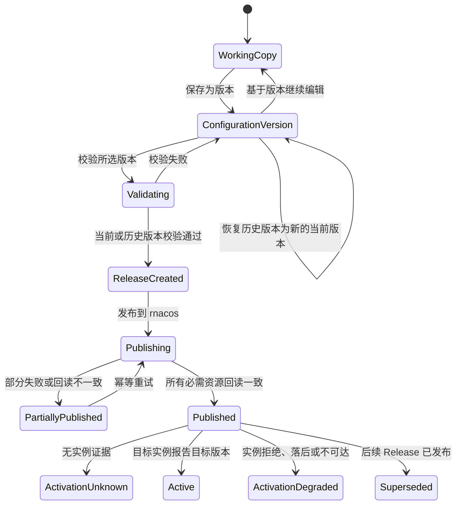

# Access Gateway Console 产品需求文档

- 状态：Draft v0.7（网络策略、可更新逻辑证书与 SAN 派生 SNI 选择控制面 P0 已实现）
- 适用范围：`web/`、`server/`，以及实现校验、证书生效和激活证据所需的
  `native/access-server/` 配套能力
- 产品主线：域名 Project → 逐条 YAML/JavaScript Route → 保存配置版本 → 选择当前/历史版本 → 发布到 rnacos
- 事实基线：当前仓库 `native/access-server` 及其 Java 兼容契约
- 取代版本：Draft v0.1（环境、结构化路由表单和灰度规则优先的方案）

## 1. 文档目的

本文重新定义 Access Gateway Console 的产品范围和交互模型。Console 不再围绕“环境管理”或
“灰度规则管理”组织功能，而是帮助网关维护者完成一个更短、更清晰的工作流：创建域名，逐条编写
YAML 或 JavaScript 路由，把配置显式保存为不可变版本并选择当前版本或历史版本发布到 rnacos；TLS 证书与
Project 分开管理，由证书 DNS SAN 自动形成 ClientHello SNI 选择索引。

本文是产品、前端、后端、原生数据面和测试共同使用的需求基线，不是数据库 DDL 或视觉稿。
当前数据面尚未具备的能力会明确标记为配套依赖，页面不得用模拟状态掩盖能力缺失。

## 2. 本次重新设计的决定

### 2.1 产品决定

1. **Project 就是域名。** 一个 Project 对应一个规范化的 exact domain，例如
   `api.example.com`，不再向用户暴露抽象项目名。
2. **Route 是 Console 的第一重点。** 项目详情默认打开路由页，路由创建、编辑、排序、校验和
   发布是最短操作路径。
3. **每条 Route 使用独立编辑器。** YAML Route 在正文中提供 path/可选 method 和执行配置；
   JavaScript Route 使用外置 path/可选 method 加脚本正文。页面不要求用户编辑整份 Project JSON。
4. **TLS 配置是一等且独立的对象。** Console 管理稳定逻辑证书及其不可变版本、DNS SAN
   自动选择范围、有效期和部署状态；证书不绑定 Project，私钥不进入 rnacos route payload。
5. **发布目标固定为一个部署配置的 rnacos。** 普通用户不创建、选择或切换环境，用户可见 API
   也不要求传递 `environmentId`。
6. **暂不提供灰度规则配置。** Console 不展示、不编辑、不发布
   `ploto.unified-access.gray-match`；数据面的兼容读取能力保持不变。
7. **配置版本保存、rnacos 已发布和实例已激活仍是三个状态。** 写入或回读 rnacos 成功不能作为
   实例激活证据。
8. **保存产生不可变配置版本。** 最新一次显式保存是“当前配置版本”，更早的保存是“历史配置
   版本”；未保存的浏览器编辑内容不是版本，也不能发布。
9. **发布来源可选。** 发布者可以选择当前配置版本或任一历史配置版本。每次发布都创建新的
   Release、重新校验并分配新的数据面 `version`，不会改写版本历史或复用旧 payload 的
   `version`。

### 2.2 当前能力约束

| 当前事实                                       | 产品约束                                             |
| ---------------------------------------------- | ---------------------------------------------------- |
| 项目列表和逐项目 route 使用不同 Data ID        | 发布是可恢复的多资源工作流，不宣称原子事务           |
| 同一项目的相同 `version` 更新会被忽略          | 每个 Release（含历史版本发布）分配新的单调 version   |
| route 解析、脚本编译或模型构建失败时保留旧快照 | “rnacos 已发布”与“实例已激活”分开显示                |
| `host` 缺失或为空会卸载项目                    | Project 归档/下线必须单独确认，不能用空 YAML 表达    |
| route 匹配依赖数组顺序                         | Route 卡片顺序就是编译和运行顺序，排序是有语义的操作 |
| 当前 wire payload 是 JSON                      | YAML 是创作格式，发布前必须确定性编译为兼容 JSON     |
| 当前 access-server 只从启动文件加载监听器证书  | SNI 证书动态部署尚需数据面配套，不得伪装成已生效     |
| 当前实例未提供完整的项目激活证据接口           | 缺少证据时一律显示“激活未知”                         |
| 生产差分验证和最终切流门槛尚未完成             | Console 不宣称系统已经完成生产兼容认证               |

## 3. 产品目标与非目标

### 3.1 产品目标

- 让用户从域名项目列表进入后，可以在同一上下文完成 Route 编写、版本管理和发布。
- 让每条 YAML/JavaScript Route 都有独立、可排序、可折叠、可定位错误的编辑器。
- 保留 RESPONSE、PROXY、condition、rewrite、headers、CIDR、body limit 和 WebSocket 等完整
  native route 能力。
- 在写入 rnacos 前完成 YAML、项目关系和 native authoritative validation。
- 建立可审计的配置版本、不可变 Release、逐资源发布、回读、重试和回滚证据链。
- 允许从当前配置版本或历史配置版本发起发布，并清晰区分当前编辑版本、rnacos 已发布来源版本
  和实例激活版本。
- 安全管理证书及私钥，以 SAN 派生索引明确展示握手域名覆盖、有效期、部署能力和运行时证据。
- 保持与现有 rnacos wire contract、Java 基线和 C++ 热更新语义兼容。

### 3.2 非目标

- 暂不提供 production gray 的查看、编辑、模拟或发布入口。
- 不提供环境创建、环境列表、环境切换或按环境导航；部署目标由服务端启动配置决定。
- 不作为通用 rnacos 管理控制台，不允许浏览或修改无关 Data ID。
- 不转发普通网关流量，不直接读取 access-server 内存或修改其进程内对象。
- 不把 Route 简化为只能配置基础反向代理的表单。
- 不在 TypeScript 中重新实现脚本 VM、Host matcher 或 Path matcher。
- 不从 rnacos 回读、进程存活、业务请求成功或 Prometheus 指标推断实例已经激活配置。
- 不在首个版本中负责 access-server 二进制升级、进程编排和生产切流自动化。

## 4. 用户、权限与部署边界

### 4.1 用户角色

| 角色   | 主要能力                                                             |
| ------ | -------------------------------------------------------------------- |
| 管理员 | 管理成员、角色、rnacos 连接、证书策略和系统能力                      |
| 维护者 | 创建 Project、编辑 Route、保存配置版本、上传证书、执行校验和查看差异 |
| 发布者 | 选择当前/历史配置版本、创建 Release、发布、重试失败资源和执行回滚    |
| 审计者 | 只读查看 Project、Route、证书元数据、Release 和审计事件              |

编辑权限与发布权限必须可分离。所有 API 请求都执行身份与操作权限校验；未授权用户不能从列表、
搜索、错误消息或审计查询中得到隐藏对象的信息。

### 4.2 单部署边界

- 一个 Console 部署只连接一个 rnacos namespace/tenant 和一组 access-server 实例。
- rnacos endpoint、namespace、tenant、Data ID、凭据引用和实例状态端点由部署 bootstrap 或
  管理员系统设置维护，不进入普通业务导航。
- Web 不显示“当前环境”徽标，不提供环境选择器。
- 用户可见资源路径使用 `/api/projects`，而不是
  `/api/environments/:environmentId/projects`。
- 数据库可暂时保留历史 `environment_id` 作为内部单部署作用域，但它不是新版产品领域对象，
  不得继续扩散到前端类型和新 API。

## 5. 领域模型与状态

### 5.1 核心对象

- **Project**：一个规范化 exact domain，以及其路由配置版本、Release 历史和状态摘要。
- **Route Item**：Project 下有稳定控制面 ID 和顺序的一条路由；格式为 YAML mapping 或
  JavaScript 脚本。JS 的 path/可选 method 存在条目元数据中；ID、format 和顺序不直接写入 wire。
- **Working Copy**：浏览器中基于某个配置版本继续编辑的临时内容，可以包含未完成或无效 Route；
  未显式保存前不是服务端版本，不能作为发布来源。
- **Configuration Version**：用户点击“保存为版本”后形成的不可变路由配置快照，包含 Route 格式、
  YAML/JavaScript 原文、JS 外置匹配字段、Route 稳定 ID、顺序和进入 route wire payload 的 Project 设置，不包含证书私钥
  或 rnacos 连接信息。每个 Project 内使用单调递增的展示号 `V1`、`V2`……；最新版本称为“当前
  配置版本”，其余为“历史配置版本”。内部可以继续由 `draft_revisions` 承载，但 UI/API 不把它
  描述成可变草稿。
- **Certificate**：稳定逻辑证书，包含名称、当前版本指针及当前 leaf DNS SAN。
- **Certificate Version**：不可变证书链、加密私钥、指纹、SAN、有效期和校验结果；续期新增版本，
  不覆盖历史版本。
- **Certificate SAN Selector**：由当前 leaf DNS SAN 自动派生的 exact 或单层 wildcard 索引；不
  接受人工绑定且不引用 Project。TLS 握手先按 SNI 选证书，HTTP header 完整后再按
  Host/`:authority` 选 Project。
- **Release**：一次发布的不可变计划，保存所选 Configuration Version、来源类型（当前/历史）、
  编译器版本、新分配的数据面 `version`、精确 JSON payload、摘要和资源依赖关系。证书部署记录
  与 rnacos route resource 分开保存。
- **Release Resource**：项目列表或逐项目 route Data ID 的一次目标内容及其写入、回读状态。
- **Publication Attempt**：对 Release Resource 的一次写入或重试证据。
- **Activation Evidence**：某个 access-server 实例明确报告的项目 version、payload 摘要或证书
  指纹。
- **Audit Event**：配置、证书、发布、回滚、权限和系统设置操作的不可变脱敏事件。

### 5.2 配置生命周期



展示规则：

- `Version saved` 只表示不可变配置版本已经安全保存到 Console。
- “当前配置版本”只表示该 Project 最新保存的版本；它不等于 rnacos 当前发布来源，也不等于实例
  当前激活内容。
- `Published` 只表示 Release 的全部必需 rnacos 资源已写入并回读一致。
- `Active` 必须有逐实例、未过期的明确证据。
- 无原生状态接口或证据不足时显示 `Activation unknown`，不能显示绿色成功状态。
- 部分发布必须列出已变化和未变化的 Data ID，不得折叠成普通失败提示。

### 5.3 证书生命周期

证书至少区分 `invalid`、`valid`、`expiring`、`expired`、`superseded`；运行时部署另外区分
`unsupported`、`pending`、`deployed`、`failed` 和 `activation_unknown`。逻辑证书创建、版本更新
或 SNI 控制面解析成功不等于证书已经被 access-server 使用。

## 6. 信息架构

### 6.1 顶层导航

1. **Projects**：默认首页；搜索、创建和进入域名 Project。
2. **TLS**：逻辑证书、不可变版本、SAN 自动 SNI 范围、解析预览和到期提醒。
3. **Releases**：待发布变更、发布进度、失败重试和回滚历史。
4. **Audit**：配置与安全操作记录。
5. **System**：仅管理员可见；rnacos 连接、实例证据能力和部署级健康状态。

不提供“环境”和“灰度规则”导航。全局概览不应抢占 Project/Route 主流程；需要展示的项目数、
待发布数和失败数可以作为 Projects 页的紧凑摘要。

### 6.2 Project 页面

Project 页面固定显示域名、当前配置版本、未保存状态、rnacos 已发布来源版本、激活状态和
“保存为版本/发布”主操作，
页内导航按以下顺序排列：

1. **Routes**：默认页签，也是主要工作区；
2. **Versions**：当前和历史配置版本、只读预览、版本 diff、恢复和发布入口；
3. **Releases**：该域名的发布执行、资源状态、重试和激活证据；
4. **Network Policy**：HTTPS redirect 和 CIDR 访问策略；
5. **Settings**：归档/下线等低频高风险操作。

离开存在未保存修改的 Route、切换 Project、删除 Route、归档 Project 和发布时都必须提供明确的
防误操作保护。

## 7. 核心功能需求

优先级：P0 为首个业务可用版本必须具备，P1 为完整运行闭环，P2 为增强能力。

### 7.1 Project（域名）

| ID          | 优先级 | 需求                                                                             |
| ----------- | ------ | -------------------------------------------------------------------------------- |
| CON-PRJ-001 | P0     | Projects 首页按域名搜索和列出 Project，并显示 Route 数、配置版本、发布和激活状态 |
| CON-PRJ-002 | P0     | 支持创建、复制和归档 Project；创建后自动建立空 Route Working Copy                |
| CON-PRJ-003 | P0     | Project domain 必须规范化、唯一，并作为默认 exact Host 和 rnacos project key     |
| CON-PRJ-004 | P0     | 支持 Project 级 HTTPS redirect 策略：关闭、301、302、307、308；默认关闭          |
| CON-PRJ-005 | P0     | 归档/下线前展示域名将从项目列表和运行快照移除，要求输入域名二次确认              |
| CON-PRJ-006 | P0     | wire `version` 由 Release 流程分配，普通编辑器不可见、不可手工修改               |
| CON-PRJ-007 | P1     | 支持从 rnacos 导入当前项目和 route 原文，但导入不得覆盖未确认的 Working Copy     |
| CON-PRJ-008 | P1     | 支持多人编辑乐观锁；发现 base Configuration Version 改变时提示比较和合并         |

域名规则：

- 去除首尾空白和一个末尾根域点，使用 UTS #46 转为 ASCII 并转小写；
- 总长不超过 253，每个 label 长度为 1..63；
- label 仅允许字母、数字和中划线，且中划线不能位于首尾；
- 不接受通配符、端口、URL、路径和 IP 字面量；
- 显示时可同时提供 Unicode 友好形式，但存储、唯一性和发布均使用规范化 ASCII domain。

新版 Project 固定为单域名。旧配置若一个 project 包含多个 Host 或 project key 不是合法域名，
必须通过有预览和人工确认的迁移流程处理；P0 不自动拆分或静默改名。

### 7.2 逐条 YAML/JavaScript Route 编辑器

| ID          | 优先级 | 需求                                                                               |
| ----------- | ------ | ---------------------------------------------------------------------------------- |
| CON-RTE-001 | P0     | 每条 Route 渲染为独立卡片，显式选择 YAML mapping 或 JavaScript 脚本格式            |
| CON-RTE-002 | P0     | 支持新增 RESPONSE/PROXY YAML 或 JS 模板、复制、删除、折叠和拖拽/键盘排序           |
| CON-RTE-003 | P0     | YAML 从正文派生 path/method/type；JS 从外置 path/method 展示；失败时显示稳定 ID    |
| CON-RTE-004 | P0     | 编辑器支持 YAML 高亮、缩进、行号、查找、撤销、括号匹配，以及行内和 gutter 错误提示 |
| CON-RTE-005 | P0     | 支持字段补全、字段说明和 RESPONSE/PROXY snippet，但不强制用户切换到表单            |
| CON-RTE-006 | P0     | Route 顺序独立持久化；同一路径条件路由的先后变化必须作为语义 diff 展示             |
| CON-RTE-007 | P0     | 编辑中即时标出无效 YAML 且不重建编辑器或抢走焦点；有错误时阻止保存版本和 Release   |
| CON-RTE-008 | P0     | YAML 合法时 `Ctrl/Cmd+S` 打开“保存为版本”流程；保存成功前持续显示未保存状态        |
| CON-RTE-009 | P0     | 后端保存使用乐观锁，旧保存响应不得覆盖较新的本地内容或校验结果                     |
| CON-RTE-010 | P1     | 大项目按可视区域挂载编辑器，折叠卡片不保留高成本编辑器实例                         |
| CON-RTE-011 | P2     | 支持跨 Route 搜索、批量折叠、从历史 Route 复制和只读双栏语义 diff                  |

一条 Route 的 YAML 不包含 `routes:` 外层数组，不包含 Project domain、`host`、`version`、
Certificate ID 或控制面 Route ID。例如：

```yaml
path: /healthz
type: RESPONSE
status: 200
body:
  type: TEXT
  content: ok
response_headers:
  Content-Type: text/plain; charset=utf-8
```

```yaml
path: /api/users/*
method: GET
type: PROXY
service: user-service/stable
rewrite: /internal/users
timeout: 30s
proxy_headers:
  X-Gateway-Source: access-gateway
allows:
  - 10.0.0.0/8
  - '!10.1.0.0/16'
```

#### 7.2.1 YAML 子集与确定性

- 使用 YAML 1.2 core schema，每个编辑器只接受单文档、根节点为 mapping 的内容。
- 保留注释和用户格式作为配置版本原文；发布比较同时提供“源码 diff”和“编译后语义 diff”。
- 拒绝重复 key、自定义 tag、对象构造 tag、anchor、alias、merge key 和多文档输入。
- `proxy_headers`、`response_headers`、`context` 必须是 mapping 或 null；`addresses`、`allows`
  必须是 sequence 或 null。可被 YAML 解析但容器类型不符合 native codec 的内容仍视为不可保存。
- 字段名采用 native wire model 的 snake_case；未知字段在 P0 阻止新配置发布，导入的兼容未知字段
  必须单独展示且不得静默丢弃。
- 时间和大小支持 native 已定义的毫秒/秒与 bytes/K/M/G 形式；编辑器显示归一化值。
- YAML 到 JSON 的标量转换规则必须版本化并使用共享 fixture 固化，不能依赖某个 YAML 库的隐式
  时间戳、二进制或大整数类型。
- 注释或纯格式变化不生成新的运行 payload；如果语义摘要未变化，发布页明确显示“无运行时变更”。

#### 7.2.2 Route 字段范围

公共字段至少覆盖 `path`、`type`、`condition`、`max_client_body_size`、`allows` 和
`response_headers`。

RESPONSE Route 至少覆盖 `status` 与 `body`（TEXT、BASE64、TEMPLATE）。PROXY Route 至少覆盖
`service`/`addresses`、`cluster`、`proxy_headers`、`context`、`rewrite`、`timeout`、
`max_proxy_body_size`、`websocket_timeout` 和 `flush`。

完整默认值、coercion、模板、condition、CIDR、受保护 header 和 WebSocket 行为以 native codec
及 compiled route model 为准。Console 的补全列表不是兼容性承诺。

### 7.3 配置版本、校验与编译

保存与版本规则：

- “保存为版本”是显式动作。保存成功后创建新的不可变 Configuration Version，并把它标记为该
  Project 的当前配置版本；历史版本内容和元数据不得修改或覆盖。
- 每次保存要求填写 1..200 字的版本说明；系统同时记录版本号、作者、保存时间、来源版本、内容
  SHA-256、Route 数和校验状态。
- 内容与当前版本完全相同仍可保存，但界面必须提示“内容无变化”，默认阻止误建版本；用户提供
  原因后可以强制保存，审计记录原因。
- Working Copy 基于明确的 base version。保存时若服务端当前版本已经变化，返回并发冲突，用户
  必须比较、重新应用或放弃本地修改，不能静默覆盖。
- Working Copy 允许保留暂时无效的 YAML 供用户继续修复，但 Web 和 API 都必须阻止把 YAML 语法、
  安全子集或本地 Route 结构无效的内容保存为配置版本；Native 语义校验仍与保存生命周期分离。
- “恢复为当前版本”不移动当前指针到旧记录，也不修改旧记录；它复制历史内容并创建下一个新
  版本，例如把 `V3` 恢复后保存为 `V9`，来源记录为 `restoredFrom=V3`。
- “基于此版本编辑”先把历史模型加载为浏览器内 Working Copy，不立即创建中间版本；保存时以
  服务端当前版本作为并发 base、以所选历史版本作为 `restoredFrom`，把编辑后的完整模型一次保存为
  下一个新版本。

| ID          | 优先级 | 需求                                                                               |
| ----------- | ------ | ---------------------------------------------------------------------------------- |
| CON-VER-001 | P0     | 每次显式保存生成 Project 内单调递增、不可变的配置版本                              |
| CON-VER-002 | P0     | Versions 页列出当前和历史版本，展示说明、作者、时间、Route 数、摘要和校验/发布状态 |
| CON-VER-003 | P0     | 支持只读打开任一版本，并与当前版本、前一版本或 rnacos 已发布来源版本比较           |
| CON-VER-004 | P0     | 发布入口允许选择当前版本或历史版本；历史版本必须有明显标识和二次确认               |
| CON-VER-005 | P0     | 未保存 Working Copy 不能发布；发布时提示先保存为版本或放弃未保存内容               |
| CON-VER-006 | P0     | 历史版本发布不会改变当前配置版本，也不会删除当前 Working Copy                      |
| CON-VER-007 | P0     | 恢复历史版本通过复制内容创建新版本，禁止倒退版本号或原地修改历史记录               |
| CON-VER-011 | P0     | 基于历史版本编辑时只在最终保存生成一个新版本，并同时记录当前 base 与历史来源       |
| CON-VER-008 | P0     | 配置版本号与 native wire `version` 分离，二者不得在 API、UI、日志和审计中混称      |
| CON-VER-009 | P1     | 支持版本说明搜索、按作者/校验/发布状态筛选和稳定游标分页                           |
| CON-VER-010 | P2     | 支持为重要配置版本添加受控标签；标签变化必须独立审计                               |

校验分四层：

1. **YAML 语法校验**：单个编辑器即时返回行列错误；
2. **Route schema 校验**：检查字段类型、必填项、枚举和字段组合；
3. **Project 语义校验**：按当前顺序检查重复/冲突 path、域名和跨 Route 关系；TLS SNI
   规则由独立校验流程处理；
4. **Native 权威校验**：把完整候选编译为精确 wire JSON，使用与 access-server 相同的 codec、
   脚本编译器和 route model 校验。

| ID          | 优先级 | 需求                                                                          |
| ----------- | ------ | ----------------------------------------------------------------------------- |
| CON-VAL-001 | P0     | 保存版本前必须通过 YAML 与本地 Route 结构校验；Release 前必须通过全部四层校验 |
| CON-VAL-002 | P0     | Native Validator 不可用、超时或 contract version 不匹配时 fail closed         |
| CON-VAL-003 | P0     | 错误至少包含 Route ID、字段路径、行、列、稳定 code 和安全 message             |
| CON-VAL-004 | P0     | 错误定位到对应 Route 卡片和行列，提供“上一处/下一处错误”导航                  |
| CON-VAL-005 | P0     | 校验结果绑定配置版本和内容摘要；过时结果不能覆盖其他版本或 Working Copy       |
| CON-VAL-006 | P0     | 提供最终项目列表和 project route JSON 的只读预览、语义 diff 和 SHA-256        |
| CON-VAL-007 | P1     | 使用用户显式提供的脱敏示例请求预览 Route 选择与执行计划，不发出网络请求       |

确定性编译结果遵守当前 wire contract：

- 项目列表：`ploto.unified-access.projects`，Group `ACCESS-SERVER`，内容为分号分隔 domain；
- 项目 route：`ploto.unified-access.route.<domain>`，Group `ACCESS-SERVER`；
- Project domain 编译为唯一 exact `host`；HTTPS redirect 设置编译为对应 HostStrategy；
- 所有 Route YAML 按页面顺序解析并放入 JSON `routes` 数组；
- Release 分配 `version`，YAML 和普通 Project 设置中不能覆盖它；
- 编译器版本、输入摘要、输出 bytes 和 native validator contract version 都进入 Release 证据。

### 7.4 证书管理

| ID           | 优先级 | 需求                                                                              |
| ------------ | ------ | --------------------------------------------------------------------------------- |
| CON-CERT-001 | P0     | 支持上传 PEM 证书链和私钥，解析后展示 subject、issuer、SAN、指纹和有效期          |
| CON-CERT-002 | P0     | 校验证书链格式、证书与私钥匹配、有效期和域名覆盖；失败时不建立可用版本            |
| CON-CERT-003 | P0     | 首个版本建立稳定逻辑证书并从 DNS SAN 自动生成 selector；版本保持不可变            |
| CON-CERT-004 | P0     | SAN selector 按 exact 优先、单层 wildcard 解析证书，不引用 Project                |
| CON-CERT-005 | P0     | 更新创建新版本并原子替换 SAN selector；覆盖变化必须明确确认                       |
| CON-CERT-006 | P0     | 同优先级多候选返回 conflict；不按上传时间、到期日或存储顺序任意选择               |
| CON-CERT-007 | P0     | 私钥加密存储、永不回显、不可下载，不进入日志、trace、审计 diff 或 rnacos payload  |
| CON-CERT-008 | P0     | TLS 页分别显示 matched/uncovered/conflict、版本事实状态和 activation unknown      |
| CON-CERT-009 | P1     | 到期阈值支持 30/14/7 天提醒，提醒失败不影响证书事实状态                           |
| CON-CERT-010 | P1     | 经专用安全交付通道把证书部署到支持 SNI 的 access-server，并收集逐实例证书指纹证据 |
| CON-CERT-011 | P2     | 支持 ACME 或企业证书服务自动签发与续期，仍使用不可变版本和显式部署记录            |
| CON-CERT-012 | P0     | 证书内容校验不做业务流量灰度；未来实例批次部署单独记录 rollout 与逐实例证据       |

当前 access-server 只支持启动时从文件加载一组监听器证书，尚不支持 Console 管理的逐域名 SNI
证书。逻辑证书、版本更新、SNI 控制面解析和 TLS 快照发布已经完成；由于逐实例证据尚未实现，
运行时状态必须显示 `activation_unknown`，不能从 Nacos readback 推断 `deployed`。

上传时的本地校验可以确定 PEM 结构、所提供链条的相邻签名关系、leaf/key 匹配、当前有效期和 DNS
SAN，不需要业务流量验证。到期状态必须随时间持续计算；公共 CA 信任、吊销状态和企业私有信任策略
需要后续 trust policy，不能把“本地校验通过”描述成所有客户端都信任。证书事实不灰度，未来实例
批次部署只解决运行时发布风险。

私钥不得通过普通 rnacos 配置分发。证书交付协议必须具备双向鉴权、传输加密、最小权限、大小
上限、原子替换、失败保留旧证书和逐实例指纹回执；具体协议在详细设计中决定。

如果 Project 开启 HTTPS redirect，发布前必须确认以下条件之一：已有覆盖该域名的运行时证书证据，
或部署明确声明 TLS 由受信任的外部终止器负责。缺少两者时阻止发布，避免重定向到不可用 HTTPS。
当前逐实例证书证据和外部终止器声明尚未实现，因此这一发布前置校验仍是明确缺口；Console 只能
展示入口约束和 `activation_unknown`，不能从配置保存、rnacos readback 或 TLS 库存推断 HTTPS
已经可达。

### 7.4.1 网络策略配置

网络策略作为 Configuration Version schema v5 的一部分保存，而不是可漂移的 Project 当前属性。
其中 HTTPS redirect 独立配置为关闭/301/302/307/308，并编译到 exact HostStrategy；CIDR 支持
“Route 自主管理”和“Project 统一策略”两种互斥模式。统一模式把允许 CIDR 和优先拒绝 CIDR
确定性编译进每条 route `allows`，并禁止 Route YAML 同时声明 `allows`。详细需求、迁移、API、
安全前提和验收见
[`network-policy-and-certificate-design.md`](network-policy-and-certificate-design.md)。

当前 native 按 Java 兼容语义从 `X-Real-Ip` 执行 CIDR 判断，缺失或不可解析时跳过检查。因此生产
部署必须由受信任入口清洗并设置该头；可信代理边界完成前不得把该配置宣传为独立网络防火墙。
HTTPS redirect 同样只信任已清洗的 `X-Forwarded-Proto`。当前单一业务监听器启用 TLS 时不接收
明文 HTTP，因此直连 access-server 不会触发 HTTP 到 HTTPS 重定向；该策略面向同时接收 HTTP/HTTPS
的受信任 Ingress/LB 链路。

### 7.5 Release 与发布到 rnacos

| ID          | 优先级 | 需求                                                                                      |
| ----------- | ------ | ----------------------------------------------------------------------------------------- |
| CON-REL-001 | P0     | 从用户选择且通过校验的配置版本创建不可变 Release，保存来源版本、base 摘要和精确 payload   |
| CON-REL-002 | P0     | Project 页提供固定主操作“发布版本”，默认选择当前版本，也可显式切换到历史版本              |
| CON-REL-003 | P0     | 发布前重新读取目标资源；base 摘要不一致时停止并报告外部变更冲突                           |
| CON-REL-004 | P0     | 每个 Data ID 独立记录 queued、writing、write_failed、readback_mismatch、verified、skipped |
| CON-REL-005 | P0     | 写入后必须回读；只有全部必需资源 verified 才标记 Published                                |
| CON-REL-006 | P0     | 支持失败资源幂等重试，已 verified 资源默认不重复写入                                      |
| CON-REL-007 | P0     | 部分发布显示真实中间态，并提供继续重试或从 base 创建恢复 Release 的入口                   |
| CON-REL-008 | P0     | 发布历史配置版本创建新 Release，分配高于当前值的新 wire `version`，不改写当前配置版本     |
| CON-REL-009 | P0     | 发布内容只包含项目列表和 project route，不读取或修改 gray Data ID                         |
| CON-REL-010 | P1     | 支持审批、定时发布和保护时段；执行时仍重新检查冲突                                        |
| CON-REL-011 | P0     | 创建 Release 时使用当前编译器和 Native Validator 重新校验所选版本，不盲信历史校验结果     |
| CON-REL-012 | P0     | 发布确认页同时展示来源配置版本、当前配置版本、当前 rnacos 来源版本和新 wire `version`     |

版本选择与发布规则：

- 默认发布来源为当前配置版本。历史版本按版本号倒序可选，并展示保存说明、作者、时间、校验状态、
  最近发布结果以及与 rnacos 当前内容的语义差异。
- 存在未保存 Working Copy 时，发布动作不得隐式包含这些修改。用户可以先保存为新版本、继续发布已
  保存版本，或取消；选择“继续发布已保存版本”需要再次确认未保存内容不会进入本次 Release。
- 选择历史版本时，确认页必须使用“发布历史版本 Vn”文案，并说明发布成功后“当前配置版本”仍为
  Vm。不得把历史发布伪装成版本指针回退。
- 任何配置版本每发布一次都产生新的 Release。即使该版本过去发布过，也必须分配新的单调 wire
  `version`，生成新的精确 payload，并保留本次 base observation、校验器 revision 和发布证据。
- 如果历史版本使用旧 schema 或当前 Native Validator 已不再接受，则阻止创建 Ready Release，
  展示兼容错误，并允许把历史内容恢复为新的当前版本后人工修订；禁止绕过校验直接写 rnacos。
- “恢复为当前版本”和“发布历史版本”是两个独立操作：前者生成新 Configuration Version，后者
  生成新 Release。任何操作都不能重写已有版本或 Release。

发布顺序：

- 新建 Project：先写入并回读 project route，再把 domain 加入项目列表；
- 修改 Project：写入带新 version 的 project route；该写入可能立即被实例观察到；
- 归档 Project：先从项目列表移除并回读，再把 route Data ID 清理作为独立可选步骤；
- 单 Project Release 默认不夹带其他 Project 的未发布配置版本；若项目列表需要变化，只加入相应项目
  列表资源。

rnacos 不提供跨 Data ID 事务。确认页必须解释新增/移除 Project 的可见中间态，Worker 崩溃后
必须先回读事实再继续，不能盲目重写。

### 7.6 发布状态、激活证据与审计

| ID          | 优先级 | 需求                                                                               |
| ----------- | ------ | ---------------------------------------------------------------------------------- |
| CON-ACT-001 | P0     | 分开显示配置版本保存、rnacos 发布和实例激活三个状态                                |
| CON-ACT-002 | P0     | 当前无原生证据时显示“激活未知：access-server 未提供证据”                           |
| CON-ACT-003 | P0     | 不使用 rnacos 回读、请求成功、进程存活或流量指标替代激活证据                       |
| CON-ACT-004 | P1     | 按实例展示 build、项目 version/摘要、最近拒绝原因、证书指纹和证据时间              |
| CON-ACT-005 | P1     | 证据过期后不能继续显示 Active；部分实例失败不得被健康实例掩盖                      |
| CON-AUD-001 | P0     | 记录 Project、Configuration Version、证书、校验、Release、发布、重试和恢复操作     |
| CON-AUD-002 | P0     | 审计事件包含 actor、对象、动作、结果、request ID 和时间，不能原地修改或删除        |
| CON-AUD-003 | P0     | 审计只保存脱敏摘要；私钥、凭据、Authorization、Cookie 和敏感 header 值不得进入事件 |

## 8. 后端 API 需求

API 统一位于 `/api`，使用显式 request/response schema、稳定错误 code、字段路径和 request ID。
资源建议如下：

| 领域            | 最小能力                                                                |
| --------------- | ----------------------------------------------------------------------- |
| Session         | 当前用户、权限和注销                                                    |
| Projects        | `/api/projects` 列表、创建、详情、复制、归档和状态摘要                  |
| Routes/Versions | Working Copy、保存配置版本、版本列表/详情、恢复、源码 diff 和乐观锁     |
| Validation      | YAML/schema/project/native 校验、wire 预览和语义 diff                   |
| TLS             | 逻辑证书、不可变版本、SAN 自动 SNI 解析、有效期和部署证据；绝不返回私钥 |
| Releases        | 创建、详情、发布、资源级重试、冲突处理和回滚                            |
| Audit           | 过滤、稳定 cursor 分页和授权导出                                        |
| System          | rnacos 连接与只读测试、validator/worker/实例证据能力状态                |

新 API 和前端类型不包含 `environmentId`。修改接口使用 idempotency key 与乐观锁；保存配置版本
必须提交预期 draft lock version。发布请求断开后，后台任务仍需保存已经发生的外部写入证据。

版本与发布 API 必须满足：

- 保存版本请求携带 `If-Match` 或等价 base lock，响应返回不可变 version ID、Project 内版本号和
  新 lock；并发冲突返回 `409 CONFIG_VERSION_CONFLICT`；
- 版本列表使用稳定倒序游标，列表项不返回完整 YAML，版本详情按权限解密返回精确 Route 原文；
- 创建 Release 请求必须显式携带 `sourceVersionId` 和用户确认时的 `expectedCurrentVersionId`，不能
  用“当前”这一可变别名在后台延迟解析；确认期间当前版本变化时返回冲突并要求重新确认；
- 创建 Release 和开始发布分别使用 `Idempotency-Key`；同 key、同请求返回同一资源，同 key、不同
  请求返回 `409 IDEMPOTENCY_KEY_REUSED`；
- Release 响应同时返回 `sourceConfigurationVersion` 与 `allocatedWireVersion`，字段名不得简写为
  含义不明的 `version`。

错误定位示例：

```json
{
  "error": {
    "code": "NATIVE_VALIDATION_FAILED",
    "message": "Route configuration is invalid",
    "requestId": "...",
    "fields": [
      {
        "routeId": "...",
        "path": "condition",
        "line": 6,
        "column": 12,
        "code": "INVALID_EXPRESSION",
        "message": "..."
      }
    ]
  }
}
```

## 9. 持久化要求

逻辑存储至少包含：

| 对象                        | 关键内容                                                              |
| --------------------------- | --------------------------------------------------------------------- |
| `projects`                  | domain、状态、HTTPS 策略、当前配置/发布摘要                           |
| `route_items`               | 稳定 ID、Project、顺序；当前编辑头不作为发布事实                      |
| `draft_revisions`           | 内部承载不可变配置版本：版本号、Route 原文/顺序、作者、说明和来源版本 |
| `validation_runs`           | 配置版本、校验层级、编译器/validator 版本、结果和结构化错误           |
| `certificate_series`        | 稳定逻辑证书、当前版本、兼容 SAN 摘要和乐观锁                         |
| `certificates`              | 不可变版本、公共元数据、指纹、SAN、有效期和加密文档引用               |
| `certificate_dns_names`     | 迁移 `0008` 的兼容历史；新流程不再读写                                |
| `certificate_san_selectors` | 当前 leaf DNS SAN 派生的唯一 exact/wildcard 查询索引                  |
| `certificate_bindings`      | 迁移前绑定历史；新流程不再读写                                        |
| `certificate_deployments`   | 目标实例、状态、指纹证据和脱敏错误                                    |
| `releases`                  | 不可变元数据、来源配置版本、来源类型、wire version、状态和审批信息    |
| `release_resources`         | Data ID/group、顺序、精确 payload、base/target 摘要和发布状态         |
| `publication_attempts`      | attempt、幂等键、开始/结束、结果和脱敏错误                            |
| `activation_observations`   | 实例、Project version/摘要、证书指纹、观测和过期时间                  |
| `audit_events`              | actor、对象、动作、结果、request ID 和脱敏摘要                        |

YAML 原文、编译后 JSON 和 Certificate 私钥是不同安全等级的文档。Release payload 必须可重放
并计算稳定摘要；私钥使用 envelope encryption，密钥轮换不改变证书指纹。删除用户、Project 或
Route 不能破坏历史 Release 和审计引用。

`drafts.current_revision_no` 可以继续作为“当前配置版本号”的内部指针，但所有
`draft_revisions` 均不可变。发布引用具体 revision 主键，禁止只保存当前指针。历史版本发布不得
更新 `drafts.current_revision_no`；历史恢复必须插入新 revision 后再以事务更新该指针。

## 10. 非功能需求

### 10.1 一致性与可靠性

- MySQL 事务不覆盖 rnacos 或证书交付；所有外部副作用使用可恢复状态机。
- Worker 重启后先查询本地 attempt 和外部事实，再决定继续、重试或等待人工处理。
- YAML 解析、编译和 native validation 必须有 contract version；升级前使用兼容 fixture 回归。
- 所有时间以 UTC 持久化，在 UI 按用户时区展示。
- rnacos、Native Validator 或证书交付不可用时 fail closed，并保留可重试的脱敏证据。

### 10.2 性能

- 以现有约 352 个项目、1302 条 Route 的语料两倍作为首轮列表、搜索和发布 diff 验收输入。
- 页面不得一次挂载所有代码编辑器；使用折叠、虚拟列表或按可视区域挂载。
- 编辑一条 Route 不应触发所有 Route 编辑器重渲染。
- YAML 解析使用短防抖；全项目校验可取消，并丢弃不匹配目标版本或 Working Copy 的结果。
- 列表和审计使用稳定 cursor pagination；外部调用设置超时、并发上限和有限重试。

### 10.3 安全

- 生产使用安全会话、CSRF 防护、SameSite/HttpOnly cookie 和明确的会话过期策略。
- 配置、YAML、URL、header、模板、证书和导入文件全部视为不可信输入。
- 禁止 YAML 自定义对象构造；预览不执行配置脚本，不渲染未净化 HTML，不发出网络请求。
- 数据库查询参数化。rnacos、validator、证书交付和实例接口使用与用户会话分离的最小权限身份。
- 私钥、rnacos 凭据、token、Authorization、Cookie、请求/响应 body 和敏感 route header 值
  不得进入日志、trace、错误、审计或前端 telemetry。

### 10.4 可用性与可访问性

- 状态同时使用文字、图标和颜色；代码编辑器、排序、折叠和错误导航支持键盘操作。
- 每条 Route 编辑器具有可访问名称，例如“路由 3：PROXY /api/users”。
- 项目切换、删除 Route、归档、发布历史版本和恢复历史版本有明确的未保存保护和影响说明。
- 桌面端优先保证完整编辑；窄屏至少支持只读 YAML、状态和紧急发布结果查看。
- 首版使用简体中文，领域枚举与展示文案分离，为后续国际化保留边界。

### 10.5 测试

- 前端覆盖多编辑器隔离、YAML 错误定位、排序、未保存保护、语义 diff 和键盘操作。
- 后端单元测试使用 Fastify injection 和 fake adapter，不依赖真实 MySQL、rnacos 或公网。
- YAML 编译器与 native validator 共享 golden fixture，覆盖 RESPONSE、PROXY、condition、模板、
  CIDR、timeout、body limit、WebSocket、重复 key 和禁止的 YAML 特性。
- rnacos 集成测试使用 disposable 服务，覆盖新增 Project、修改、归档、部分成功、回读不一致和
  Worker 重启恢复。
- 证书测试使用测试专用证书，覆盖 key mismatch、SAN 不覆盖、过期、替换、私钥不回显和部署失败
  保留旧证书。

## 11. 分阶段交付

### 阶段 0：产品模型收敛

- 移除环境选择、环境徽标和灰度规则入口；
- 新 API 使用单部署作用域和 `/api/projects`；
- Project 固定为规范化域名；
- 建立 YAML/JavaScript Route Item、顺序和不可变 Configuration Version 模型。

### 阶段 1：Route-first 编辑器

- Project 列表和 Project/Routes 主页面；
- 每条 Route 一个 YAML 或 JavaScript 代码编辑器；
- 新增、复制、删除、排序、保存为版本、乐观锁和未保存保护；
- 当前/历史版本列表、只读查看、diff 和恢复为新版本；
- YAML/JS 元数据/schema/Project 校验、源码 diff 和语义 diff。

### 阶段 2：证书与权威校验

- 逻辑证书上传、加密存储、SAN/有效期/key match 校验、不可变版本、SAN 派生 SNI 索引和到期状态；
- YAML/JavaScript Route 到 wire JSON 的版本化确定性编译器；
- native validator CLI/adapter、错误到 Route 行列的映射；
- wire 预览与 Release 前 fail-closed gate。

### 阶段 3：rnacos 发布闭环

- 从当前或历史配置版本创建不可变 Release、分配单调 wire `version`、执行冲突检查；
- 项目列表和 project route 逐 Data ID 写入、回读、部分成功和幂等重试；
- 历史版本发布创建新 Release，历史恢复创建新 Configuration Version；
- 审计和基础通知；激活证据缺失时仍显示未知。

### 阶段 4：证书与配置激活闭环

- access-server 逐域名 SNI 证书能力和专用安全交付协议；
- 项目 version、摘要、证书指纹的逐实例证据；
- 证据过期、拒绝、落后、不可达和部分激活状态。

### 阶段 5：增强能力

- 审批、定时发布和保护时段；
- ACME/企业证书服务自动续期；
- 脱敏请求模拟、跨 Route 搜索和审计导出。

灰度规则不在上述阶段内。重新引入前必须单独立项，不得顺带加入 Project Release。

## 12. MVP 验收场景

1. **无环境主流程**：用户登录后直接看到 Projects，不出现环境选择器、环境徽标或
   `environmentId` URL；页面没有灰度规则入口。
2. **创建域名**：输入 `API.Example.com.` 后创建 `api.example.com` Project 和空 Route Working Copy；
   URL、通配符和重复域名被准确拒绝。
3. **逐条混合编辑**：用户新增 RESPONSE/PROXY YAML 与 JavaScript Route；JS 必须提供外置 path，
   method 可选；修改一条不会改变另一条的内容或保存状态。
4. **错误定位**：某条 YAML 存在重复 key、JS 缺 path 或脚本编译失败时，卡片显示错误并阻止保存。
5. **顺序语义**：拖动同 path method/condition Route 后，最终 JSON 数组严格按
   新顺序生成。
6. **完整能力**：至少成功编译一个 TEXT RESPONSE、一个 service PROXY、一个 static-address
   PROXY 和一个 WebSocket Route。
7. **证书安全**：上传证书和匹配私钥后展示 SAN、指纹和有效期；不匹配私钥被拒绝，任何 API、
   日志、审计和 rnacos payload 都无法检索到私钥原文。
8. **证书更新与诚实状态**：更新一个逻辑证书时原子切换版本及 SAN selector；范围变化需要确认。
   数据面支持动态 SNI，但实例证据未接入时仍显示“Release 已发布 / 实例激活未知”，不显示“已生效”。
9. **保存版本**：用户基于 `V2` 修改 Route 并填写说明后保存为不可变 `V3`；`V2` 仍可只读查看，
   并发用户先保存 `V4` 时旧 base 保存返回冲突而不覆盖。
10. **发布当前版本**：默认选择当前 `V4`；校验通过后，先写入并回读 project route，再按需更新
    项目列表；全部 verified 后显示 Published，实例证据缺失时显示 Activation unknown。
11. **发布历史版本**：当前配置版本为 `V6` 时选择历史 `V3` 发布；确认页明确提示历史来源，创建
    新 Release 和更高 wire `version`，发布完成后当前配置版本仍为 `V6`。
12. **未保存隔离**：编辑器存在未保存内容时选择发布 `V6`，页面明确提示未保存内容不会进入
    Release；用户可先保存、继续发布已保存版本或取消，系统不得静默发布 Working Copy。
13. **历史兼容失败**：旧版本在当前编译器或 Native Validator 下失败时禁止发布，可恢复其内容为
    新版本后修改，不能绕过校验。
14. **外部冲突与部分发布**：rnacos base 已改变时不覆盖；部分写入失败时逐 Data ID 展示结果，
    重试不重复写 verified 资源。
15. **恢复历史内容**：把历史 `V2` 恢复为新的当前 `V7`，保留 `restoredFrom=V2`；不得移动指针
    或修改 `V2`。
16. **归档 Project**：用户输入完整域名确认后先从项目列表移除；不使用空 route 内容表达下线。

## 13. 必需配套依赖与开放决策

### 13.1 必需配套依赖

- 安全、严格、可保留源码位置的 YAML 1.2 parser 与版本化 YAML-to-wire compiler；
- 基于 `access_server_core` 的离线 Native Validator contract；
- rnacos publication worker、只读回读 adapter 和最小权限服务身份；
- 证书 envelope encryption 与 KEK/Secret Provider；
- access-server 实例级 TLS 快照版本、加载结果和有界鉴权状态接口；
- access-server 完成生产差分与切流门槛后的正式生产声明。

### 13.2 待详细设计决定

- 浏览器崩溃恢复副本的保留方式；恢复副本不作为正式配置版本或可发布来源；
- YAML parser/editor 选型、补全 schema 来源和 YAML 错误到 native 字段路径的 source map；
- 旧的多 Host/non-domain project 向单域名 Project 的迁移策略；
- 证书私钥保留期限、销毁证明、KEK provider 和运行时安全交付协议；
- 外部 TLS 终止器声明的授权方式和证书覆盖证据；
- Project `version` 的并发分配算法和 int32 上限处理；
- 单 Project Release 遇到并发项目列表变化时的合并和冲突策略；
- 企业身份源、会话、多因素认证和默认发布审批策略。

## 14. 文档影响

- [`console-detailed-design.md`](console-detailed-design.md) 是本文对应的实现设计，详细定义配置版本
  选择、Release 创建、发布状态机、API、存储和并发边界。
- [`fixed-workspace-and-secure-listener-design.md`](fixed-workspace-and-secure-listener-design.md)
  记录当前固定工作区、整份 JSON 编辑器和启动证书实现，仅作为现状说明；其中的 Console 产品
  交互被本文取代。
- [`network-policy-and-certificate-design.md`](network-policy-and-certificate-design.md) 定义已实现的
  Configuration Version v3 网络策略、可更新逻辑证书、SAN 自动 SNI 解析、安全边界和动态 SNI
  交付；实例激活证据仍未实现。
- [`project-settings-requirements.md`](project-settings-requirements.md) 和
  [`project-settings-detailed-design.md`](project-settings-detailed-design.md) 定义已实现的 Project
  Settings 下线 Release、Project List 回读证据和归档边界；route Data ID 清理仍是后续可选动作。
- 任何 wire/config 行为变更仍需同步更新 native codec/runtime、server schema/service、web 类型、
  兼容 fixture 和用户文档。

## 15. 需求追踪来源

- [`native/access-server/src/config/AccessConfig.h`](../native/access-server/src/config/AccessConfig.h)：
  项目、Host、Route、version 和默认 Data ID wire model；
- [`native/access-server/docs/compatibility-contract.md`](../native/access-server/docs/compatibility-contract.md)：
  Java 兼容字段、路由、热更新和错误契约；
- [`native/access-server/src/runtime/RouteConfigStore.h`](../native/access-server/src/runtime/RouteConfigStore.h)：
  version、卸载和不可变快照状态；
- [`native/access-server/src/runtime/AccessConfigWatcher.h`](../native/access-server/src/runtime/AccessConfigWatcher.h)：
  项目订阅图、ready 和配置失败信息；
- [`native/access-server/docs/migration-plan.md`](../native/access-server/docs/migration-plan.md)：
  当前完成状态、差分门槛和生产切流边界；
- [`native/access-server/docs/script-corpus-differential.md`](../native/access-server/docs/script-corpus-differential.md)：
  已验证的 condition/template/rewrite 语法范围。
